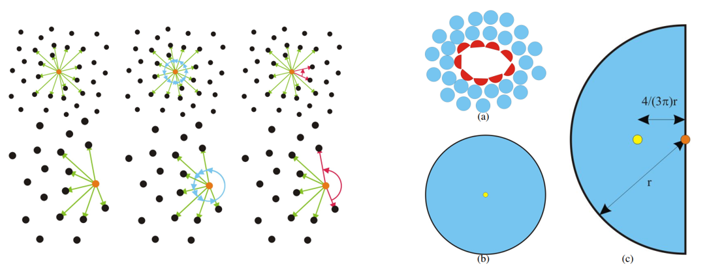

<head>
    
    
</head>

国庆节快乐！这是我的第一篇正经博客！内容是关于最近复现的一篇论文。

我的研究课题里需要做点云配准相关的工作，查了一些文献之后决定先参考这篇19年发表在 Computers & Graphics 上的论文: *Fast template matching and pose estimation in 3D point clouds*。 这篇论文对我的课题有比较大的参考价值。

导师建议我先复现一下看看效果，自己写一遍代码的话，对于论文的内容的了解也会加深。代码是用 VS2017 + PCL1.9.1写的，用PCL1.9.1显示点云的时候VTK会弹出警告窗口，但是如果用 VS2019 + PCL1.12.0的话似乎没有这个问题。

这篇论文的算法可以分成三个部分，第一部分是提取边缘点，第二部分是从边缘点里提取点对，第三部分是基于点对来进行RANSAC匹配。

论文中给出的流程图：
 

-------------

# 1. 边缘提取 
算法的第一步就是对模板点云 (template)和待检测的场景点云 (scene)进行边缘提取。这么做可以大大减少需要处理的点云的数量，提高计算速度，同时也能保留原点云的一些独特的几何特征。边缘提取的整体流程还是比较简洁的，首先为点云里的每一个点都计算一个特征向量 （feature vector，不是eigenvector），每个向量有5个元素，也就是5个特征。第二步对这些特征向量进行k-means聚类，分为两类，一类是非边缘点，另一类就是边缘点了。
## 1.1 点特征计算
当我们计算某个点的几何特征的时候，一般要综合这个点和其周围点来考虑，因此在算特征之前要先给目标点圈定一个邻域，邻域半径的大小可以是点云平均密度的几倍，总之是不能太大也不能太小。

假设我们要计算特征的那个点是 $p$，邻域的半径是$r$，其邻域中点的集合是$N_r(p)$，以此来计算一个加权协方差矩阵：

$$
\sum (p) = \frac{1}{|N_r(p)|}\sum_{p_i \in N_r(p)}h(||p_i-\overline{p}||)(p_i-\overline{p})(p_i-\overline{p})^T
$$

其中 $\overline{p}$是邻域的中点(medoid)，$h()$是一个高斯窗口函数，$\|N_r(p)\|$指的是集合里点的总数。

协方差矩阵的三个特征值（从大到小排列）为$\lambda_1$，$\lambda_2$，$\lambda_3$，它们所对应的特征向量是$e_1$，$e_2$，$e_3$，其中前两个特征向量是在该点的切向量，而第三个特征向量为法向量。根据这三个特征值（eigenvalue），我们可以得出以下的三个点特征（feature）：

-  non-planarity：$f_p(p)=1-(\lambda_2-\lambda_3)/\lambda_1$
-  sphericity: $f_s(p) = \lambda_3/\lambda_1$
-  surface variation: $f_s(p) = \lambda_3/(\lambda_1 + \lambda_2 + \lambda_3)$
 
很明显，边缘点的这三个特征的值会明显高于非边缘点（脑补了一下桌子边和桌面的区别），而且它们的值都介于0和1之间。

这三个特征值的选取借鉴了Hackel等人在2016年发表的论文 *Contour detection in unstructured 3D point clouds*。Hackel的论文里基于特征值 (eigenvalue)计算的特征 (feature)就比较多了↓：
 
 
 

论文作者对$f_p(p)$的计算做了一个小的改动，将上图表格里的planarity改成了non-planarity，改动的目的应该是让边缘点的每个特征的值都比非边缘点的大。

剩下的两个点特征的计算借鉴了Bendels等人在2006年发表的*Detecting Holes in Point Set Surfaces*。其中一个是angle criterion $f_a(p)$，另一个是half-disc criterion $f_h(p)$。这两个特征在原文里被一笔带过了，不过可以参考Bendels的论文里的内容：
 

 
计算这两个特征之前首先需要将$N_r(p)$ 投影到一个和法向量$e_3$垂直的平面上。$f_a(p)$计算的是在投影平面上，点$p$对应的那个点到与周围点的连线之间夹角的最大值，从上图的左侧可以看出，处在边缘的点对应的最大夹角明显大于非边缘点。$f_h(p)$计算的是$p$在投影平面上和投影点的中心(centroid)，也就是到周围点距离总和最短的那个点，之间的距离。从上图右侧可以看出，边缘点一般会比较偏离中心，因此这个距离会更大。

## 1.2 k-means 聚类
每个点的特征向量归一化之后，就可以聚类了。根据上面的分析不难看出，理论上每一个边缘点的每一个特征都应该比非边缘的点要大，因此聚类完成之后，向量的二范数更大的那一类就是边缘点。

用T-LESS dataset里面的模型测试结果：
 

 

可以看出对于个别带有圆柱面或者椭圆形状的模型，算法识别的效果不是很好，我觉得可能有两个原因，一是边缘点具有的一些特征这些点也有，二是圆柱形的物体，比如管子，它们的边缘本身就很难判定。

除了边缘点之外，后续的步骤还需要用到协方差矩阵最大特征值对应的特征向量$e_1$，它可以用来表示边缘的方向 (edge direction)。（其实原文写的是$e_2$，个人认为应该是笔误了，因为根据作者给出的图来看$e_1$才是他们要找的那个向量）

Reference：

- [1][Fast template matching and pose estimation in 3D point clouds](https://www.sciencedirect.com/science/article/abs/pii/S0097849319300081)
- [2][Contour detection in unstructured 3D point clouds](https://ethz.ch/content/dam/ethz/special-interest/baug/igp/photogrammetry-remote-sensing-dam/documents/pdf/timo-jan-cvpr2016.pdf)
- [3][Detecting Holes in Point Set Surfaces](https://cg.cs.uni-bonn.de/en/publications/paper-details/bendels-2006-detecting/)
- [4][T-LESS](http://cmp.felk.cvut.cz/t-less/)
