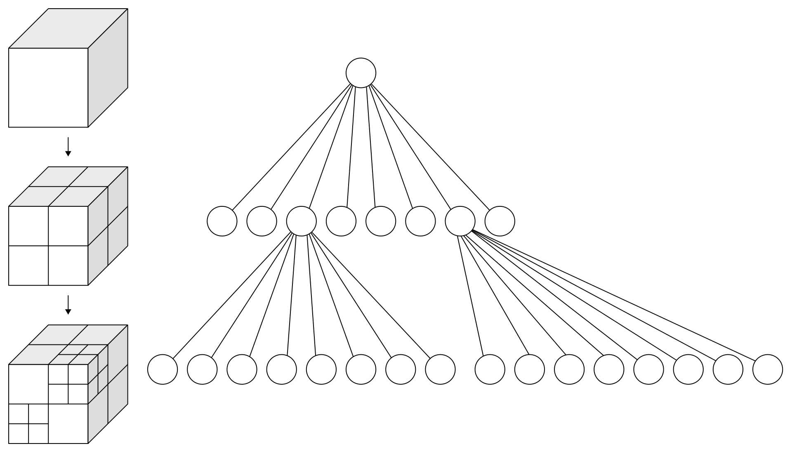

以前我对PCL里面八叉树的用法并不了解。最近正在看的一篇论文用八叉树来存储点云，并且涉及到了在八叉树特定深度的搜索，于是研究了一下如何在PCL用八叉树实现题目里的功能。

八叉树的结构是这样的：
<br>

<br>

给点云构造八叉树，首先把点云的包围盒分割成8个小方格，小方格可以再分为8个更小的方格，直到满足迭代终止条件。迭代的终止条件可以是达到最大迭代深度，或者是达到最小分辨率（就是小方格的边长不可以小于这个分辨率）。

八叉树里最小的格子就是叶子节点(leaf node)，PCL支持直接返回一个叶子节点里包含的所有点的索引，用`octree.voxelSearch (searchPoint, pointIdxVec)`这个函数，可以将八叉树中`searchPoint`这个点所在的叶子节点中包含的所有点的索引存到`pointIdxVec`里。

那么如果想要对某一个特定深度上的非叶子节点（branch node）实现同样的功能呢？应该分为两步，首先我们需要找到这个非叶子节点，其次返回该节点所包含的所有点的索引。

看似简单，但其实第一步对于我来说都有点难度超标了。。虽然在PCL里非叶子节点也可以存储点索引，但是需要自己手动存进去，默认情况下调用`getBranchContainer()`函数返回的是一个空的vector。因此想要获取非叶子节点里包含的点，就要找到其下属所有的叶子节点，然而PCL的官方文档里一大堆长得差不多但是功能差很多的类让我眼花缭乱，网上相关的讨论也比较少，看了半天都不知道该怎么用，感觉自己菜得一笔……不过在反复查了很多次之后我找到了一个省事的方法，就是依靠这两个函数：`auto it = octree.fixed_depth_begin(depth)`和`octree.getVoxelBounds(it,min_bound,max_bound)` 。第一个的函数的功能是返回一个在给定深度的迭代器；第二个函数的功能是将一个节点的最大和最小的边界存到两个长度为3的向量里。由此一来，我们可以先用第一个函数初始化一个在固定深度的迭代器并开始搜索，对于迭代器每次指向的节点，可以用第二个函数来生成它的坐标范围，如果我们给出的点在这个范围内，那么该节点就是我们的目标节点。

第一步结束后，由于我们已经得到了目标节点的坐标范围，用`octree.boxSearch()`就可以找到这个范围内的所有点的索引了。

使用以上几个PCL函数需要`#include <pcl/octree/octree_search.h>`。以下是我自己写的实现这个功能的函数（仅针对非叶子节点，叶子节点可以直接用PCL自带的`voxelSearch()`。）:

```cpp

/*
usage: find the branch node that include a specific point at a specific depth, 
then store indices of all the points in that node.
*/
void Get_node_at_specific_depth(int depth, const pcl::PointXYZ& pt, vector<int>& indices)
{
	if (depth < 0 || depth > octree.getTreeDepth()) //if the depth exceed the limit
	{
		throw runtime_error("Depth exceeds the limit!");
	}
	//initialize the iterator at a certain depth
	auto it = octree.fixed_depth_begin(depth);
	while (it.getCurrentOctreeDepth() == depth)
	{

		Eigen::Vector3f min_bound, max_bound;
		//find the min and max bound of the current node
		octree.getVoxelBounds(it, min_bound, max_bound);
		//determine whether the point is within the bound by comparing the vectors
		if (Is_in_voxel(min_bound, max_bound, pt.getVector3fMap()))
		{
			//if ture, save indices of all points within this bound
			octree.boxSearch(min_bound, max_bound, indices);
			return;
		}
		it++;

	}

	//if we did not find any voxel that meets the requirement
	cout << ("Voxel not found!") << endl;
	return;
}

```
虽然我的确实现了这个功能，但是并不知道以上否是实现这个功能的最佳方法，而且我对于PCL里八叉树整体的数据结构也是一知半解，后续还需要多看一些源代码。不得不感叹学C++和PCL好难，我以为我在第五层，其实我在地下室。

Reference：
- [1][PCL Octree Cheat Sheet](https://www.ridgesolutions.ie/index.php/2019/02/14/pcl-octree-cheat-sheet/)
- [2][Official Documents](https://pointclouds.org/documentation/group__octree.html)
