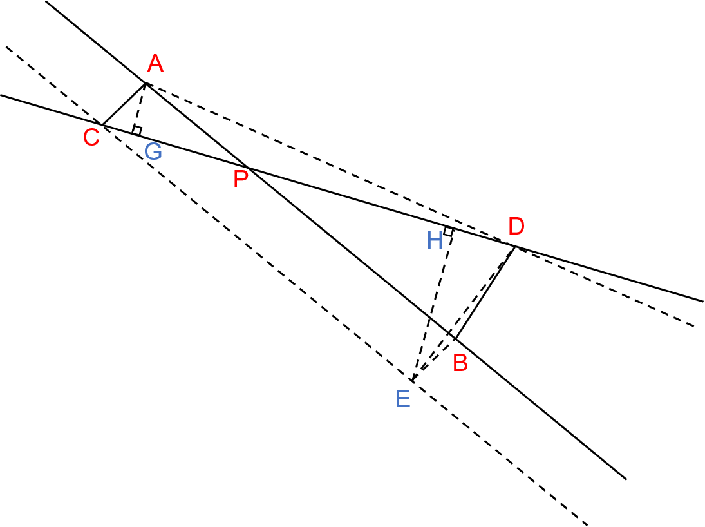
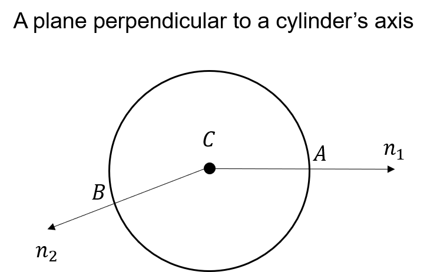

<head>
    
    
</head>

Today is the second day of the new semester! Hoping that I can make some good research progress in this semester.

This post is about how to get the intersection of two lines in 3D space (note that the lines are on the same plane and are not parallel, or they will not intersect). The contents are relatively simple so I would like to write them in English.

As is shown in the following image, let's say we have two lines $l_1$ and $l_2$, and our goal is to get their intersection point $P$. First of all, we can select two points on each line, which are $A,B$ on $l_1$ and $C,D$ on $l_2$. After that, we can draw three lines: $AG$ perpendicular to $l_2$, $CE$ parallel to $AB$ ($CE=AB$) and $EH$ perpendicular to $l_1$.
 

 
It is easy to prove that $\Delta AGP$ and $\Delta EHC$ are similar triangles. Therefore, we can calculate $\frac{AP}{AB}$ by:

 $$\frac{AP}{AB} = \frac{AP}{CE} = \frac{AG}{EH}  = \frac{area(\Delta ACD)}{area(\Delta ECD)} $$

Since the coordinates of $A, B, C, D, E$ are already known, we can calculate the area of the above two triangles by cross multiplication. After that, the position of $P$ can be easily obtained.

One application of this method is to calculate the center of a cylinder.  As shown in the figure below, if we already know the axis of a cylinder, we can find the center of the cylinder by projecting two points(with their normals known) on the cylinder surface onto a plane perpendicular to the axis and then using the method above.  
 

 
Reference:
- [1][CSDN](https://blog.csdn.net/xdedzl/article/details/86009147)
