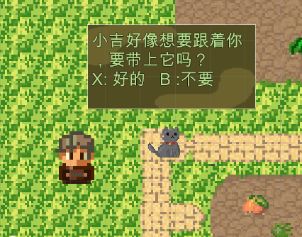
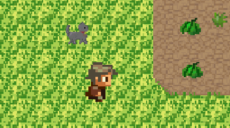

<style>
img{
    width: 60%;
    padding-left: 20%;
}
</style>

在上一篇博客中我提到自己最近产生了用Unity做一个2D像素小游戏的想法。我打算把制作游戏的过程记录在博客里。

我用aseprite画了一只小猫作为主角的宠物放在了游戏场景里，想让它和主角一起冒险。这篇博客的主题是如何让小猫跟随主角移动。
<br>

<br>
我设置的是当主角靠近小猫弹出对话框之后，按下手柄的"X"键让它自动跟随主角。首先我们需要检测出当对话框弹出的时候，用`if(Input.GetButton("Choose"))`函数来检测 "X"键是否被按下。其中""里的内容是自定义的键值，可以在edit -> project settings -> input里自行设置。一般情况下，手柄"X"键的名称是"joystick button 2"，可以google查自己手柄型号所对应的键值。

下一步就是获取主角和小猫所处的位置，计算出他们俩的距离。我们可以在小猫对应的脚本里定义变量`private GameObject hero`来表示主角，再用`hero = GameObject.Find("hero_name")`来获取主角的gameobject，其中"hero_name"就是给主角设定的标签名称。获取位置可以用`hero.transform.position`，得到的是一个代表xyz坐标的三维向量（因为游戏是2D环境，向量的第三个值是0）。

当我们获取小猫和主角的距离之后，就可以规划小猫走动的路径了，为了防止小猫和主角重叠，可以设定一个距离（`offset`）。而为了让小猫的走动看上去更加自然，用`Mathf.Lerp()`函数来对小猫现在的位置以及目标位置进行插值。

这一部分的代码如下：

```csharp
            //小猫和主角的固定距离
            Vector3 offset = hero.transform.forward * (-1.0f) + hero.transform.up * 1.0f;
			//插值的范围
            float interpolation = speed * Time.deltaTime;
			//小猫的目标坐标
            target.x = Mathf.Lerp(transform.position.x, hero.transform.position.x+offset.x, interpolation);
            target.y = Mathf.Lerp(transform.position.y, hero.transform.position.y+offset.y, interpolation);

            transform.position = target;
            transform.rotation = hero.transform.rotation;
```

这样一来，小猫就可以跟着主角走了！当然后面还有很多需要优化的东西。
<br>



Reference:
- [网上的Unity教程（有博客有视频，记不住是哪些了）]
