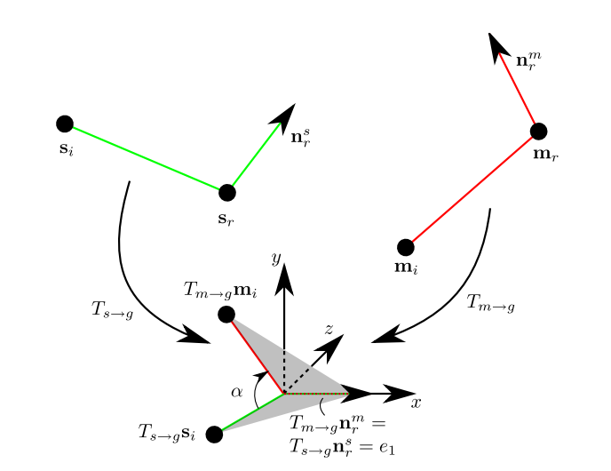

<head>
    
    
</head>

这是关于前一段时间复现的点云模板匹配论文的第二篇博客（[第一篇在这里](https://jyyyjyyyj.github.io/2021-10-01-registration1/)）。这篇博客的内容是如何从点云中提取用于后续匹配的点对，以及变换矩阵(transformation matrix)的计算。
整篇论文的流程图如下：
 

 

## 1. 点对提取

为了降低后续RANSAC搜索耗费的时间，我们需要从点云的边缘点（edge points）中提取出能够在一定程度上代表物体几何信息的点对$\{p_i,p_j\}$。
  
其中，$p_i$是在场景点云（scene cloud）的边缘点$\epsilon$中随机选取的，而$p_j$是在满足以上两个条件的情况下，在$\epsilon$中随机选取的。为了保证我们在场景点云$\epsilon$中提取的点对中至少有一个点$p_i$有$p_t$的概率（$p_t$可以设为0.999之类的）落在待匹配模型的边缘点$\Psi$上，我们要提取的$p_i$的个数至少为：

$$ n_1 = \frac{ln(1-p_t)}{ln(1-P(p_i \in \Psi))} $$

其中$P$代表的是一个点落在待匹配模型的边缘上的概率，我们可以用待匹配模型的边缘点和场景边缘点的数量之比来表示：

$$ P(p_i \in \Psi) = \frac{|\Psi|}{|\epsilon|} $$

$p_j$会在$p_i$的领域内提取，我们将这个邻域的直径设为$\delta$，也就是模板点云的包围盒直径，那么$p_j$同样属于$\Psi$的概率为：

$$ P(p_j \in \Psi) = \frac{|\Psi|}{|N_\delta(p_i)|} $$

那么可以用计算$n_1$的公式来计算$n_2$。这里需要注意的是，待匹配模型的边缘$\Psi$，和模板点云的边缘$\epsilon'$之间会有差异，因为场景点云对应的是三维扫描的结果，很有可能会存在噪声，而模板点云一般是由一个完整的CAD模型得来的。不过在噪声不是很大的情况下，我们可以假设$|\Psi| \approx |\epsilon'|$。（由于光学扫描很难扫到被遮蔽的部分，如果物体之间的遮蔽区域很大的话，二者的差距就会很离谱。）

每个点对需要满足以下两个要求：
 - 点与点之间的距离 $d \in [0.5\delta,0.7\delta]$。其中$\delta$ 是点云包围盒的直径长度。
 - $p_i$的边缘方向（edge direction）与 $\overrightarrow{p_i p_j}$ 的夹角的余弦值的绝对值小于0.7：$|cos(\angle(\overrightarrow{t_{p_i}},\overrightarrow{p_i p_j}))|<0.7$。
 
## 2. 点对特征提取
每个点对需要提取4个特征，经过离散化之后存入哈希表里以方便后续的查询。原文的作者采用了MurMurHash3这个哈希函数，可惜愚钝的我不太会用……于是就直接用C++里的unordered_map来实现这个功能了。

这4个特征很容易计算，分别是：
- 点对所构成的线段长度 ：$||p_i-p_j||_2$
- 点对向量与两个点处的边缘方向的夹角（在0到$\pi$之间）：$\angle(\overrightarrow{p_ip_j},\overrightarrow{tp_i})$，$\angle(\overrightarrow{p_ip_j},\overrightarrow{tp_j})$
- $p_i$处的两个主曲率之比：$\kappa_2/\kappa_1$

## 3. 变换矩阵
点云模板匹配的最终目的就是计算出场景点到模板点的变换矩阵（为什么不是模板点到场景点呢，我想我应该会在下一篇博客里写到吧……），使模板的点能够很好地契合到场景点里。在这里我参考了Drost等人论文里的方法（他们有图，看上去更直观）：

图中红色的线是一对模板点对，绿色的线是场景点对，二者端点上的箭头是法向量。首先用两个变换矩阵$T_{s\rightarrow g}$以及$T_{m\rightarrow g}$，将两个法向量转到$x$轴上，并让$s_r$和$m_r$这两个点与坐标系原点重合。接下来再计算两个点对向量之间的夹角$\alpha$，以及对应的旋转矩阵$R_x(\alpha)$。由此一来，我们就可以知道由场景点到模板点的旋转矩阵为：

$$T_{s\rightarrow m} = T_{s\rightarrow g}R_x(\alpha){T^{-1}_{m\rightarrow g}}$$

这样的话，就可以把比较复杂的变换矩阵计算拆分成几个相对简单的步骤。

## Reference
- [Drost的论文](https://ieeexplore.ieee.org/document/5540108/)
