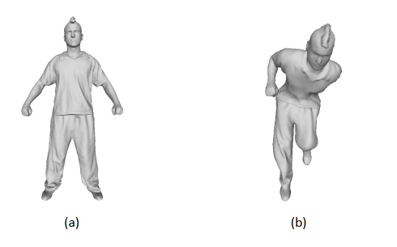
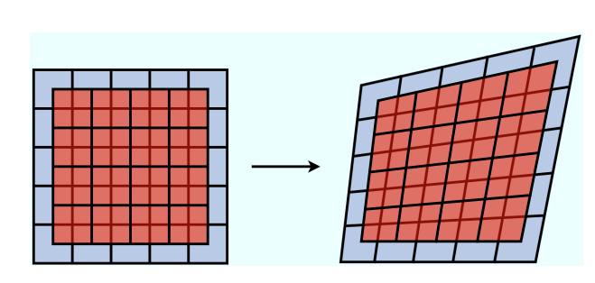
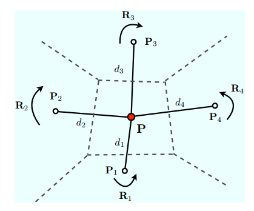

<head>
    
    
</head>

最近看了一些关于非刚性配准 (non-rigid registration)的论文。个人的理解是，非刚性配准经常会用在一些动态物体或者是会变形的物体上，配准的输入和目标虽然是同一个物体，但是它们的的形态是不一致的，比如像下面这张图，虽然这两个模型都属于同一个人，但是姿势却不一样：
 

 
找了一些顶刊的相关论文，从中先挑了最简洁（其实就是最短）的一篇读了，打算用一个很简单的笔记概括一下。

---

论文是2011年发表的 *Locally Rigid Globally Non-rigid Surface Registration*，从这篇文章的名字大致就能看出它的整体思想了，就是将一个表面看做是很多局部表面的集合，对于每个局部表面采用刚性配准，但是对于全局而言是非刚性配准。

首先作者用有向距离场（SDF）来表示源和目标形状，对于一个点$x$，和一个形状$A$，计算$\phi_A(x)$，就是$x$到$A$中离它最近的一个点的有向距离。为了节约计算时间和空间，在算SDF之前先降采样。

接下来用一个双网格FFD（free form deformation）框架来描述这个非刚性配准的问题。假设输入形状为$A$，目标形状为$B$，$A$的FFD网格会变形，而它的变形是通过网格上的控制点来控制的。除了FFD网格之外，还有一个用于采样的网格附加在FFD网格上，可以用FFD网格中的控制点来控制采样网格的形变。这两者之间的位置关系如下图（红色的是采样网格，背景灰蓝色的是FFD网格）：
 

 

---
假设整体采样区域是$S$，其中的一个子区域是$s$，那么刚性变换的误差函数就可以写成这样：

$$E = \sum_{s\in S}(\phi_B(s)-\phi_A(s))^2$$

通过求解$E$的最小值，就可以得出每个子采样区域的最佳刚性变换$T(s,w)$，其中$w$是刚性变化的参数。这个刚性变换$T$，是用在FFD网格里的控制点上的。因此，虽然对控制点进行了刚性变换，但是控制点的变化会使整个空间发生非刚性的变形。

此外，控制点和控制点之间是两两影响的，如果一个控制点旋转了，那它周边的四个控制点也要旋转，同时，如果某个控制点周围的点转了，它也得跟着转（这不是套娃吗？）因此，一个控制点的变换矩阵会受到其邻域点的影响，而这个影响的大小和点之间的距离有关，距离越近，影响越大。下图解释了这个现象：
 

 

接下来就是一个迭代的过程：计算每个子区域的刚性变换$T$ -> 将这个刚性变换应用到控制点上 -> 控制点的变化引发输入形状$A$的非刚性变化 -> 计算新的刚性变换，直至收敛。

---
这篇论文对我而言很有参考价值，尤其是FFD的概念，我觉得很有意思，或许下一篇博客就是关于这个的吧！

### Reference

- [paper](https://ieeexplore.ieee.org/document/6126411)
