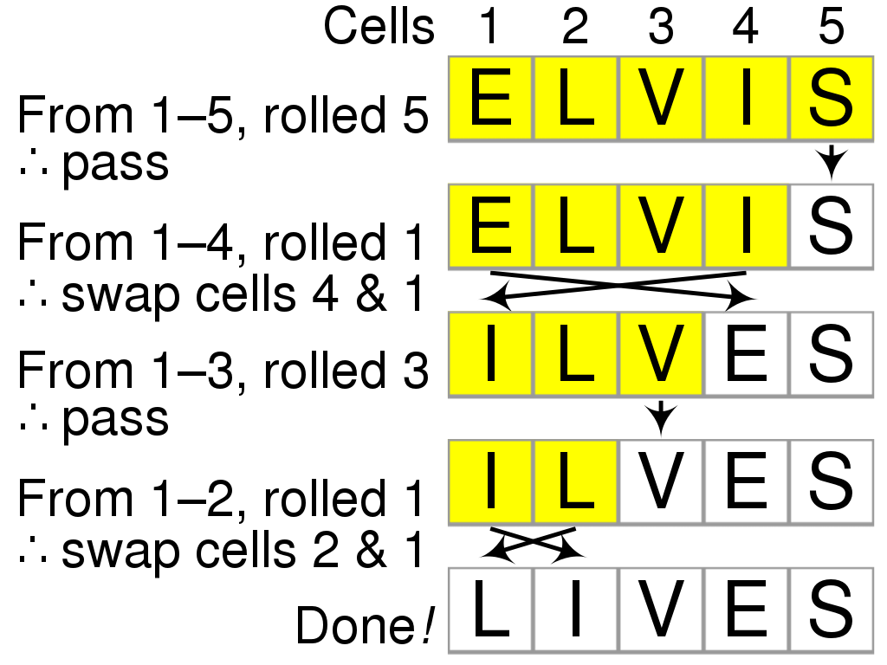

<head>
    <script src="https://cdn.mathjax.org/mathjax/latest/MathJax.js?config=TeX-AMS-MML_HTMLorMML" type="text/javascript"></script>
    <script type="text/x-mathjax-config">
        MathJax.Hub.Config({
            tex2jax: {
            skipTags: ['script', 'noscript', 'style', 'textarea', 'pre'],
            inlineMath: [['$','$']]
            }
        });
    </script>
</head>

<style> 
  img{ 
     width: 50%; 
     padding-left: 25%; 
  } 
</style>

最近在leetcode上做题的时候遇到了需要使用洗牌算法（shuffle algorithm）的题目。洗牌算法可以将一个数组打乱重新排列，而生成每种排列的概率是相等的。

上网查了查资料之后发现有好几种不同的洗牌算法，先记录其中的一个：Fisher–Yates shuffle。下图是从维基百科上找来的算法的一个例子：
<br>

<br>

假设需要被打乱的数组为$a$，其长度为$n$，那么数组里各个元素为$a_0,a_1,...,a_{n-1}$。进行排序的时候，从最后一个元素开始反向遍历数组（图里的例子是反向，其实正向也是一样的），对于数字里的第$i$个元素$a_i$，我们从$a_0$ ~ $a_i$中随机选择一个元素$a_j$作为$a_i$的新值，并将$i$, $j$两处的元素进行交换。这样一来，下标在$i$ ~ $n-1$部分的数组为乱序后的数组，而$0$ ~ $i-1$部分为待打乱的数组，不需要耗费额外的空间。这样的方法可以保证每种序列的生成概率都是相等的。

以下是Fisher–Yates算法的C++代码，用的是正向遍历：
```c++
vector<int> shuffle(const vector<int>& Elements) 
{
	vector<int> vShuffle = Elements;
	for (int i = 1; i < vShuffle.size(); ++i)
	{
		int r = rand() % (i + 1); //随选择0~i中的一个元素
		if (r != i)
		{
			swap(vShuffle[r], vShuffle[i]); //交换
		}
	}
	return vShuffle;
}
```
### Reference
  - [LeetCode 384](https://leetcode-cn.com/problems/shuffle-an-array/)
  - [Fisher–Yates shuffle](https://en.wikipedia.org/wiki/Fisher%E2%80%93Yates_shuffle)
