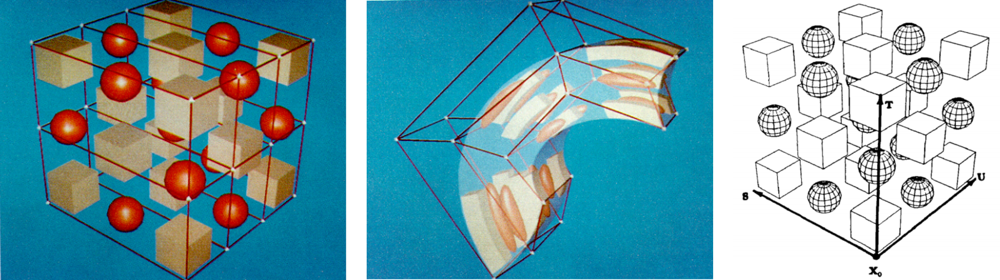
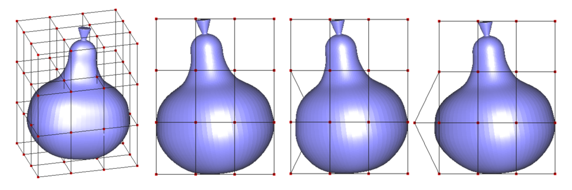

<head>
    
    
</head>

2021年的最后一个月到了！steam的年末大促刚刚结束，我在朋友的安利下购入了极乐迪斯科，还买了一个像素RPG浪漫沙加3，前者还没拆封，后者在pc上只有日文版和英文版，抱着学习日语的态度玩了18分钟就被扑面而来的各种片假名给劝退了。。

我最近学习了上一篇论文中所提到的自由变形（Free Form Deformation, FFD) 技术。自由变形是由*Free-Form Deformation of Solid Geometric Models*这篇写于1986年的论文提出来的。简单来说，自由变形在模型的外部添加一个由许多小格子（lattice）形成的框架，使我们可以通过拖动框架上的控制点来改变物体的形状。下图就是一个例子，最左边的小图展示了FFD框架，其中白色的小三角形就是控制点，而中间的小图是拖动控制点之后物体的变形效果。

 

 

自由变形的部分计算需要依靠物体的局部坐标，以模型中最角落的一个坐标为原点，可以构建一个局部坐标 $STU$，其效果就像上图最右所示，令这个原点为$X_0$，我们可以用以下的公式来表示模型中任意一个点。
$$X = X_0 + sS+tT+uU$$

其中 $(s,t,u)$ 为局部坐标，需要注意的是局部坐标的范围处于 $(0,1)$ 之内。局部坐标通过$STU$轴之间的叉乘来计算（公式打起来有点麻烦懒得写了）。为了图方便，其实可以事先旋转模型令 $STU$ 轴分别平行于笛卡尔坐标系里的 $XYZ$ 轴。$STU$ 轴的方向在初始化一次之后就不需要改变了。

假设在 $S,T,U$ 方向上分别有 $l,m,n$个控制点，那么每个控制点的局部坐标$P_{ijk}$就可以如下公式来表示

$$P_{ijk} = X_0 + \frac{i}{l}S+\frac{j}{m}T + \frac{k}{n}U$$

接下来是这个方法最重要的部分，也就是曲面变形的计算。由于我们在变形的过程中并不会改变点的索引以及点与点之间的连接关系，所以只需要改变点坐标即可。点的坐标变换是由一个三项贝恩斯坦多项式(Bernstein polynomial)计算的。

贝恩斯坦多项式的表达式如下：

$$b_{n,i}(u) = \frac{n!}{i!(n-i)!}u^i(1-u)^{n-i}$$

曲面上的一个点$X$，其通过改变FFD控制点坐标所得到的变形后的笛卡尔坐标为$X_{ffd}$：

$$X_{ffd} = \sum\limits_{i=1}^{l}b_{l,i}(s)[ \sum\limits_{j=1}^{m}b_{m,j}(t)(\sum\limits_{k=1}^{n}b_{n,k}(u)P_{ijk})] $$

其中$(s,t,u)$为该点的局部坐标，$P_{ijk}$是控制点的笛卡尔坐标。

我用OpenGL写了一个乞丐版的FFD示例（因为目前还没有实现鼠标拖动控制点的功能，控制点坐标是我手动输入改的），用的是一个梨子的模型。从左到右分别是梨子，梨子的侧视图，将同一个控制点分别向内/向外拖得到的变型后的侧视图。
 

 

### Reference
- [FFD paper](https://dl.acm.org/doi/abs/10.1145/15922.15903)
- [编程时的部分参考](https://www.researchgate.net/publication/314261522_FREE_FORM_DEFORMATION_METHODS_-_THE_THEORY_AND_PRACTICE)
