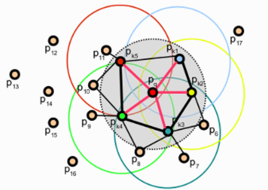

<head>
    
    
</head>

一个多星期没写博客了，天气又变冷了。最近忙着写研究课题的中期报告以及选修课的报告，还感冒了……心累。还好中期报告可以用英文写，不然我可能要当场退学了（开玩笑的）。

这篇博客的主题是点特征直方图（PFH），是由PCL的开发者提出的。PFH是一种能够描述某个点及其k-邻域所包含的一小块区域的表面特征的描述符，它是基于点的法向量来计算的。按照原作者在PCL的tutorial中所写，PFH的原理是："It attempts to capture as best as possible the sampled surface variations by taking into account all the interactions between the directions of the estimated normals."  因此PFH的质量和法向量的估计是否准确有大的关联。

如下图所示，PFH需要计算点$p_q$的k-邻域中的所有点两两之间的关系：

对于这个k-邻域中的每一对点$\{p_s,p_t\}$，可以生成一个以$p_s$为原点的局部坐标系$uvw$，其中$u$轴与$p_s$点的法向量$n_s$平行，$v$轴方向为为$(p_t-p_s)\times u$轴的叉乘，而$w = u \times v$。下图就是一个例子：

在这个基础上，我们可以针对每个点对计算一个带有四个元素的特征向量$<\alpha,\phi,\theta,d>$。其中$d$是$p_s$和$p_t$之间的距离，$\theta = \arctan(w \cdotp n_t, u \cdotp n_t)$，其他的两个特征的计算方法可以直接从上图看出来。

在此之后，每个点对应的四个特征都被分散到$b$个子区间里，通过统计k-邻域中所有点的特征在这$b$个区间里出现的次数，就可以画出该点对应的直方图。在编程的时候`#include <pcl/features/pfh.h>`并调用`pcl::PFHEstimation`这个类，就可以计算PFH了。

由于计算一个点的PFH时，需要计算k-邻域中每个点和其余所有点组成的点对的特征向量，因此它的复杂度为$O(n^2)$。为了降低复杂度作者提出了一个简化版本，即为 fast point feature histogram (FPFH)。

在计算一个点$p_q$的FPFH时，只考虑$p_q$和k-邻域中的点组成的点对，由此复杂度从$O(n^2)$降到了$O(n)$。此外，每个点对只计算$<\alpha,\phi,\theta>$这三个特征，这个简化后的特征被称为simplified PFH (SPFH)。最终的FPFH由以下公式计算得到：

$$FPFH(p_q) = SPFH(p_q) + \frac{1}{k}\sum_{i=1}^k \frac{1}{\omega_i} \cdotp SPFH(p_i)$$

其中$\omega_i$代表$p_i$的权重，对应了$p_q$和$p_i$之间的距离。

FPFH的示例图如下图所示，其中红色的点标出了计算$p_q$的SPFH所需要的点对，对应了上式等号右边的第一项。而用黑线表示的是需要进行额外加权操作的点对，对应了上式等号右边的第二项，其中有些点对在第一项和第二项里各被用了一次，用加粗的黑线表示。

与PFH相比，FPFH不仅在计算复杂度上有所降低，同时也简化了结果的表示，因为每个点只有一个FPFH。某个点的FPFH可能会考虑与其距离大于邻域的半径的点，不过这个距离不会大于2倍直径。

------
第一次接触PFH大概是在一年前，那个时候我正在休学实习，在点云处理方面还是个完全的新手，看得云里雾里的。过了一年再回头看这个概念，发觉其实并不难。这说明这一年里多少还是有点进步的吧。

### Reference
- [PFH](https://pcl.readthedocs.io/projects/tutorials/en/master/pfh_estimation.html#pfh-estimation)
- [FPFH](https://pcl.readthedocs.io/projects/tutorials/en/master/fpfh_estimation.html#fpfh-estimation)

