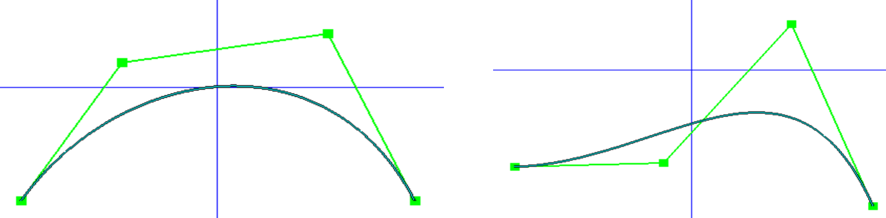
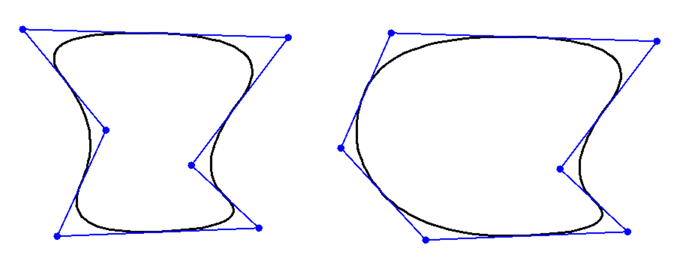

<head>
    
    
</head>

2021年马上就要结束了！不出意外的话这应该是今年最后一篇博客。本篇博客的内容是贝塞尔曲线和B样条曲线，是图形学里很常用并且非常基础的概念。前段时间的课上又讲了关于这两种曲线的知识，于是想做一个很简单的记录。

----
在二维情况下，曲线可以根据曲线的方程表达式分为三类：

- 显式曲线(explicit)： $y=f(x)$
- 隐式曲线(implicit)： $f(x,y) = 0$
- 参数曲线(parametric)：$c(t) = (x(t),y(t))$

其中，贝塞尔曲线和B-样条曲线是两种很常用的参数曲线。

### 贝塞尔曲线

贝塞尔曲线是基于一系列控制点$\{P_i\}$生成的。曲线的表达式如下：

$$C(t) = \sum_{k=0}^n P_iB_i^n(t)$$

其中基函数$B_i^n(t)$为贝恩斯坦多项式，在[自由变形](https://jyyyjyyyj.github.io/2021-12-04-FFD/)这篇博客里中有提及。贝恩斯坦多项式的表达式为：

$$B_i^n(t) =  \frac{n!}{i!(n-i)!}t^i(1-t)^{n-i}$$

贝塞尔曲线的形状与控制点的数量，控制点的个数均有关系。下图是一条二维坐标系中三次贝塞尔曲线的例子（从课堂作业上截来的图），可以看出，当改变一个控制点的位置，贝塞尔曲线的全局形状也会跟着改变：

贝塞尔曲线的特点是，移动一个控制点时，全局范围内的点也会跟着改变，随着控制点数量的增多，贝恩斯坦多项式中项的次数也会跟着变大。两条贝塞尔曲线拼接时，很难满足连续要求。

### B-样条曲线

与贝塞尔曲线不同的是，B-样条曲线是非全局的，也就是一个控制点的变化只会影响到局部的曲线。一个$n$次B-样条曲线的表达式如下：

$$C(t) = \sum_{k=0}^n P_iN^n(t-i)$$

其中，$N^n(t)$为B-样条曲线的基函数，其递归表达式如下：

$$
N^0(t) = \left\{  
             \begin{array}{**lr**}  
             x=1, &  if |t|<\frac{1}{2}\\  
             y=0, & otherwise.
             \end{array}  
\right.\\
N^{(i+1)}(t)  = \int N^0(s)N^{i}(t-s)ds
$$

以下是b样条曲线的一个例子，可以看到，当改变了其中一个控制点时，只有一部分的曲线会改变。

-----
### Reference
- [Computer Graphics Curves](https://www.tutorialspoint.com/computer_graphics/computer_graphics_curves.htm)

- 课堂PPT

Happy new year!!
