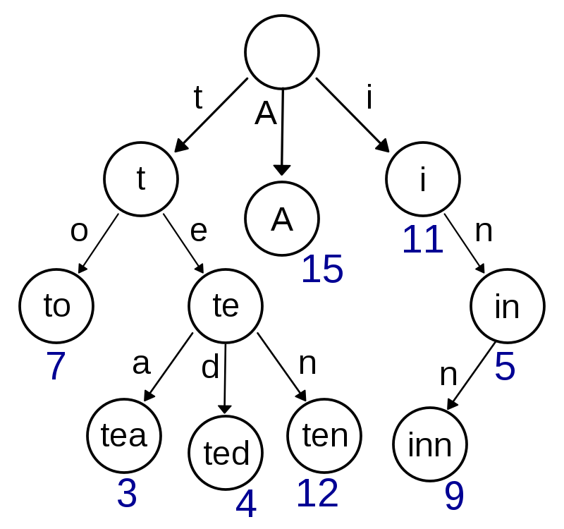

字典树(Trie tree)又称为前缀树，可以高效地存储和查询大量字符串。我最近在做leetcode第208题的时候接触到了字典树的概念。

字典树结构的一个例子如下图（来自维基百科）。在字典树中，除根节点之外，每个节点都代表一个字符，并且包含一个布尔量"isEnd"来表明该节点是否是某一个字符串的终点，一个包含了其指向的子节点的矩阵。如果是的话，布尔量的值为true。这样一来，从根节点开始到任意一个终点节点的路径就组成了一个字符串。从图中可以看出，具有公共前缀的字符串，比如最右侧的"in"和"inn"，共享了路径。这样能够提高存储和查询的效率。




需要注意的是，在字典树中，终点节点不一定是叶子节点。比如"in"的"n"所在的节点不是叶子节点。


### 插入

向字典树中存入一个字符串a时，首先查询与根节点连接的节点中是否有节点包含a的第一个字符a[0]。如果没有，那就创建一个包含a[0]的新节点与根节点连接，并在该节点之后依次创建包含a[1], a[2],..., a[n-1]的新节点；如果有，那就顺着该节点继续重复以上步骤。最后，需要将代表a[n-1]的终点节点中的"isEnd"设为true。

### 查询

查询字典树中是含有字符串a时，从根节点开始，沿着路径依次查询是否包含a中的各个字符，如果有一条从根节点开始的路径能够代表a，且该路径的最后一个节点的"isEnd"值为true，那么字典树中包含a。

打了这么多字还是觉得有点乱乱的，下面就直接放leetcode 208题的代码吧：


```c++
class Trie {
public:
    Trie() {
        isEnd = false;
		//字典树中只包含小写字母，因此next矩阵的大小为26
        for(int i = 0;i<26;i++)
        {
            //initialize
            next[i] = nullptr;
        }
    }
    
	//插入
    void insert(string word) {
        Trie* root = this;
        int tmp;
        for(char it: word)
        {
            tmp = it-'a';
            if(root->next[tmp] == nullptr)
            {
				//如果子节里不包含相应的字符，就新建一个子节点
                Trie* node = new Trie();
                root->next[tmp] = node;
            }
            root = root->next[tmp];
        }
        root->isEnd = true;
    }
    
	//查找单词
    bool search(string word) {
        Trie* root = this;
        int tmp;
        for(char it: word)
        {
            tmp = it-'a';
            if(root->next[tmp] == nullptr)
                return false;
            root = root->next[tmp];
        }
        return root->isEnd;      
    }
    
	//查找公共前缀
    bool startsWith(string prefix) {
        Trie* root = this;
        int tmp;
        for(char it: prefix)
        {
            tmp = it-'a';
            if(root->next[tmp] == nullptr)
                return false;
            root = root->next[tmp];
        }
        return true;
    }

private:
    bool isEnd; //节点是否是某个单词的结尾
    Trie* next[26]; //该节点指向的子节点
};

/**
 * Your Trie object will be instantiated and called as such:
 * Trie* obj = new Trie();
 * obj->insert(word);
 * bool param_2 = obj->search(word);
 * bool param_3 = obj->startsWith(prefix);
 */
```

### Reference

- [leetcode 208](https://leetcode-cn.com/problems/implement-trie-prefix-tree/)
- [wiki](https://en.wikipedia.org/wiki/Trie)
- [简单易懂的字典树](https://zhuanlan.zhihu.com/p/143975546)
