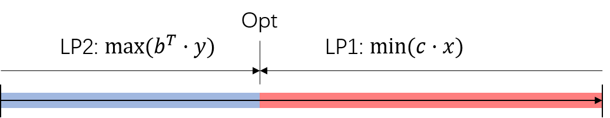
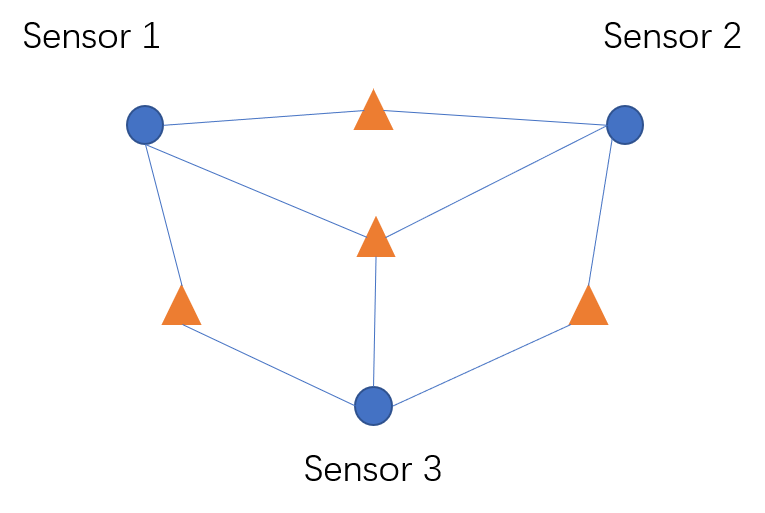

<head>
    
    
</head>

本篇博客的内容是对偶线性规划（Dual LP），是这学期选修的一门课里的内容（腊月里考试，唉），记下来当作是复习了。

首先，一个线性规划问题包含输入，输出，约束条件以及目标函数这四个部分，它的基本形式是这样的：

Input: $A$, $b$, $c$

Output: $x \in \mathbb{R}$

Constraint: $A \cdot x \geq b$

Objective funtion: $\min(c \cdot x)$

那么它的对偶线性规划为：

Input: $A$, $b$, $c$

Output: $y \in \mathbb{R}$

Constraint: $A^T \cdot y \leq c^T$

Objective funtion: $\max(b^T\cdot y)$

为了方便表示，第一个线性规划问题称为LP1，它的对偶线性规划问题为LP2。同时，LP1也可以看做是LP2的对偶。

LP1和LP2之间有如下的特性：

##### 1. LP1和LP2的目标函数的最优值相同
如下图所示，蓝色是LP2的目标函数值的范围，红色部分是LP1的目标函数值的范围，二者的最优值Opt是相同的。换句话说，如果LP1和LP2的目标函数值相同，那么该值即为最优值。

##### 2. 互补松弛性（complementary slackness）

这个留到下次再继续补充

-----

#### 一道例题

例题来自于课堂的PPT。假设我们有如下图所示的传感器网络，其中圆代表传感器，三角形代表需要检测的目标，一个传感器可以监测所有与其相连的目标。假设每个传感器最多只能使用一个小时，且必须同时监测所有的目标，我们想要最大化监测目标的时间。由图可知，想要同时检测所有的三角形，可选的传感器组合有： ${\{1,2\},\{1,3\},\{1,2,3\}}$。

将其转化为一个线性规划问题：

Input: 传感器集合$S$，对于集合中的每个传感器$s_i \in S$，其所能检测到的目标集合 $T_s$。

Output: 每种能够覆盖所有目标的传感器组合$C_1,...,C_p$的使用时间$t_1,...,t_p$。

Constraint: 每个传感器的使用时间不可以超过一个小时，即对于任意一个传感器$s_i$：

$$\sum_{j:i \in C_j} t_j \leq 1$$

Objective Function: $\max(t_1+...+t_p)$

其中，约束条件可以转化为$Ax \leq b$的形式，其中$A$ 中的任一元素$a_{ij}$ 表示传感器$s_i$否属于组合$C_j$，如果属于，$a_{ij}$为1，反之为0；$x=[t_1,t2,...,t_p]^T$, $b = [1,1,...,1]^T$。而目标函数可以写为$\max (c*x)$，其中$c = [1,1,...,1]$。上面这张图中共有3个传感器以及3种可用的组合，求出的最优解为$x=[0.5,0.5,0.5]$，目标函数的最优值为1.5。

当传感器以及监测目标的数量变得非常大的时候，方程的数量也会变多。此时我们可以借助它的对偶线性规划来进行求解。即将约束条件和目标函数转换成如下形式：

Constraint: $A^T y \geq c^T$

Objective Function: $\min (b^Ty)$

这样方程的数量就变成了可选组合$C$的数量。我们可以通过一种迭代的方法（Garg-Konemann算法）来求对偶LP的可行解。该算法的步骤如下：

1. 将$x$中每个元素的初始值设为0，$y$中每个元素的初始值设为$\delta$，$\delta$是一个很小的值。
2. 找出最小化$a_{1i}y_1+a_{2i}y_2+...+a_{ni}y_n$ 的$i'$。此时，我们可以将第$i'$个约束条件看做是最有问题的约束。
3. 如果$a_{1i'}y_1+a_{2i'}y_2+...+a_{ni'}y_n \geq 1$ ，那么所有约束条件都满足了（因为其他不等式的左侧只会比它大），此时我们获得了一个可行解，算法结束。
4. 如果第$i'$个约束没有满足，那么对于所有令$a_{ji'}=1$的$j$，我们令$y_{j} \leftarrow  (1+\theta)y_j$。
5. $x_{i'} \leftarrow  x_{i'}+\tau$
6. 跳转到第二步。

其中$\theta,\delta,\tau$这三个参数需要提前设定。其中$\tau$和$\delta$的设置可以参考以下公式（证明略）：

$$\tau = \frac{\ln(1+\theta)}{\ln{1+\theta}-\ln(\delta)}$$

$$\delta = (1+\theta)((1+\theta)n)^{-\frac{1}{\theta}}$$

一般情况下，问题的解只会包含可选组合中的一小部分，因此就算传感器数量较多，也不会迭代太多次数。

----
待续……

