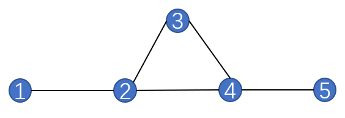

<head>
    
    
</head>

本篇博客记录了原始-对偶（Primal-Dual）方法，是上一篇博客[线性规划的对偶问题](https://jyyyjyyyj.github.io/2022-01-15-duallp/)的扩展。内容主要来自这学期选修的一门课程以及网络上的资料。

同上一篇博客一样，以下称原线性规划问题为LP1，其对偶线性规划为LP2，二者的基本形式如下：

#### LP1:
Input: $A$, $b$, $c$

Output: $x \in \mathbb{R}$

Constraint: $A \cdot x \geq b$

Objective funtion: $\min(c \cdot x)$

#### LP2:

Input: $A$, $b$, $c$

Output: $y \in \mathbb{R}$

Constraint: $A^T \cdot y \leq c^T$

Objective funtion: $\max(b^T\cdot y)$

### 原始-对偶线性规划(Primal-Dual LP)
在写primal-dual方法之前，先回顾一下对偶线性规划的**互补松弛性(complementary slackness)**：

假设LP1的解为$x$，LP2的解为$y$，如果此时$y$中的某个变量$y_i$的值大于0，那么其在LP1中对应的约束条件中的符号应为等号，即: $\sum_{j=1}^{n} a_{ij}x_j = b_i$，此时我们称这个约束是**紧**的。假如$y_i=0$，那么LP1中对应的约束应该取不等号，即：$\sum_{j=1}^{n} a_{ij}x_j > b_i$，此时这个约束是**松**的。

Primal-Dual方法从对偶LP的可行解出发, 在满足互补松弛条件的前提下, 使得原始变量朝着可行解的方向迭代。在此用课堂上一道比较简单的例题来帮助理解。

#### 例题：支配集(dominating set)问题
假设有一个如下图所示的社交网络$S=\left \\{V,E\right \\}$，其中$V$代表人，$E$中存放社交关系（举个例子，图中1和2是朋友，那么$\left\{1,2\right\} \in E$）。我们需要在这群人中选出一个子集$S$，在使$S$中人数尽可能少的同时，让我们可以通过$S$联系到$V$中所有的人。由此可知，在一个可行解中，$V$中的每个人$v_i$要么属于$S$，要么是$S$中某个人的朋友。

于是写出线性规划问题LP1：

Input：$V$, $E$

Output: $x_1,...,x_5 \in \left\{0,1\right\}$，代表是否选择第$i$个人到子集$S$里。

Constraint: $Ax \geq b$

Optimization function: $\min(cx)$

其中 

$$A =\left[ \begin{array}{ccccc}
1&1&0&0&0\\
1 &1& 1& 1& 0\\
0 &1 &1& 1& 0\\
0 &1& 1& 1& 1\\
0 &0 &0& 1& 1\end{array}
\right],  b = \left[ \begin{array}{c}
1\\
1 \\
1\\
1 \\
1 \end{array}
\right], c = b^t$$

它的对偶线性规划LP2为：
Output: $y_1,...,y_5$

Constraint: $A^ty \leq c^t$

Optimization function: $\max (b^ty)$

我们用Primal-Dual方法来求解这个线性规划问题。根据互补松弛性，若$x_i > 0$，那么$A^{(i)}y = c_i$，为紧约束；当$y_i > 0$时，$A_ix = b_i$。

Primal-Dual方法的流程如下：

1. 给$x$和$y$中每个元素赋初始值0。
2. 从$y$中选取一个不存在于任何紧约束中的变量$y_{i'}$。
3. 增大$y_{i'}$，直到它让一些LP2中的约束由松变紧。用$j_1,...,j_k$来表示这些约束。
4. $x_{j_i} \leftarrow 1,...,x_{j_k} \leftarrow 1$。
5. 如果此时$x$满足了LP1的约束条件，终止迭代，反之跳到第2步。

该方法是一个N-近似方法，N为最多可拥有的朋友数量+1。

----
待续……

### Reference

- [Primal-Dual](https://blog.csdn.net/qx3501332/article/details/105546208/)
