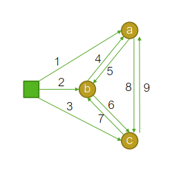

<head>
    
    
</head>

本篇博客记录了原始-对偶（Primal-Dual）方法，是上一篇博客[线性规划的对偶问题](https://jyyyjyyyj.github.io/2022-01-15-duallp/)的扩展。内容主要来自这学期选修的一门课程以及网络上的资料。

同上一篇博客一样，以下称原线性规划问题为LP1，其对偶线性规划为LP2，二者的基本形式如下：

#### LP1:
Input: $A$, $b$, $c$

Output: $x \in \mathbb{R}$

Constraint: $A \cdot x \geq b$

Objective funtion: $\min(c \cdot x)$

#### LP2:

Input: $A$, $b$, $c$

Output: $y \in \mathbb{R}$

Constraint: $A^T \cdot y \leq c^T$

Objective funtion: $\max(b^T\cdot y)$

### 原始-对偶线性规划(Primal-Dual LP)
在写primal-dual方法之前，先回顾一下对偶线性规划的**互补松弛性(complementary slackness)**：

假设LP1的解为$x$，LP2的解为$y$，如果此时$y$中的某个变量$y_i$的值大于0，那么其在LP1中对应的约束条件中的符号应为等号，即: $\sum_{j=1}^{n} a_{ij}x_j = b_i$，此时我们称这个约束是**紧**的。假如$y_i=0$，那么LP1中对应的约束应该取不等号，即：$\sum_{j=1}^{n} a_{ij}x_j > b_i$，此时这个约束是**松**的。

Primal-Dual方法从对偶LP的可行解出发, 在满足互补松弛条件的前提下, 使得原始变量朝着可行解的方向迭代。在此用课堂上一道比较简单的例题来帮助理解。

#### 例题：支配集(dominating set)问题
假设有一个如下图所示的社交网络$S=\left\\{V,E\right\\}$，其中$V$代表人，$E$中存放社交关系（举个例子，图中1和2是朋友，那么$\left\\{1,2\right\\} \in E$）。我们需要在这群人中选出一个子集$S$，在使$S$中人数尽可能少的同时，让我们可以通过$S$联系到$V$中所有的人。由此可知，在一个可行解中，$V$中的每个人$v_i$要么属于$S$，要么是$S$中某个人的朋友。

于是写出线性规划问题LP1：

Input：$V$, $E$

Output: $x_1,...,x_5 \in \left\\{0,1\right\\}$，代表是否选择第$i$个人到子集$S$里。

Constraint: $Ax \geq b$

Optimization function: $\min(cx)$

其中 

$$A =\left[ \begin{array}{ccccc}
1&1&0&0&0\\
1 &1& 1& 1& 0\\
0 &1 &1& 1& 0\\
0 &1& 1& 1& 1\\
0 &0 &0& 1& 1\end{array}
\right],  b = \left[ \begin{array}{c}
1\\
1 \\
1\\
1 \\
1 \end{array}
\right], c = b^t$$

它的对偶线性规划LP2为：
Output: $y_1,...,y_5$

Constraint: $A^ty \leq c^t$

Optimization function: $\max (b^ty)$

我们用Primal-Dual方法来求解这个线性规划问题。根据互补松弛性，若$x_i > 0$，那么$A^{(i)}y = c_i$，为紧约束；当$y_i > 0$时，$A_ix = b_i$。

Primal-Dual方法的流程如下：

1. 给$x$和$y$中每个元素赋初始值0。
2. 从$y$中选取一个不存在于任何紧约束中的变量$y_{i'}$。
3. 增大$y_{i'}$，直到它让一些LP2中的约束由松变紧。用$j_1,...,j_k$来表示这些约束。
4. $x_{j_i} \leftarrow 1,...,x_{j_k} \leftarrow 1$。
5. 如果此时$x$满足了LP1的约束条件，终止迭代，反之跳到第2步。

该方法是一个N-近似方法，N为最多可拥有的朋友数量+1。

#### 例题2：健壮的网络设计(Survivable network design)

我其实不清楚如何把survivable翻译成中文，个人认为这个词是对干扰的鲁棒性较高的意思。

假设我们有如下的一个网络，其中每个圆代表一个传感器，方块代表基站，基站和传感器，传感器和传感器之间可以互相传递信息，而建立每条信息同道需要花费一定的代价（标在了直线上，代价等于直线的编号）。我们想要在尽量减少代价的同时，令基站向所有传感器发送信息，且当随机一条线路损毁的时候，信息的传递不受影响。

写出如下的线性规划问题LP1：

Input: 基站，传感器集合$V$，所有可建立的连接$l=[l_1,l_2,...,l_9]$，及对应的代价$c = [1,2,...,9]$。

Output: 需要建立的连接 $x = [x_1,x_2,...,x_9]^t, x\in \\{0,1\\}$。

Constraint: 基站必须能够向所有传感器发射信息，即便有一条路线毁坏。即在传入任意一个传感器集合的路径中，必须至少有两条路是通的。以传感器$a$为例，其对应的限制条件是：$x_1+x_4+x_9 \geq 2$；如果将$a,b$看做是一个传感器集合，其对应的限制条件是：$x_1+x_2+x_7+x_9 \geq 2$。

Optimization function: $\min(cx)=\min(x_1+2x_2+...+9x_9)$

写完之后发现有个问题，那就是限制条件的数量是$2^n$，其中$n$是传感器的数量。如果我们有很多传感器，那么限制条件也会变得特别多（这一点和例题1很像）。

接下来我们对算法进行一下简化，将“当随机一条线路损毁的时候，信息的传递不受影响”这个条件去掉，换句话说，就是把约束条件不等号右边的2变为1，这个简化后的问题用LP1'表示。此时，我们可以用Edmond算法（可以参考[这里](https://blog.csdn.net/weixin_43751631/article/details/101191081)）快速地解决它。Edmond算法解出的路径编号集合为 $S=\\{1,2,3\\}$，即为基站到传感器的三条路径。

随后，我们查找$S$是否满足LP1中的一些约束条件，并移除这些条件。

LP1中的约束条件如下：

$$
x_1+x_4+x_9 \geq 2 \\
x_2+x_5+x_7 \geq 2 \\
x_3+x_6+x8 \geq 2\\
x_1+x_2+x_7+x_9 \geq 2\\
x_1+x_3+x_4+x_6 \geq 2\\
x_2+x_3+x_5+x_8 \geq 2\\
x_1+x_2+x_3 \geq 2
$$

$S$能够满足除了前三个之外的不等式。我们去除已被满足的约束，剩下未被满足的约束：

$$
x_4+x_9 \geq 1\\
x_5+x_7 \geq 1\\
x_6+x_8 \geq 1
$$

这三个不等式分别对应$a,b,c$三个单独的节点。针对余留下的约束，我们写出如下的线性规划LP2及其对偶线性规划LP3：

##### LP2
Input, output, constraint参照前文。

Optimization function: $\min(4x_4+...+9x_9)$

##### LP3
Input: 参照前文

Output: $y = [y_a,y_b,y_c]$

Constraint: 
$$ y_a \leq 4\\
y_a \leq 9\\
y_b \leq 5\\
y_b \leq 7\\
y_c \leq 6\\
y_c \leq 8
$$

Optimization function: $\max(y_a+y_b+y_c)$

然后，采用Primal-Dual方法来解决问题。首先将剩余的每个最小传感器集合（其实就是单个传感器）中变量的值变为4，此时LP3的第1个约束变紧，对应LP2中$x_4$值变为1。接下来将$y_a$去掉，剩下的值变为5，此时LP3中第3个约束变紧，对应LP2中$x_5$的值变为1。最后去掉$y_b$，令剩下的$y_c$值变为6，对应$x_6$变为1。

由此可知，最后求得的LP1的解为$S=\\{1,2,3,4,5,6\\}$。

例题2中算法的整体步骤如下：

1. 用Edmond算法解决简化后的问题，算法的结果为$S$。对$S$中的每一个元素$i$，令$x_i = 1$。
2. 移除原问题中已被满足的约束条件。
3. 用Primal-Dual方法使解满足剩下的条件。
3.1.令剩余的约束条件为$C = \\{c_1,...,c_p\\}$。若$C = \emptyset$，终止算法。剩余的对偶变量为$y_{c_1},...,y_{c_p}$。$C$的*最小子集*的集合为$C'$。
3.2. 对于$C'$中的每个最小子集$c$，增大$y_c$的值，直到第$i$个约束变紧。
3.3. $x_i \leftarrow 1$，移除被满足的约束，跳回步骤3.1.

其实我对于“最小子集”这个概念有些不太明白，老师在课堂资料上写的原文是"minimal set"，结合题目之后我的理解是，这个所谓的minimal set应该就是指单个的传感器吧。

### Reference

- [Primal-Dual](https://blog.csdn.net/qx3501332/article/details/105546208/)
