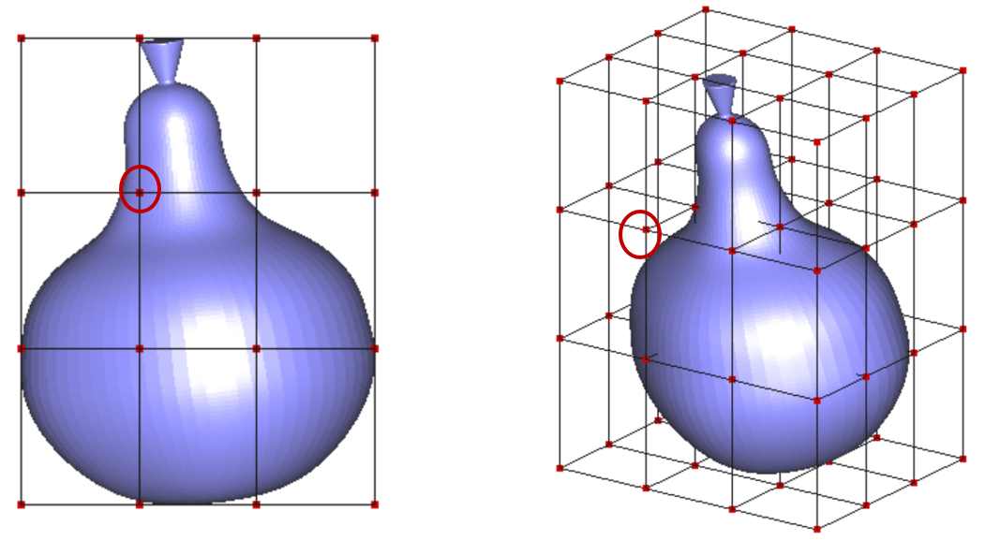
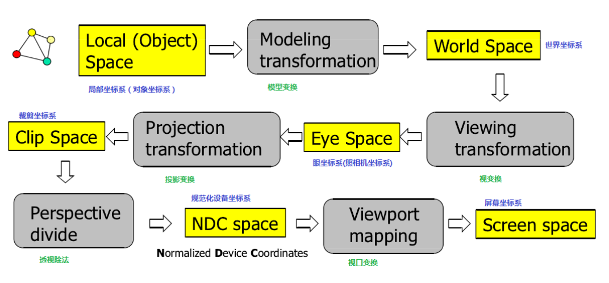

<style> 
  img{ 
     width: 60%; 
     padding-left: 20%; 
  } 
</style>


在几个月前的博客[自由变形](https://jyyyjyyyj.github.io/2021-12-04-FFD/)里，我用OpenGL实现了自由变形（Free Form Deformation, FFD）算法，然而当时的代码只能通过手动输入来修改控制点坐标。我对代码做了一些改进，实现通过鼠标拖动控制点来改变物体形状的功能。

GLUT中的鼠标交互函数的声明是这样的：`void glutMouseFunc(void(*func)(int button,int state,int x,int y))`

其中，`button`表明鼠标按键，它有3个可能取值：`GLUT_LEFT_BUTTON, GLUT_MIDDLE_BUTTON, GLUT_RIGHT_BUTTON`，分别代表鼠标左键，滚轮和右键。`state`表明调用函数时，鼠标是否被按下，它的取值可以为：`GLUT_DOWN, GLUT_UP`。而x和y表明当前鼠标所在的位置（左下角为原点）。如果我想通过鼠标左键来拖动控制点，那么需要在函数中判断鼠标左键是否被按下，如果被按下，则判断是否选中了控制点，如果选中且鼠标产生了拖动，那么更改相应的控制点的坐标。

我将整个流程分为了两部分：选取控制点和拖动控制点。

### 1. 选取控制点

实现这个功能主要考虑两点：一是要检测到鼠标按下的信号，且获取鼠标所在的位置，二是查找是否有控制点被鼠标选中（即鼠标的屏幕坐标和控制点的屏幕坐标是否有重叠）。我们可以获取鼠标在屏幕空间的xy坐标，将其转化为三维世界坐标，再与控制点坐标进行对比。

当鼠标选中屏幕中的某一个像素的时候，我们可以认为它产生了一条z坐标范围从0到1的线段，线段上的每一个点都拥有相同的屏幕坐标（或许可以理解为从鼠标出发，垂直屏幕往里射入的一条线）。如果鼠标选中了控制点，那么该控制点应该位于这条段上。需要注意的是，有时候一条线段上会有不止一个控制点。下图左侧是一个梨子模型的侧视图，控制点网格的大小是4×4，对于屏幕中任意一个控制点，还有3个被挡住的控制点与其拥有相同的屏幕坐标。因此，假设我们在这种情况下选中圆圈中的控制点，其产生的线段实际上经过了4个控制点，此时我们应该选择距离人眼最近的那个。如果将梨子旋转到右图的位置，并点击圆圈中的位置，此时选中的有且仅有一个控制点。



这样一来，就可以写出判断鼠标是否选中控制点的流程了：

1. 判断鼠标左键是否按下，如果按下，获取鼠标的屏幕坐标。

2. 将屏幕坐标通过反投影转换成三维的世界坐标，此时代入-1和1两个不同的z，获取鼠标所产生的线段的起始和终点。

3. 判断是否有控制点落在了线段上，如果有多个控制点，选择距离人眼最近的那个。


顺带一提，OpenGL中坐标转换的顺序如下图：




## 2. 拖动控制点

当我们选中了某个控制点之后，下一步就是拖动它。判断控制点是否被拖动，只需要判断在鼠标左键从按下到抬起的这段时间里，光标的位置是否产生了改变。

此时我们用一个全局布尔量`drag`来判断鼠标是否在拖拽控制点。当检测到鼠标点击控制点时，令`drag = true`，并记录此时被选中的控制点。当鼠标没有被按下且`drag`为true的时候（说明这个时候已经拖完了），令`drag = false`，根据目前鼠标的位置更新被拖动的控制点的位置。

实现第1部分和第2部分的函数`onmouse(int button, int state, int x, int y)`如下：

```c++
void onmouse(int button, int state, int x, int y)
{
	GLint viewport[4];
	GLdouble mvmatrix[16], projmatrix[16];
	
	GLint realy;  
	GLdouble wx0, wy0, wz0, wx1, wy1, wz1;  

    //获取变换矩阵
	glGetIntegerv(GL_VIEWPORT, viewport);
	glGetDoublev(GL_MODELVIEW_MATRIX, mvmatrix);
	glGetDoublev(GL_PROJECTION_MATRIX, projmatrix);


	switch (button) {
	case GLUT_LEFT_BUTTON:
		if (state == GLUT_DOWN && drag == false)
		{
			realy = viewport[3] - (GLint)y - 1;
			//令z为-1和1，获取线段的范围
			gluUnProject((GLdouble)x, (GLdouble)realy, -1.0,
				mvmatrix, projmatrix, viewport, &wx0, &wy0, &wz0);
			gluUnProject((GLdouble)x, (GLdouble)realy, 1.0,
				mvmatrix, projmatrix, viewport, &wx1, &wy1, &wz1);
			
			float st[3] = { wx0,wy0,wz0 };
			float ed[3] = { wx1,wy1,wz1 };
			
			//获取被选中的控制点坐标
			//通过向量叉乘来计算控制点到线段的距离，如果距离小于阈值，该点被选中，
			  如果没有选中控制点，返回-1
			//如果同时选中了多个点，那么选择距离人眼最近的那个（也就是距离st最近的那个）
			int idx = detect_control_point(ffd, st, ed);
			cout << "idx: " << idx << endl;
			if (idx != -1)
			{
			   //检测到了控制点，记录该点的索引，并将drag设为true
				drag = true;
				seleted_ctrl_pt = idx; //update selected control point
			}

		}
		else
		{
			//如果drag为true，说明完成了拖动，此时需要更新控制点坐标
			if (drag)
			{
				drag = false;
				GLfloat newx, newy, newz;
				newx = (float)x;
				newy = (float)viewport[3] - (float)y - 1;
				glReadPixels(x, (int)newy, 1, 1, GL_DEPTH_COMPONENT, GL_FLOAT, &newz);

				gluUnProject((GLdouble)newx, (GLdouble)newy, (GLdouble)newz, mvmatrix, 
					projmatrix, viewport, &wx1, &wy1, &wz1);
					
					
				//更新控制点坐标
				ffd.control_pts[seleted_ctrl_pt][0] = (float)wx1;
				ffd.control_pts[seleted_ctrl_pt][1] = (float)wy1;
				ffd.control_pts[seleted_ctrl_pt][2] = (float)wz1;
			}
		}
		break;
	case GLUT_RIGHT_BUTTON:
		if (state == GLUT_DOWN)
			exit(0);
		break;
	default:
		break;
	}

}

```
### 其他的一些小问题

由于除了拖动控制点之外，我还实现了通过键盘旋转坐标系的功能（用到了glRotatef()），我发现只要一旋转，就检测不到控制点了。这是因为旋转坐标系之后，鼠标选中的点的坐标变了，但是事先存储好的控制点的坐标没变。因此应该将1中两个点st和ed转回初始的角度，再进行后续的检测。

此外，还有一个问题就是`glReadPixels()`所得出的z坐标似乎不太准确，导致更新之后的控制点的z坐标非常的奇怪，这一部分有待改进。


## 总结

这篇博客主要探讨了在OpenGL里如何使用鼠标选中和拖动点的问题。如果拖动的对象是一个比较大的物体的话，应该需要更复杂的方式来判定鼠标是否在物体范围内。

## Reference
- [【OpenGL】鼠标点击获取世界坐标](https://blog.csdn.net/qq_27161673/article/details/80272122)
