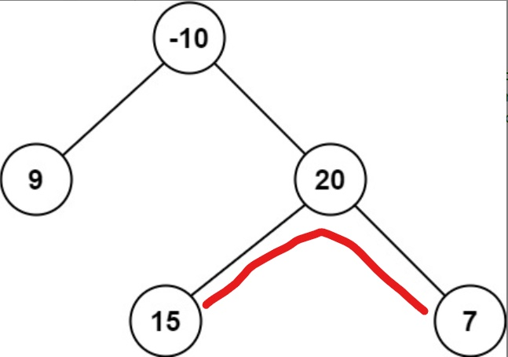
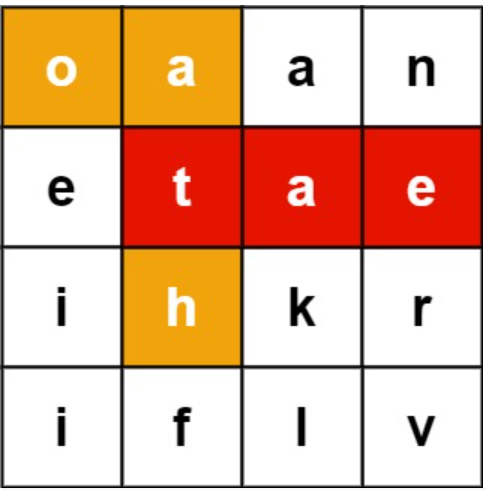

<style> 
  img{ 
     width: 60%; 
     padding-left: 20%; 
  } 
</style>

快一个月没有更新博客了，最近身体状态一直不太好，研究课题和其他方面的学习都停滞了很久。不过随着气温的逐渐升高，精气神也应该提上来才对。

我最近正在做LeetCode上的LeetBook[《高级算法》](https://leetcode-cn.com/leetbook/detail/top-interview-questions-hard/)中的题目，里面题目根据涉及到的知识点分为：数组和字符串，链表，树和图，回溯算法，排序和搜索，动态规划，数学，设计问题以及其他。题目的整体难度比较高，我想如果全都做一遍对水平应该有比较大的提升。

这篇博客里记录了其中部分题目（都是第一时间没能做出来的）的题解，会随着做题的进度持续更新。

（说起来，我想做个目录方便以后查阅，不过目前还没搞懂该怎么做。）

目前包含的题目有这些：

- [生命游戏](https://leetcode-cn.com/problems/game-of-life/)
  
- [滑动窗口的最大值](https://leetcode-cn.com/problems/sliding-window-maximum/)
  
- [二叉树中的最大路径和](https://leetcode-cn.com/problems/binary-tree-maximum-path-sum/)

- [计算右侧小于当前元素的个数](https://leetcode-cn.com/problems/count-of-smaller-numbers-after-self/)

- [单词搜索 II](https://leetcode-cn.com/problems/word-search-ii/)

- [单词拆分 II](https://leetcode-cn.com/problems/word-break-ii/)


## 数组和字符串


### NO. 289 生命游戏

**题目描述：**
给定一个包含 m × n 个格子的面板，每一个格子都可以看成是一个细胞。每个细胞都具有一个初始状态： 1 即为 活细胞 （live），或 0 即为 死细胞 （dead）。每个细胞与其八个相邻位置（水平，垂直，对角线）的细胞都遵循以下四条生存定律：
1. 如果活细胞周围八个位置的活细胞数少于两个，则该位置活细胞死亡;
   
2. 如果活细胞周围八个位置有两个或三个活细胞，则该位置活细胞仍然存活；

3. 如果活细胞周围八个位置有超过三个活细胞，则该位置活细胞死亡；

4. 如果死细胞周围正好有三个活细胞，则该位置死细胞复活；

下一个状态是通过将上述规则同时应用于当前状态下的每个细胞所形成的，其中细胞的出生和死亡是同时发生的。给你 m x n 网格面板 board 的当前状态，返回下一个状态。


**题解：**

生命游戏其实就是一个很经典的元胞自动机，每个细胞的下一个时间点的状态完全由其自身已经邻域的当前状态来决定。这道题的难点在于，如何采用原地算法来解决这道问题（也就是不能借助额外的空间）。

细胞的状态转换只有四种：0-0，0-1，1-0以及1-1。由于需要原地修改细胞的状态，并且不能让修改后的状态影响到其他细胞的状态判定，所以对于0-1和1-0这两种转换，可以先把细胞的值改为一个特定的临时值（比如0-1对应的临时值设为2，1-0对应3，这样对临时值做对2取余的操作后就可以得到他们原本的状态）。等遍历完所有细胞之后再把这个临时值改回去。

然后很容易就能写出代码啦：

```c++
class Solution {
public:
    int neighbors[3] = {0, 1, -1};
    int m, n;

    void gameOfLife(vector<vector<int>>& board) {
        m = board.size();
        n = board[0].size();

        // 遍历面板每一个格子里的细胞
        for (int row = 0; row < m; row++) 
        {
            for (int col = 0; col < n; col++) 
            {
                int livecount = 0;
                //计算活细胞数量
                for(int i = 0; i < 3; i++)
                {
                    for(int j = 0; j < 3; j++)
                    {
                        if(i == 0 && j == 0)
                            continue;
                        int r2 = row + neighbors[i];
                        int c2 = col + neighbors[j];
                        if(r2 < 0 || c2 < 0 || r2 >= m || c2 >= n)
                            continue;
                        if(board[r2][c2] %2 == 1)
                            livecount++;
                    }
                }

                //按照规则判定
                if ((board[row][col] == 1) && (livecount < 2 || livecount > 3)) 
                    // 活变死
                    board[row][col] = 3;
                

                if (board[row][col] == 0 && livecount == 3) 
                    // 死变活
                    board[row][col] = 2;
                
            }
        }
        for (int row = 0; row < m; row++) 
        {
            for (int col = 0; col < n; col++) 
            {
                if (board[row][col] == 3) 
                    board[row][col] = 0;
                else if(board[row][col] == 2)
                    board[row][col] = 1;
                
            }
        }
    }
};


```


### NO. 239 滑动窗口的最大值 
**题目描述：**

给你一个整数数组 nums，有一个大小为 k 的滑动窗口从数组的最左侧移动到数组的最右侧。你只可以看到在滑动窗口内的 k 个数字。滑动窗口每次只向右移动一位。

返回 滑动窗口中的最大值 。


**题解：**

我感觉很多涉及到“最大值”“最小值”字眼的题目都可以考虑用优先队列来求解，这道题也是如此。

我们首先将第一个滑动窗口中的值存入优先队列（大顶堆）。优先队列中存储的类型是`pair<int,int>`，其中pair.first是元素值，而pair.second是该元素在数组里的位置。随后，窗口每向右滑动一格，就将新加入的元素push进优先队列，同时检查优先队列的顶端元素，将坐标不在滑动窗口范围内的全pop出来。由于优先队列中的元素是按照值从大到小的顺序排列的，每次更新后的优先队列的顶端元素一定是滑动窗口中的最大值。

代码如下：

```c++
class Solution {
public:
    vector<int> maxSlidingWindow(vector<int>& nums, int k) {
	//建立优先队列
        priority_queue<pair<int,int>,vector<pair<int,int>>,func> q;
        vector<int> rtn;
        int maxval = -10001;
		
        if(nums.size() < k)
        {
            for(int it: nums)
                maxval = max(maxval,it);
            rtn.push_back(maxval);
            return rtn;
        }
		
		//首先得出第一个滑动窗口的最大值
        int i = 0;
        for(; i < k; i++)
        {
            q.push({nums[i],i});
        }
        auto tmp = q.top();
        maxval = tmp.first;
        rtn.push_back(maxval);
        
		//滑动窗口不断地向右移动，每移动一格，检查一下优先队列的顶端
		while(i < nums.size())
        {
            while(!q.empty() && q.top().second <= i-k)
                q.pop();
			//把新加入的元素push进优先队列
            q.push({nums[i],i});
			
			//获取优先队列的顶端值
            rtn.push_back(q.top().first);
            i++;
        }
        return rtn;
        
    }

    struct func
    {
        bool operator() (pair<int,int> a, pair<int,int> b) 
        {
            return a.first <= b.first;
        }
    };
};
```


## 树和图

### NO.124 二叉树中的最大路径和

**题目描述**

路径 被定义为一条从树中任意节点出发，沿父节点-子节点连接，达到任意节点的序列。同一个节点在一条路径序列中 至多出现一次 。该路径 至少包含一个 节点，且不一定经过根节点。

路径和 是路径中各节点值的总和。

给你一个二叉树的根节点 root ，返回其 最大路径和 。

以下是一个例子：



最大路径用红色的线标识，最大路径和为15+20+7=42。


**题解：**

这道题可以用递归的方法来解。假设我们想要求解以某一个节点为根节点的最大路径和，我们可以分别求解 以该节点的左子节点为根节点的最大路径和 以及 以该节点的右子节点为根节点的最大路径和。将这二者与该节点的值相加就可以得出结果（需要注意的是，当某些节点对应的最大路径和小于0时，就舍弃这个节点）。

**题解：**

```c++
/**
 * Definition for a binary tree node.
 * struct TreeNode {
 *     int val;
 *     TreeNode *left;
 *     TreeNode *right;
 *     TreeNode() : val(0), left(nullptr), right(nullptr) {}
 *     TreeNode(int x) : val(x), left(nullptr), right(nullptr) {}
 *     TreeNode(int x, TreeNode *left, TreeNode *right) : val(x), left(left), right(right) {}
 * };
 */
class Solution {
private:
    int maxsum = INT_MIN;

public:
    int getmaxsum(TreeNode* node) 
	{
        if (node == nullptr) {
            return 0;
        }
		//如果子树的最大路径和小于0，那么舍弃这部分的结果
        int leftval = max(getmaxsum(node->left), 0);
        int rightval = max(getmaxsum(node->right), 0);

        // 获得以节点node为根节点的最大路径和
        int curmaxsum = node->val + leftval + rightval;

        // 更新最大值
        maxsum = max(maxsum, curmaxsum);

        // 返回该节点对应的最大贡献，需要注意的是只能选取左右子树中的一支，因为如果有分叉的话，整体的路径就连不起来了
        return node->val + max(leftval, rightval);
    }

    int maxPathSum(TreeNode* root)
	{
        int tmp = getmaxsum(root);
        return maxsum;
    }
};

```

### NO. 315 计算右侧小于当前元素的个数

**题目描述:**

给你一个整数数组 nums ，按要求返回一个新数组 counts 。数组 counts 有该性质： counts[i] 的值是  nums[i] 右侧小于 nums[i] 的元素的数量。

**题解：**

这道题和剑指Offer第51题的[数组中的逆序对](https://leetcode-cn.com/problems/shu-zu-zhong-de-ni-xu-dui-lcof/)很像，这道题可以用归并排序来求解，在这篇[总结排序和查找算法的博客](https://jyyyjyyyj.github.io/2022-01-25-sort/)中有提到。在数组中，如果前面的数字大于后面的数字，则这两个数字就组成了一个逆序对。而这道题的要求其实就是统计逆序对在整个数组中的分布。

将剑指Offer51的代码稍作修改就可以得到这道题的题解了，需要注意的是，要建一个数组来保存排序后每个数字在原数组中的位置：

```c++
class Solution {
public:
    vector<int> index;
    vector<int> count;
    vector<int> countSmaller(vector<int>& nums) {
        int n = nums.size();
        count.resize(n);
        index.resize(n);
        iota(index.begin(),index.begin()+n,0);
        merge_sort(nums, 0, n-1);
        return count;
    }
    
    void merge_sort(vector<int>& nums,int st, int ed) {
        if(ed-st == 1 && nums[index[st]] > nums[index[ed]])
        {
            int tmp = index[st];
            count[index[st]]++;
            index[st] = index[ed];
            index[ed] = tmp;
            return;
        }
        if(ed -st <= 1)
            return;
        int mid = st + (ed-st+1)/2;
        merge_sort(nums,st,mid);
        merge_sort(nums,mid+1,ed);
        merge(nums,st,ed);
    }
    
    void merge(vector<int>& nums,int st, int ed) {
        
        int mid = st + (ed-st+1)/2;
        vector<int> tmp(ed-st+1,0);
        int i1 = st;
        int i2 = mid+1;
        int i3 = 0;
        while(i1 <= mid && i2 <= ed)
        {
            if(nums[index[i1]] <= nums[index[i2]]) //在此之前的都是逆序对
            {
                count[index[i1]] += (i2-mid-1);
                tmp[i3++] = index[i1++];
            }
            else
            {
                tmp[i3++] = index[i2++];
            }
        }

        while(i1 <= mid)
        {
            count[index[i1]] += (ed-mid);
            tmp[i3++] = index[i1++];
        }
        while(i2 <= ed)
        {
            tmp[i3++] = index[i2++];
        }

        copy(tmp.begin(),tmp.end(), index.begin() + st);
    }
};
```
## 回溯算法

### NO. 212 单词搜索 II

**题目描述：**
给定一个 m x n 二维字符网格 board 和一个单词（字符串）列表 words， 返回所有二维网格上的单词 。

单词必须按照字母顺序，通过 相邻的单元格 内的字母构成，其中“相邻”单元格是那些水平相邻或垂直相邻的单元格。同一个单元格内的字母在一个单词中不允许被重复使用。

一个例子：



我们可以在这个数组中找到"eat"和"oath"两个单词。

**题解：**

这道题就是要在字符数组中寻找连着的字符来构成给定的单词。一开始我想用最传统的dfs来做，但是超时了（困难题哪是那么容易就能让你做出来的）。看了官方题解之后发现原来可以用字典树，心里有点郁闷，因为我曾经写过一篇[有关字典树的博客](https://jyyyjyyyj.github.io/2021-12-30-Trie/)，却没想到用它。。。我们可以将待查找的字符串全部存入字典树，然后再采用dfs和回溯来遍历整个字符数组。由于字典树里存储了所有单词，所以只要遍历一次就可以获取所有答案了。

代码：

```c++
class Solution {
public:
    int dirs[4][2];
    int m,n;
    vector<string> rtn;
    //字典树的数据结构，其中children用哈希表防止有重复的字符
    struct TrieNode 
    {
        string word;
        unordered_map<char,TrieNode *> children;
        TrieNode() 
        {
            this->word = "";
        }   
    };
    vector<string> findWords(vector<vector<char>> & board, vector<string> & words) {
        m = board.size();
        n = board[0].size();
        TrieNode * root = new TrieNode();

        for (auto & word: words){
            insertTrie(root,word);
        }

        for (int i = 0; i < board.size(); ++i) {
            for (int j = 0; j < board[0].size(); ++j) {
                dfs(board, i, j, root);
            }
        }        

        return rtn;     
    }

    void dfs(vector<vector<char>>& board, int x, int y, TrieNode * root) 
    {
        if(x < 0 || y < 0 || x >= m || y >= n|| board[x][y] == '#')
            return;
        char ch = board[x][y];
        //没有这个词        
        if (!root->children.count(ch)) {
            return;
        }
        root = root->children[ch];
        //找到了一个单词
        if (root->word.size() > 0)
        {
            rtn.push_back(root->word);
            //已经找到这个单词了，就把他从字典树里删掉
            root->word = "";
        }
        
        //设为已访问
        board[x][y] = '#';
        for (int i = 0; i < 4; ++i) 
        {
            int nx = x + dirs[i][0];
            int ny = y + dirs[i][1];
            dfs(board, nx, ny, root);
        }
        //回溯
        board[x][y] = ch;
        return;
    }
    
    //向字典树中插入一个单词
    void insertTrie(TrieNode * root,const string & word) {
        TrieNode * node = root;
        for (auto c : word){
            //如果子节点里没有字符c，则新建一个
            if (!node->children.count(c)) {
                node->children[c] = new TrieNode();
            }
            node = node->children[c];
        }
        node->word = word;
    }
};
```

其中，dirs[4][2]存储的是四个dfs搜索的上下左右四个方向，由于连打两个大括号会导致jekyll报错，所以我把其定义部分给删了。


## 动态规划

### NO.140 单词拆分 II

**题目：**
给定一个字符串 s 和一个字符串字典 wordDict ，在字符串 s 中增加空格来构建一个句子，使得句子中所有的单词都在词典中。以任意顺序 返回所有这些可能的句子。

注意：词典中的同一个单词可能在分段中被重复使用多次。

一个例子：

输入:s = "catsanddog", wordDict = ["cat","cats","and","sand","dog"]

输出:["cats and dog","cat sand dog"]


**题解：**

虽然这道题被分到了动态规划类里面，但是看到这道题我的第一反应是用回溯算法来做。以下是采用回溯算法的题解：


**1. 回溯算法：**

用回溯算法结题的思路和上一题 单词搜索II 有点类似。首先将wordDict里面的所有字符串都存到哈希表里（如果想要更高效的话，也可以像上一题一样采用字典树来存储），然后从0下标开始，在s中截取不同长度的子串。如果wordDict里面包含这个子串，那么就暂时截去子串，然后对s中剩余的部分进行相同的操作，直到遍历完s中所有的字符。

此外还可以添加一个剪枝的操作。首先获取wordDict中字符串的最大长度maxlen，然后在截取s子字符串的时候限制子字符串长度不可以超过maxlen，这样能节约不少时间。

以下是代码：

```c++
class Solution {
public:
    unordered_map<string,int> dict;
    vector<string> rtn;
    int maxlen;
	
    vector<string> wordBreak(string s, vector<string>& wordDict) {
        //单词的最大长度
        maxlen = 0;
        for(string it: wordDict)
        {
            //存入哈希表，当然也可以构建字典树
            dict[it] = 1;
            int sz = it.size();
            maxlen = max(maxlen,sz);
        }
        string cur;
        dfs(s,cur,0);
        return rtn;
    }

    void dfs(string s, string cur, int st)
    {
        if(st == s.size())
        {
            //如果正好遍历到了s的末尾，说明cur是一个符合要求的答案，将其存入数组rtn
            int len = cur.size();
            cur = cur.substr(0,len-1);
            rtn.push_back(cur);
            return;
        }

        for(int ed = st; ed < s.size() && ed < (st + maxlen);ed++)
        {
            //截取不同长度的子串
            string tmp = s.substr(st,ed-st+1);
            if(dict[tmp] == 1)
            {
                //如果子串在worddict内，进入下一步
                string cur2 = cur;
                cur2 = cur2 + tmp;
                cur2 = cur2 + " ";
                dfs(s,cur2,ed+1);
            }
            //回溯
        }
    }
};
```

**动态规划：**

我去查了查这道题的简化版 NO.139 单词拆分。简化版中的题目只需要判断字符串s是否可以拆分，而不需要给出所有的拆分方案。

在139题中，假设s长度为n，可以用长为n的数组dp来记录下表范围为0到i的子串是否可以被拆分，如果可以，那么`dp[i] = true`，反之为`false`。

同样的创建一个哈希表dict来存储wordDict里的单词（也可以用效率更高的字典树，但是我懒得写了），那么状态转移方程可以写为:

$$dp[i] = dp[j] \And dict.count(s.substr(j,i-j+1)), 0 \leq j \leq i$$

代码如下：

```c++
class Solution {
public:
    bool wordBreak(string s, vector<string>& wordDict) {
        //前缀树？
        int sz = s.size();
        vector<bool> dp(sz,false);
        unordered_map<string,int> map;
        int maxlen = 0;
        for(string it:wordDict)
        {
            map[it]++;
            int len = it.size();
            maxlen = max(maxlen,len);
        }
        //cout<<maxlen<<endl;
        if(map.count(s))
            return true;
            
        //首先寻找被拆分出的第一个单词
        for(int i = 1; i <= s.size();i++)
        {
            string tmp = s.substr(0,i);
            if(map.count(tmp))
            {
                dp[i-1] = true;
            }
        }
        int i = 0;
        while(i<sz && dp[i] == false)
            i++; 
        if(i==sz)
            return false;
        for(; i < sz;i++)
        {
            if(!dp[i])
            {
                int cur = max(0,i-maxlen);
                for(int j = i-1; j >= cur;j--)
                {
                    string tmp = s.substr(j+1,i-j);
                    dp[i] = dp[j] && map.count(tmp);
                    if(dp[i])
                        break;
                }
            }
        }
        return dp[sz-1];
    }
};
```

如果想在139题的基础上完成140题的题解，那么就要在dp[i]为true的时候记录下对应的拆分方案。

----
待续
    
