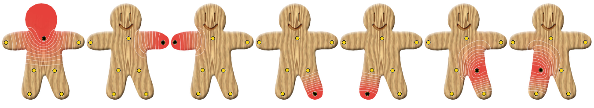
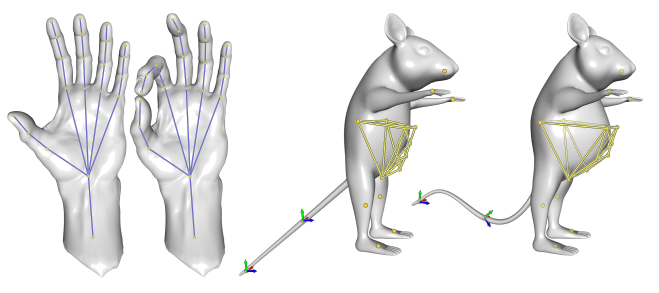

<head>
    
    
</head>

最近在研究三维物体非刚性配准的问题，[这篇博客](https://jyyyjyyyj.github.io/2021-11-23-non-paper/)里讨论了一个比较传统的方法，然而现在机器学习才是大势所趋。我对机器学习实在是知之甚少，看paper看得我脑袋都大了……最近在读老师给我的论文，作者在文章中提到了他们在数年前在SIGGRAPH上发表的一种关于物体实时变形的论文：*Bounded Biharmonic Weights for Real-Time Deformation*，提出了一种通过用户交互来使物体变形的方法。本篇博客是关于这篇论文的笔记。

## 方法概述

这篇文章提出的bounded biharmonic weight（以下以BBW为简称）可以在约束条件下最小化拉普拉斯能量。关于拉普拉斯能量这个概念，文章中并没有详细说明，不过我觉得可以参考[拉普拉斯矩阵](https://jyyyjyyyj.github.io/2021-12-08-Lap/)的定义。拉普拉斯矩阵存储了三维物体中每个点与其邻域点之间的距离。当我们对物体进行变形的时候，需要保证变形之后的物体看上去比较顺眼（比如表面上不能坑坑洼洼）。由此可知，物体虽然整体上有明显的变形，但局部的变形不大，即每个点和其邻域之间的相对位置变动不能够太明显。因此，通过尽量减小这种点与点之间距离的变动（当然不能完全不变，只是要限制在一个范围内），能够保证物体光滑。

很多变形方法，比如之前博客里提到的老古董[自由变形](https://jyyyjyyyj.github.io/2021-12-04-FFD/)，需要在物体外部构建一个封闭的框架（cage），如果待变形物体的形状比较复杂的话，会给框架的构建带来麻烦。而BBW对物体框架的封闭性并没有要求，它的框架实际上是一堆simplice（这个我不知道怎么翻译，只能意会了）的集合。

该方法的大体思路比较明确。首先在物体上设置$m$个控制句柄（control handle，这个handle可以是一个区域，一个点，或者一根骨骼线），用户可以拖动这些句柄，也就是对每个句柄进行一个仿射变换$T_j$。然后通过以下公式获取物体中每个点变形后的坐标：

$$ p' = \sum_{j=1}^{m}w_j(p)T_jp$$

其中，$w_j$是$T_j$的BBW。

而$w_j$的值是通过最小化拉普拉斯能量来获得的。相对应的求解模型如下（排版有点丑凑合看了）：

$$\mathop{\arg\min}_{w_j,j=1,...,m} \sum^{m}_{j=1} \frac{1}{2} \int_{\Omega} \Vert \Delta w_j \Vert ^2dV$$

$$s.t. \\
w_j \vert H_k   = \delta_{jk} \\
w_j \vert F \quad is \quad linear, \forall F \in F_C \\
\sum_{j=1}^{m}w_j = 1 \\
0 \leq w_j(p) \leq 1$$

其中$H_k$代表一个控制句柄，$\delta_{jk}$是克罗内克函数，当$i=j$时值为1，否则值为0，这样的话能够保证在控制句柄处的BBW值是最大的。$F_c$是框架面（cage faces）的集合。

此外，BBW的值不可以小于0，因为如果出现负值，物体就会朝着相反的方向变形，那就不符合常理了。

由此求得的图形能够保留许多特性。首先最小化拉普拉斯能量能够使变形后的物体是平滑的，其次，每个$w_j$在其对应的控制句柄处是最大的，并随着点到控制句柄的距离的增加而减小，就像下图姜饼小人的heat map所示。换言之，对某一处点的拖动只能影响他周围的局部形状。

## 实现

在实际实现的时候，作者采用了线性有限元（linear FEM）来将$w_j$的求解公式进行了离散化。部分的实验结果如下：

可以看出，物体框架可以是局部的或者非封闭性的，并且拖动某一个局部部分并不会影响到其他部分的形状。结果整体上也很自然。

## Reference

- [paper](https://igl.ethz.ch/projects/bbw/)
