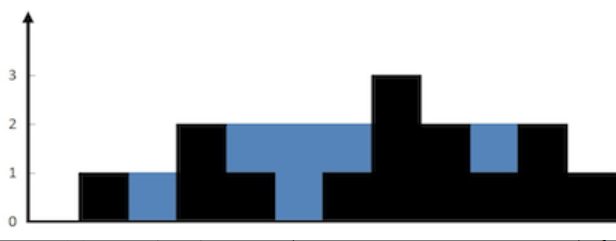
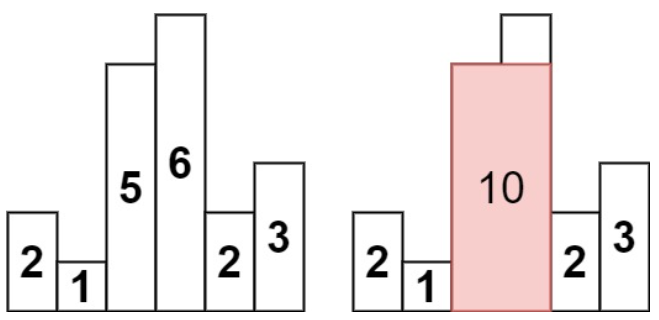

<head>
    <script src="https://cdn.mathjax.org/mathjax/latest/MathJax.js?config=TeX-AMS-MML_HTMLorMML" type="text/javascript"></script>
    <script type="text/x-mathjax-config">
        MathJax.Hub.Config({
            tex2jax: {
            skipTags: ['script', 'noscript', 'style', 'textarea', 'pre'],
            inlineMath: [['$','$']]
            }
        });
    </script>
</head>

<style> 
  img{ 
     width: 60%; 
     padding-left: 20%; 
  } 
</style>

因为博客有点过于长了，所以把[ LeetBook《高级算法》题解](https://jyyyjyyyj.github.io/2022-03-30-advanced_algorithm/)分成了两部分。

《高级算法》的题目根据涉及到的知识点分为：数组和字符串，链表，树和图，回溯算法，排序和搜索，动态规划，数学，设计问题以及其他。这篇博客中记录了了 **动态规划，数学，设计问题，其他** 这几个类别的部分题目的题解。

目前包含的题目如下：

- [单词拆分 II](https://leetcode-cn.com/problems/word-break-ii/)

- [数据流的中位数](https://leetcode-cn.com/problems/find-median-from-data-stream/)

- [最大数](https://leetcode-cn.com/problems/largest-number/)

- [根据身高重建队列](https://leetcode-cn.com/problems/queue-reconstruction-by-height/)

- [接雨水](https://leetcode-cn.com/problems/trapping-rain-water/solution/)

- [柱状图中最大的矩形](https://leetcode-cn.com/problems/largest-rectangle-in-histogram/)

## 动态规划

### NO.140 单词拆分 II

**题目：**
给定一个字符串 s 和一个字符串字典 wordDict ，在字符串 s 中增加空格来构建一个句子，使得句子中所有的单词都在词典中。以任意顺序 返回所有这些可能的句子。

注意：词典中的同一个单词可能在分段中被重复使用多次。

一个例子：

输入:s = "catsanddog", wordDict = ["cat","cats","and","sand","dog"]

输出:["cats and dog","cat sand dog"]


**题解：**

虽然这道题被分到了动态规划类里面，但是看到这道题我的第一反应是用回溯算法来做。以下是采用回溯算法的题解：


**1. 回溯算法：**

用回溯算法结题的思路和上一题 单词搜索II 有点类似。首先将wordDict里面的所有字符串都存到哈希表里（如果想要更高效的话，也可以像上一题一样采用字典树来存储），然后从0下标开始，在s中截取不同长度的子串。如果wordDict里面包含这个子串，那么就暂时截去子串，然后对s中剩余的部分进行相同的操作，直到遍历完s中所有的字符。

此外还可以添加一个剪枝的操作。首先获取wordDict中字符串的最大长度maxlen，然后在截取s子字符串的时候限制子字符串长度不可以超过maxlen，这样能节约不少时间。

以下是代码：

```c++
class Solution {
public:
    unordered_map<string,int> dict;
    vector<string> rtn;
    int maxlen;
	
    vector<string> wordBreak(string s, vector<string>& wordDict) {
        //单词的最大长度
        maxlen = 0;
        for(string it: wordDict)
        {
            //存入哈希表，当然也可以构建字典树
            dict[it] = 1;
            int sz = it.size();
            maxlen = max(maxlen,sz);
        }
        string cur;
        dfs(s,cur,0);
        return rtn;
    }

    void dfs(string s, string cur, int st)
    {
        if(st == s.size())
        {
            //如果正好遍历到了s的末尾，说明cur是一个符合要求的答案，将其存入数组rtn
            int len = cur.size();
            cur = cur.substr(0,len-1);
            rtn.push_back(cur);
            return;
        }

        for(int ed = st; ed < s.size() && ed < (st + maxlen);ed++)
        {
            //截取不同长度的子串
            string tmp = s.substr(st,ed-st+1);
            if(dict[tmp] == 1)
            {
                //如果子串在worddict内，进入下一步
                string cur2 = cur;
                cur2 = cur2 + tmp;
                cur2 = cur2 + " ";
                dfs(s,cur2,ed+1);
            }
            //回溯
        }
    }
};
```

**动态规划：**

我去查了查这道题的简化版 NO.139 单词拆分。简化版中的题目只需要判断字符串s是否可以拆分，而不需要给出所有的拆分方案。

在139题中，假设s长度为n，可以用长为n的数组dp来记录下表范围为0到i的子串是否可以被拆分，如果可以，那么`dp[i] = true`，反之为`false`。

同样的创建一个哈希表dict来存储wordDict里的单词（也可以用效率更高的字典树，但是我懒得写了），那么状态转移方程可以写为:

$$dp[i] = dp[j] \And dict.count(s.substr(j+1,i-j)), 0 \leq j < i$$

代码如下：

```c++
class Solution {
public:
    bool wordBreak(string s, vector<string>& wordDict) {
        //前缀树？
        int sz = s.size();
        vector<bool> dp(sz,false);
        unordered_map<string,int> map;
        int maxlen = 0;
        for(string it:wordDict)
        {
            map[it]++;
            int len = it.size();
            maxlen = max(maxlen,len);
        }
        //cout<<maxlen<<endl;
        if(map.count(s))
            return true;
            
        //首先寻找被拆分出的第一个单词
        for(int i = 1; i <= s.size();i++)
        {
            string tmp = s.substr(0,i);
            if(map.count(tmp))
            {
                dp[i-1] = true;
            }
        }
        int i = 0;
        while(i<sz && dp[i] == false)
            i++; 
        if(i==sz)
            return false;
        for(; i < sz;i++)
        {
            if(!dp[i])
            {
                int cur = max(0,i-maxlen);
                for(int j = i-1; j >= cur;j--)
                {
                    string tmp = s.substr(j+1,i-j);
                    dp[i] = dp[j] && map.count(tmp);
                    if(dp[i])
                        break;
                }
            }
        }
        return dp[sz-1];
    }
};
```

如果想在139题的基础上完成140题的题解，那么就要在dp[i]为true的时候记录下对应的拆分方案。


## 设计问题

### NO. 295 数据流的中位数

**题目：**

中位数是有序列表中间的数。如果列表长度是偶数，中位数则是中间两个数的平均值。

例如，

[2,3,4] 的中位数是 3

[2,3] 的中位数是 (2 + 3) / 2 = 2.5

设计一个支持以下两种操作的数据结构：

- void addNum(int num) - 从数据流中添加一个整数到数据结构中。
  
- double findMedian() - 返回目前所有元素的中位数。


**题解：**

这道题可以用优先队列来解。用两个有点队列queMax和queMin来存储输入的数字，其中queMax是小顶堆，存储较大的那一半数字，而queMin是大顶堆，存储较小的那一半，这样能够保证queMax和queMin的顶端一直都是排序在最中间的两个数。（这种做法似乎在很多题目中都出现过）

如果两个有些队列都为空，那么数据率先进入queMax。如果输入的数据大于queMax的顶端（也就是最小值），那么将其push进queMax，反之push到queMin里。

此外，为了保证两个队列的长度差不超过1，每输入一个新的数字，就要检查一下长度，如果其中某一个队列过长，就将其顶端数字push到另一个队列中。

在输出中位数时，如果两个队列长度相等，那么返回二者顶端元素的均值，否则返回长度较长者的顶端元素。

以下是代码：

```c++
class MedianFinder {
public:
    priority_queue<int, vector<int>, less<int>> queMin;
    priority_queue<int, vector<int>, greater<int>> queMax;

    MedianFinder() 
    {

    }

    //queMin 存储较小的那一半数字，queMax存储较大的一半
    void addNum(int num) {
        if (queMin.empty() || num <= queMin.top()) {
            queMin.push(num);
            if (queMax.size() + 1 < queMin.size()) {
                queMax.push(queMin.top());
                queMin.pop();
            }
        } else {
            queMax.push(num);
            if (queMax.size() > queMin.size()) {
                queMin.push(queMax.top());
                queMax.pop();
            }
        }
    }

    double findMedian() {
        if (queMin.size() > queMax.size()) {
            return queMin.top();
        }
        return (queMin.top() + queMax.top()) / 2.0;
    }
};

```


## 数学

### NO. 179 最大数

**题目：**

给定一组非负整数 nums，重新排列每个数的顺序（每个数不可拆分）使之组成一个最大的整数。

注意：输出结果可能非常大，所以你需要返回一个字符串而不是整数。

示例：

输入：nums = [10,2]   输出："210"

**题解：**

这道题我一开始没想出来做法，但是看了题解之后发现其实挺简单的……首先为了避免溢出，需要将输入的整数全部转为字符串存入一个vector中。由于C++能够对字符串进行排序，比如"21" > "12"，我们可以自定义一个vector排序函数，对于任意两个字符串a和b，如果a+b > b+a，就将a排在b的前面。最后将排序完成的字符串数组按照顺序输出即可。

代码：

```c++
class Solution {
public:
    string largestNumber(vector<int>& nums) {
        //将整数数组转换为字符串数组，排序后拼接
        vector<string> nums_new;
        for(int it: nums)
        {
            nums_new.push_back(to_string(it));
        }
        sort(nums_new.begin(),nums_new.end(),comp);
        string rtn;
        for(string it: nums_new)
            rtn += it;

        if(rtn[0] == '0')
            return "0";
        return rtn;

    }
	
	//排序函数
    static bool comp (const string& a, const string& b)
    {
        return (a+b) > (b+a);
    }
};
```


## 其他

### NO. 406 根据身高重建队列

**题目：**

假设有打乱顺序的一群人站成一个队列，数组 people 表示队列中一些人的属性（不一定按顺序）。每个 people[i] = [hi, ki] 表示第 i 个人的身高为 hi ，前面 正好 有 ki 个身高大于或等于 hi 的人。

请你重新构造并返回输入数组 people 所表示的队列。返回的队列应该格式化为数组 queue ，其中 queue[j] = [hj, kj] 是队列中第 j 个人的属性（queue[0] 是排在队列前面的人）。

**题解：**

这道题难度是中等，但是我完全不会，看了官方题解才知道怎么做（感到智熄）。感觉这道题和[计算右侧小于当前元素的个数](https://leetcode-cn.com/problems/count-of-smaller-numbers-after-self/)有些类似，一个是根据右侧小于当前元素的个数推断出原来的顺序，另一个则相反。后者可以用插入排序的方法来解决。

要解决这道题，首先对people中的数组按照身高从小到大进行排序，如果有两个人身高相同，那么将hi较大的那个排在前面。

这样一来，排在前面的元素对应着矮个子的人。对于排序后的people[0]，由于不会有人比他更矮了，所以其对应的hi值就是排在他前面的人的个数。此时我们新建一个与people大小相同的数组rtn存放结果，从rtn.begin()开始数hi个位置，那么people[0]应该被放在第hi+1个空位置上。对于people[0]之后的元素的操作也是相同的，都是将其放在第hi+1个空位置上。对于身高相同的两个人，其中必有一个人的hi值较大，我们在对people进行排序时，把hi较大的那个人排在前面，这样在遍历排序后的people时，可以先预留出足够的位置。

代码如下：

```c++
class Solution {
public:
    vector<vector<int>> reconstructQueue(vector<vector<int>>& people) {
        //按照身高从小到大排序，如果有人身高相同，那么ki较大的那一方放在前面
        //因为当身高相同时，ki较大的那一方应该在原序列中靠后，那么应该先对其进行排序
        sort(people.begin(),people.end(),comp);
        int n = people.size();
        vector<vector<int>> rtn(n);
        for(int i = 0; i < n; i++)
        {
            int k = people[i][1];
            int j = -1;
            while(k>=0 && j < n)
            {
                j++;
                if(rtn[j].empty())
                    k--;
            }
            rtn[j] = people[i];
        }
        return rtn;

    }

    static bool comp(vector<int> a, vector<int> b)
    {
        if(a[0] < b[0] || (a[0] == b[0] && a[1] > b[1]))
            return true;
        return false;
    }
};
```

## 其他

### NO.41 接雨水

**题目：**

给定 n 个非负整数表示每个宽度为 1 的柱子的高度图，计算按此排列的柱子，下雨之后能接多少雨水。

例子：



输入：height = [0,1,0,2,1,0,1,3,2,1,2,1]
输出：6 (蓝色部分的就是能够接到的雨水)

**题解：**

这是一道比较热门的题目了（似乎在hot 100里？），可以用动态规划或者单调栈来做。

**1. 动态规划**

对于位于i下标的柱子，其能够接到雨水的量r[i]取决于左右两侧接到雨水的高度，为：r[i] = min(r[i-1],r[i+1])-height[i]。

我们首先从左向右遍历，获取每个柱子左侧雨水能达到的最大高度，再从右向左遍历，获得右侧雨水能达到的最大高度，就可以通过以上公式来解决问题了：

```c++
class Solution {
public:
    int trap(vector<int>& height) {
        int n = height.size();
        if (n == 0) {
            return 0;
        }
        vector<int> l(n,0);
        vector<int> r(n,0);
        //初始化最靠边的柱子
        l[0] = height[0];
        r[n-1] = height[n-1];

        //遍历获取左右两侧的雨水高度
        for(int i = 1;i < n; i++)
        {
            l[i] = max(l[i-1],height[i]);
            r[n-i-1] = max(r[n-i],height[n-i-1]);
        }

        int rtn = 0;

        //去左右雨水高度中的较小值
        for(int i = 0; i < n; i++)
        {
            rtn += min(l[i],r[i])-height[i];
        }
        return rtn;
    }
};
```

**2. 单调栈**

单调栈内的元素从栈底到栈顶是单调递增/减的。以单调递减栈为例，其顶端元素应该是栈内最小的元素。如果新加入的元素tmp比栈顶元素大，那么应该不停地pop出栈顶元素，直到新的栈顶元素大于tmp，再将tmp存入栈中。

对于第i根柱子，只有其前后方各找到一根比它更高的柱子，才可以接水。本题维护一个单调递减栈，从左到右遍历数组，当单调栈内的元素数量大于等于2，且当前遍历到的柱子高度大于栈顶元素，就得到了一个可以接水的区域（栈顶元素最低，其左侧右侧都有一个偏高的柱子）。此时接雨水的高度为：min(height[left],height[right])-height[top]，其中left就是栈顶元素下一个的元素（大于等于栈顶）。而雨水的宽度为right-left-1。

将top出栈后可以获得left的高度，此后left就变成了新的top。

代码：

```c++
class Solution {
public:
    int trap(vector<int>& height) {
        int rtn = 0;
        stack<int> stk;
        int n = height.size();
        for (int i = 0; i < n; ++i) {
            //当前柱子高度大于栈顶元素
            while (!stk.empty() && height[i] > height[stk.top()]) {
                int top = stk.top();
                stk.pop();
                if (stk.empty()) {
                    break;
                }
                //栈中元素数量大于等于2
                int left = stk.top();
                int w = i - left - 1;
                int h = min(height[left], height[i]) - height[top];
                rtn += w * h;
            }
            stk.push(i);
        }
        return rtn;
    }
};
```


### NO. 84 柱状图中的最大矩形

**题目：**

给定 n 个非负整数，用来表示柱状图中各个柱子的高度。每个柱子彼此相邻，且宽度为 1 。

求在该柱状图中，能够勾勒出来的矩形的最大面积。


示例：



如上图所示的输入，最大矩形面积应为10。

**题解：**

这道题同样可以用单调栈来求解。我们选中第i根柱子，如果想要找到包含第i根柱子的最大矩形，那么需要分别向左和向右遍历寻找第一根高度小于它的柱子。第i根柱子的高度为矩形的高，这两根柱子之间的距离即为矩形的宽。

上述寻找左右边界的过程可以采用单调递增栈来实现，如果当前遍历到的元素小于栈顶元素，那么说明找到了第一根高度小于栈顶元素的柱子。

对于每一根柱子，我们都计算包含这根柱子的矩形的最大面积，最后返回这些矩形面积的最大值。

代码：

```c++
class Solution {
public:
    int largestRectangleArea(vector<int>& heights) {
        if(heights.size() == 1)
            return heights[0];
        //首尾都加上0，避免无法计算到边界情况
        heights.push_back(0);
        heights.insert(heights.begin(),0);
        int n = heights.size();

        //记录包含每一根柱子的矩形最大值
        vector<int> area(n,0);
        stack<int> st; //记录左右边界
        //从左向右遍历，寻找右边界
        for(int i = 0; i < n;i++)
        {
            while(!st.empty() && heights[st.top()] > heights[i])
            {
                int tmp = (i-st.top())*heights[st.top()];
                area[st.top()] += tmp;
                st.pop();
            }
            //如果此时stack内非空，那么顶端元素是向左遍历的第一根小于i的柱子
            //这里宽度-1，避免第i根柱子的面积被计算2遍。
            if(!st.empty())
                area[i] += (i-st.top()-1)*heights[i];
            st.push(i);
        }

        int rtn = 0;
        for(int it:area)
            rtn = max(rtn,it);
        return rtn;
    }
};

```

-----
下一篇博客该写点什么好呢……
