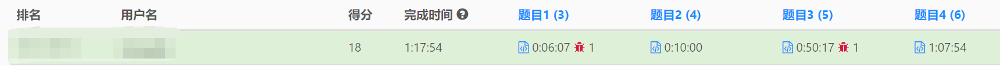

<head>
    <script src="https://cdn.mathjax.org/mathjax/latest/MathJax.js?config=TeX-AMS-MML_HTMLorMML" type="text/javascript"></script>
    <script type="text/x-mathjax-config">
        MathJax.Hub.Config({
            tex2jax: {
            skipTags: ['script', 'noscript', 'style', 'textarea', 'pre'],
            inlineMath: [['$','$']]
            }
        });
    </script>
</head>

<style> 
  img{ 
     width: 80%; 
     padding-left: 10%; 
  } 
</style>

**五月的第一天，劳动节的早晨，我……终于第一次在力扣周赛上ak了！**



虽然这次周赛的困难题相对之前遇到的要简单很多，但是能自己做出来还是很兴奋的！所以这篇博客就放上我对[周赛第4题](https://leetcode-cn.com/problems/total-appeal-of-a-string/)的题解吧。

**题目：**

字符串的 引力 定义为：字符串中 不同 字符的数量。

例如，"abbca" 的引力为 3 ，因为其中有 3 个不同字符 'a'、'b' 和 'c' 。
给你一个字符串 s ，返回 其所有子字符串的总引力 。

子字符串 定义为：字符串中的一个连续字符序列

**题解：**

要求字符串s的引力，就是要列出其所有的连续子串，并将每个子串中不重复的字母数量相加。这道题可以用哈希表+动态规划来做。

首先，假设s的长度为n，建立一个长度为n的dp数组，其中dp[i]为所有以第i个字符（下表从0开始）为结尾的子字符串的引力和。然后我们就可以发现：除了把第i个字符单独当做一个子字符串来看之外，其余的以第i个字符为结尾的子串，都可以通过在以第i-1个字符为结尾的子串的末尾加上s[i]来形成，二者的引力值要么相同（s[i]在之前就出现过），要么前者比后者大1（s[i]在之前没出现过）。由此一来，如果我们知道s[i]上一次在字符串中出现的位置，就能根据dp[i-1]算出dp[i]：

$$
dp[i] = dp[i-1]+i-lastpos_{s[i]}
$$

其中lastpos是指s[i]上一次出现的位置，如果s[i]在之前没出现过，lastpos的值为-1。

我们可以用一个哈希表`unordered_map<char,vector<int>> mp`来存储字符串中每个字母的出现情况，哈希表的键值是字母，每个键值对应的整数数组存储了s中该字母出现的位置，每计算完一次dp[i]，就在哈希表中更新s[i]出现的位置。

以下是代码：

```c++
class Solution {
public:
    long long appealSum(string s) {

unordered_map<char,vector<int>> mp;
        long long rtn = 0;
        int n = s.size();
        vector<long long> dp(n,0);
        dp[0] = 1; //初始化dp[0]
        mp[s[0]].push_back(0);
        for(int i = 1; i < s.size();i++)
        {
            char it = s[i];
            if(mp[it].size() == 0)//说明这个字符之前没出现过
            {
                dp[i] = dp[i-1] + i+1;
            }
            else
            {
                int pos = mp[it].back(); //这个字符最后一次在这里出现
                dp[i] = dp[i-1]+i-pos;
            }
            mp[it].push_back(i); //更新字符出现的位置
        }
        for(auto it:dp)
            rtn += it;
        return rtn;
    }
};
```
