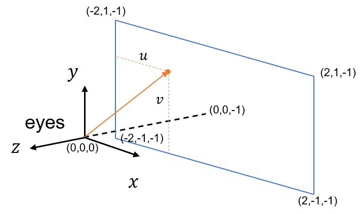

<style> 
  img{ 
     width: 60%; 
     padding-left: 20%; 
  } 
</style>

<head>
    <script src="https://cdn.mathjax.org/mathjax/latest/MathJax.js?config=TeX-AMS-MML_HTMLorMML" type="text/javascript"></script>
    <script type="text/x-mathjax-config">
        MathJax.Hub.Config({
            tex2jax: {
            skipTags: ['script', 'noscript', 'style', 'textarea', 'pre'],
            inlineMath: [['$','$']]
            }
        });
    </script>
</head>


其实很早之前我就想学光线追踪相关的内容，然而零零散散地看了很多博客或者是视频教程之后还是记不住……最近我在网上发现了一个写得很好的教材：[Ray Tracing In One Weekend](https://raytracing.github.io/books/RayTracingInOneWeekend.html#overview)。它的标题真的很有诱惑力（一个周末就能实现），内容也容易理解。本篇博客就是根据这个教材所记录的笔记。


## 1. 一些准备

### 输出图片

我们以PPM（Portable Pixmap Format）作为输出图片的格式。PPM的存储方式很简单，如下图所示：第一行的"P3"标明以ASCII形式存储，第二行写了了图像的尺寸（像素的列数和行数），而第三行标明了RGB的最大值（为255），接下来按照从上到下，从左到右的顺序写入每个像素的RGB值。


### vec3类

计算的过程中线性代数运算肯定是免不了的，在此可以设定一个vec3类来存储三维坐标，RGB值等等。在类中我们需要实现一些关于三维向量的基础操作，比如相加、点乘、叉乘等等（在网站里有详细的代码）。此外，再加上这样两句：

```c++
using point3 = vec3;   // 3D point
using color = vec3;    // RGB color
```

加上两个别名之后，vec3既可以表示三维坐标，也可以用来表示RGB值，这样一来就不容易混淆了。

然后就可以尝试着将RGB值写入ppm文件里了。作者采用的写入方式是先cout到屏幕上然后再保存，我觉得不如直接用fstream来得方便。以下是写入一个像素的RGB值的函数：

```c++
#include<fstream>

void write_color_to_file (ofstream &out, color pixel_color) {
    // Write the translated [0,255] value of each color component.
	out << static_cast<int>(255.999 * pixel_color.x) << ' '
		<< static_cast<int>(255.999 * pixel_color.y) << ' '
		<< static_cast<int>(255.999 * pixel_color.z) << endl;
}
```

需要注意的是，输出的RGB值范围是0 ~ 255，且必须是整数。

## 2. 基础的设定

### ray 类

假设一条光线上的点坐标用方程${\rm P}(t) = {\rm A}+t {\rm b}$来表示，其中$\rm A$为光源点坐标，$\rm b$为光线的方向，$t$为一个常数，表示点到光源之间的距离，其值可为正可为负。我们可以通过一个光线类`ray`来实现光线上点的定位。


### 设置场景
光线追踪器（ray tracer）的作用就是发射光线，并计算我们在光线方向上看见的颜色。实现光线追踪器需要以下三个步骤：

1. 计算眼睛到像素的光线。

2. 找出沿途与光线相交的物体。

3. 计算相交点的颜色。

从现在开始令图像的长宽比为16:9，再设置一个虚拟视口，并通过其来传递场景光线。视口的长宽比应该和图像一致，所以我们假设视口的长为4个单位，宽为2个单位，人眼在坐标轴原点，而视口距离我们1个单位。根据左手系坐标轴，可以画出这样的示意图：



其中蓝色的方框代表了视口，光线可以射向视口中任意一个点，$u,v$的值为该点对应的像素在图片中的相对坐标除以图片的长或宽，其范围在0~1之间。

假设我们想要沿着$y(-1 < y < 1)$轴设置一个由白色到天蓝色的渐变效果。由于光线坐标公式中$t$的值一般是大于等于0的（因为是一条射线），我们令$0 \leq t \leq 1$，以$t = 0.5*y+1$的方式将$y$映射到$t$，并按照如下的公式计算渐变颜色：

$$
{\rm blended} = (1-t) \cdot {\rm start} + t \cdot {\rm end}
$$

其中${\rm start} = (1,1,1)$，${\rm end} = (0.5,0.7,1)$，最终输出的图片如下所示：


是很自然的渐变色。


### 计算光线与物体的相交点

由于计算光线是否击中球体相对简单，我们在场景中添加一个球体。

令球体的球心坐标为${\rm C} =(c_x,c_y,c_z)$，半径为$r$，那么以向量的形式表示球上任意一点的坐标：

$$
\rm{(P-C) \cdot (P-C)} = r^2
$$

其中${\rm P} = (x,y,z)$。将光线公式${\rm P}(t) = {\rm A}+t {\rm b}$代入可知，光线击中球体时的坐标应该满足：

$$
({\rm A}+t {\rm b - C)} \cdot ({\rm A}+t {\rm b - C)} = r^2
$$

化简后得到：

$$
t^2{\rm b \cdot b}+2t{\rm b \cdot (A-C) + (A-C) \cdot (A-C) - r^2} = 0
$$

这其实是一个以$t$为未知数的一元二次方程，其可能有0~2个实数解，分别代表光线与球体不相交，相切以及相交这三种情况。


### 表面法线

在计算表面光照的时候还需要考虑光的反射，折射等等因素，此时表面法线方向就是必不可少的。球体上一点的法线方向与从球心指向该点的向量平行。我们用一个单位向量$n = (n_x,n_y,n_z)$来表示被击中点的法线方向，根据法线方向来渲染球体的颜色：

$$
color = (\frac{n_x+1}{2},\frac{n_y+1}{2},\frac{n_z+1}{2})
$$

渲染的过程是这样的：遍历图像上的每个像素，首先算出从人眼到该像素在视口中对应位置的光线路径，再判断光线是否能击中球体（即一元二次方程是否有实数解），如果能够击中且有两个交点，则选择离人眼更近的那一个点，然后再根据该点的法线计算出颜色。

结果如下图所示，球体的颜色是渐变的：


球体的边缘存在锯齿，这个问题会在后续进行解决。


### 考虑多个对象

以上讨论了场景中只有一个球体的情况，那么如果场景里存在多个对象呢？对于不同形状的对象，我们计算光线击中的点需要的方法也不同，所以很显然我们需要将它们分开考虑。此时我们可以写一个抽象类`hittable`来实现这个步骤：


```c++
#ifndef HITTABLE_H
#define HITTABLE_H

#include "ray.h"

struct hit_record {
    point3 p;
    vec3 normal;
    double t;
};

class hittable {
    public:
        virtual bool hit(const ray& r, double t_min, double t_max, hit_record& rec) const = 0;
};

#endif
```


其中`hit_record`记录了被光线击中的点，而`hittable`里的虚函数`hit`则用来计算光线与物体的交点，并存入`hit_record`里（如果有多个交点，则选取离人眼最近的那个）。我们为每种物体单独写一个子类，并在子类里改写`hit`函数。


### 法线朝向

物体表面上每一处的法线可能有两个朝向，一个是朝向内侧的，一个是朝向外侧的。之前在讨论球体的法线时，我们采用的法线朝向是由球心指向表面（朝外），如果光线是从物体外部射进来的，那么法线方向和光线朝向应该是相对的，如果光线是从物体内部射出去的，那么二者的朝向相同。因此，如果我们设置让法线的朝向永远和光线相对，那么当光线是从物体内部射出的时候，法线应该是朝里的。

如果法线的朝向已知，我们可以通过向量点乘来得出当前光线的朝向。举个例子，如果法线是朝向物体表面外部的，而光线是由物体内部射出的，那么二者方向向量的点乘应为正。

有两种方法可以设置法线的朝向，一种是固定地让法线指向外部，另一种是让法线永远与光线的朝向相对。二者都是可行的，在这里我们采用后者。

在上文提到的结构体`hit_record`里加入一个表示光线朝向的布尔量以及判断函数：

```c++
    bool front_face;

    inline void set_face_normal(const ray& r, const vec3& outward_normal) {
        front_face = dot(r.direction(), outward_normal) < 0;
        normal = front_face ? outward_normal :-outward_normal;
    }
```

### 击中物体列表

之前提到过，场景中可能存在多个形状和材质各不相同的物体。这些能够与光线相交的物体被统称为`hittable`，我们需要建立一个列表来存放这些物体，为此新建一个`hittable_list`类用来实现这个功能（代码太长了就不放了）。其中，用于存放`hittable`的数据结构为`vector<shared_ptr<hittable>>`。关于智能指针`shared_ptr`，可以参考[这里](https://blog.csdn.net/shaosunrise/article/details/85228823)。

---
暂且就先写到这里，剩下的内容估计还需要2~3篇笔记才能写完。


## Reference

- [Ray Tracing In One Weekend](https://raytracing.github.io/books/RayTracingInOneWeekend.html#overview)
