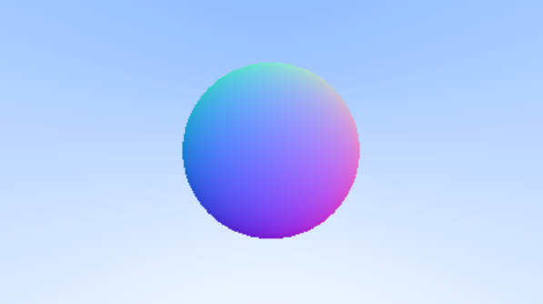

<head>
    <script src="https://cdn.mathjax.org/mathjax/latest/MathJax.js?config=TeX-AMS-MML_HTMLorMML" type="text/javascript"></script>
    <script type="text/x-mathjax-config">
        MathJax.Hub.Config({
            tex2jax: {
            skipTags: ['script', 'noscript', 'style', 'textarea', 'pre'],
            inlineMath: [['$','$']]
            }
        });
    </script>
</head>


这是参照教材[Ray Tracing In One Weekend](https://raytracing.github.io/books/RayTracingInOneWeekend.html#overview)所写的第二篇学习笔记，内容紧接着第一篇笔记[光线追踪 I](https://jyyyjyyyj.github.io/2022-05-07-ray_tracing1/)。

# 4. 抗锯齿与漫反射

### 抗锯齿（Antialiasing）

在上一篇内容生成的球体图像中，我们可以发现球体的边缘存在锯齿（下图）。然而在真实情况下，用相机拍照不会出现这种情况。我们可以通过对一个像素中的多个样本（也就是有多条光线射向该像素）取平均来尽量使图片趋近于真实。

<div style="align: center">
    
</div>

我们新建一个相机类`camera`，将相机的基本参数（比如视口大小，相机位置，等等）写进去。

一个像素的最终颜色是通过该像素点内的多个样本点的颜色叠加后取平均来得到的，具体的做法为：假设像素坐标为$(x,y)$，那么就选取多个样本点$(x+\Delta x, y+\Delta y)$，其中$\Delta x,\Delta y \in [0,1)$，并计算样本点处的颜色。最终将这些样本的颜色叠加并取平均，获得$(x,y)$处像素的最终颜色。

由此一来，边缘处的像素颜色就有了渐变效果，锯齿被减弱了：


<div style="align: center">
    
</div>

### 漫反射材质

为了让结果更加逼真，我们还需要考虑物体的材质。首先以漫反射（哑光）材质为例。产生漫反射的物体会用他们自身的颜色来影响周围的环境。同时，有部分光线会被物体表面吸收，表面颜色越深，吸收的光越多。

任何随机化漫反射方向的算法都会产生哑光的表面，可以用以下方法来简单模拟一下：

如下图所示，假设光线打到了表面上一点$\rm P$，而$\rm n$为$\rm P$处的法线。分别以$\rm P+n$与$\rm P-n$为圆形画单位圆，前者在表面外部，后者在表面内部，且二者均与表面相切。选择与入射光线在同一侧的圆（下图的情况是选择外侧的圆），并在圆中随机选择一点$\rm S$，就可以画出一条从$P$到$\rm S$的漫反射光线（图中橘色箭头）。

<div style="align: center">
    
</div>

如果漫反射光击中了物体，那么它会继续被反射，这种套娃反映在程序里就是一直不停地递归，如果递归深度过大可能会导致栈溢出，这种情况很显然是要避免的。因此，我们需要加上一个阈值来限制漫反射的次数。

假设光线每次击中物体时，会有50%的光被吸收，最大反射次数为50次，会得到一个非常暗的球体，基本上啥都看不见。我们再对rgb值进行$gamma = 2$的伽马校正，即对rgb进行开根号处理，得到更加接近于现实的结果：


<div style="align: center">
    
</div>

此时会发现，在球的影子部位（红色圈内），会出现一圈圈类似于波纹的东西。这种现象叫影子失真（shadow acne）。为了解决这个问题，我们需要忽略在$t$值很小的地方生成的反射光。

最后得到的结果是这样的：

<div style="align: center">
    
</div>

### True Lambertian Reflection

在以上所述的方法中，散射光的方向是通过在以法线为半径的单位球体内随机选取一点来计算的。而朗伯模型(Lambertian model)是通过在该球体的表面上随机选取一点来计算散射光方向。这样能够让光线散射的方向分布更加均匀。为了实现在球面上选点，我们可以先在球内部随机选取一点，再将该点的坐标进行归一化。

得到二者的对比如下，由于场景比较简单，和之前的方法并没有太大差别。但是我们可以发现，采用了朗伯模型的图片里的阴影要小一些。

<div style="align: center">
    
</div>

# 5. 更多种类的材质

由于一个场景中可能会存在各种各样材质的物体，而对于每种材质，都需要计算以下两个步骤：

1. 产生散射光（或是吸收入射光）

2. 如果发生了散射，光线衰减了多少。

类似于之前处理`hittable`的过程，我们可以建立一个材质的抽象类`material`：

```c++
class material {
    public:
        virtual bool scatter(
            const ray& r_in, const hit_record& rec, color& attenuation, ray& scattered
        ) const = 0;
};
```

在上一篇笔记中提到了`hit_record`这个结构体，其存储了被光线击中的点的相关信息。我们在`hit_record`以及物体类（如`sphere`）中加入描述材质的指针`shared_ptr<material> mat_ptr`，当光线击中某一物体时，`hit_record`中的该指针就会变为指向物体材质的指针。物体的材质决定了物体表面如何与光线交互。

现在我们已经有了漫反射材质，以下探讨其他类型的材质。

### 金属材质

对于表面光滑的金属，光线是不会以随机方向散射出去的。我们可以根据镜面反射原理算出反射光的方向：

<div style="align: center">
    
</div>


其中$\rm v$是入射光线，$n$为法向量，$\rm r$为出射光线，$\rm b$的长度为$\rm v \cdot n$。由此可以得出出射光线的方向为：

$$
\rm r = v - 2(v \cdot n)*b
$$

在代码中按照以上公式来计算光的反射。


在原来位于图像中央的球体的左右各加入一个金属材质的球，看看效果：


<div style="align: center">
    
</div>

### 模糊反射

我们可以像下图一样，通过在远处圈定一个范围（图中的圆），在圆中随机选择一点作为反射向量的终点，以此来对反射光线加上扰动，让镜面反射看上去更加模糊一点。圆的直径越大，反射光线的角度变化范围越大。


<div style="align: center">
    
</div>

以下是给镜面反射加上扰动后的渲染结果，左侧球体对应的扰动圆半径为0.3，右侧对应的为1，显然右侧球体的表面看上去更模糊一些。


<div style="align: center">
    
</div>
