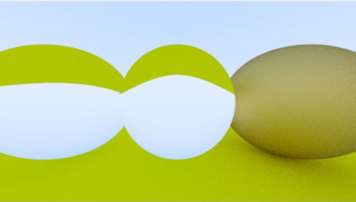
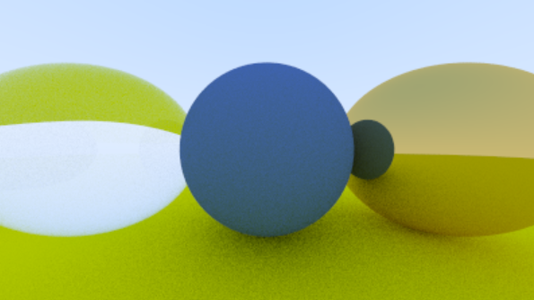
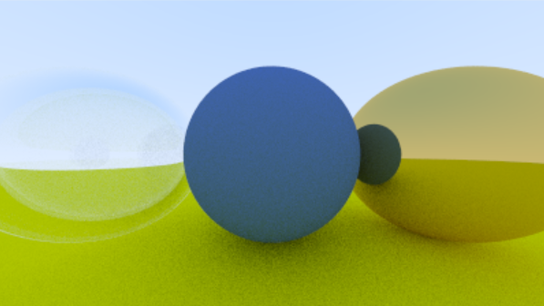
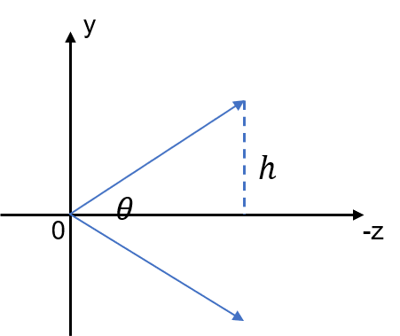
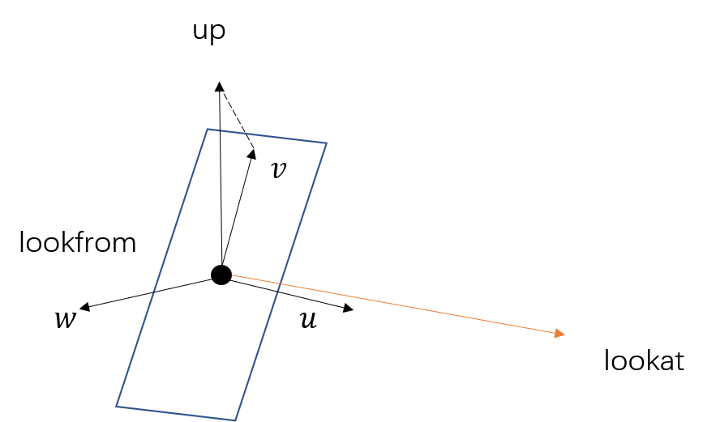
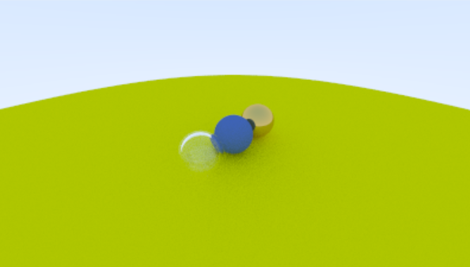
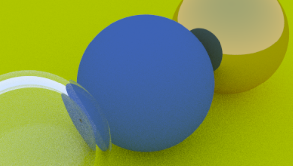
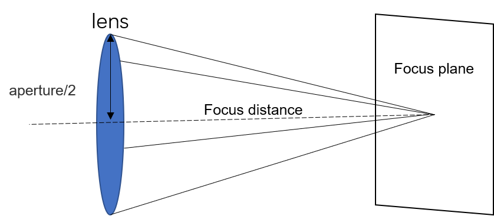
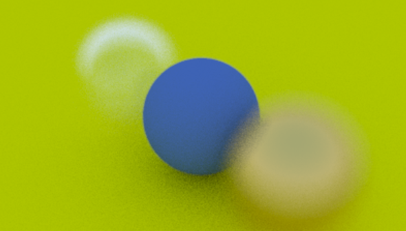
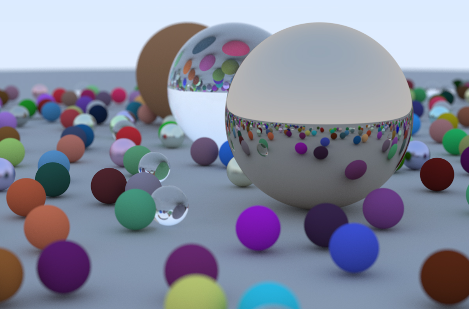

<head>
    
    
</head>

这是关于光线追踪的第三篇学习笔记，参考了教材[Ray Tracing in One Weekend](https://raytracing.github.io/books/RayTracingInOneWeekend.html)。前两篇的链接:

- [光线追踪 I](https://jyyyjyyyj.github.io/2022-05-07-ray_tracing1/)

- [光线追踪 II](https://jyyyjyyyj.github.io/2022-05-11-ray_tracing2/)

# 5. 更多种类的材质（续）

上一篇的笔记里提到了漫反射材质和金属材质和光的交互过程，这篇笔记里继续探讨更多的材质。

### 电介质材料

像水，玻璃，钻石这样的材质都是电介质材料(dielectrics)。当光线击中这种材质时，会产生反射光以及折射光。

折射光的方向是根据斯涅耳定律决定的（这是初中物理的内容了吧，这里就不写了）。我们假设这个材质总是可以产生折射（不符合现实），得到如下的渲染结果：

    

很明显这上面的结果不对。这是因为当光线从高折射率介质进入低折射率介质（比如从玻璃到空气），且入射角大于某个临界值的时候，是不会产生折射射线的，而是会发生全反射。因此，我们需要对这种情况进行判断。

### Schlick Approximation

加入了全反射后的渲染结果依旧不太理想。因为真实的的玻璃的反射率随着角度的变化而变化，如果你从一个陡峭的角度看一扇窗户，它就像一面镜子。我们可以用Schlick模型来近似地求出镜面反射系数：

$$
R(\theta) = R_0+(1-R_0)(1-\cos(\theta))^5
$$

其中：

$$
R_0 = \left(\frac{\eta_1 - \eta_2}{\eta_1+\eta_2}\right)^2
$$

其中$\theta$是入射光和表面法线的夹角，而$\eta_1$和$\eta_2$是反射平面两侧介质的折射率，$R_0$是当光线平行于表面法线入射时的反射系数。

加入Schlick近似后得到的渲染结果（从左到右材质分别为：玻璃，漫反射材质，金属）：

    

如果想要得到一个中空的玻璃，可以在相同的球心处放置一个半径为负的玻璃球体（表面法线方向朝内），得到如下的效果：

    

# 6. 相机可移动

我们想要从各种角度来查看物体。首先假设光线仍然从原点朝向$z$轴负方向射出，投影到$z=-1$上，如下图所示：

    

那么$h = \tan(\frac{\theta}{2})$，其中$\theta$就是视野(field of view, fov)。我们可以通过修改$\theta$和纵横比来修改视口的大小。fov越小，我们能看见的范围就越小，这样子在视口显示出来的结果就像是物体被局部放大了一样。

### 相机的移动和朝向

接下来讨论从不同位置看向物体时所形成的图像。假设相机摆放的位置为lookfrom，而我们看向的点为lookat。

此外，但你看向一个物体的时候，在保持身体不动的情况下仍然可以通过转动头来观察四周。我们将这个转动的轴称为up vector（头绕着鼻子转，那么鼻子就是up vector），这根轴应该位于垂直于视线方向的平面上。为此，我们可以选择任意一个方向up，并将其投影到平面上获得相机的up vector$v$，然后得到如下图所示的局部坐标系$uvw$。需要注意的是，$v$，$w$和up在同一平面内。我们仍然令相机面对$-z$轴，那么$w$应该指向$z$轴正轴。

    

改变相机的位置和朝向，令fov为90度，能够得出一个俯视视角的图像：

    

如果我们缩小fov到20，可以获得一个放大的效果：

    

# 7. 散焦模糊

这一小节涉及到一些摄影知识了。作为一个~~非常业余的~~胶片爱好者以及本科的工程光学考了97分的人（~~然而已经忘光了~~），我大致回忆一下光圈和焦距在拍照时的作用：

**光圈**：相机镜头内会有一些像叶片一样的东西，他们会挡住镜头的一部分，剩下一个圆形的孔（这是因为我们没法改变镜头的直径，只能通过遮住一部分来达到类似的效果）。通过调整光圈，我们可以调整叶片的位置，从而改变孔的直径。光圈开得越大，孔的直径就越大，能够透进来的光越多（照片变亮），反之透进来的光就越少。所以如果天气不好，没什么太阳的话，就把光圈开大一点。

同时，光圈也和景深有关系，光圈越大，景深越小，能够清晰成像的距离范围就越小，反之景深越大，能够清晰成像的范围就越大。通俗一点来讲，光圈大的时候就像在拍特写，而光圈小的时候能够清晰地拍到更多物体。

**焦距**：焦距的长短会影响到物体的成像大小，所以拍照修改焦距的时候会感觉物体在放大/缩小。

为了让渲染结果看上去更真实，我们可以简单地模拟一下对焦的效果。在焦平面上的物体都可以清晰地成像。

    

为了达到这个效果，给定焦平面到镜头的距离（focus distance，即为lookfrom到lookat的距离），我们在一个以lookfrom为圆心的圆内（圆在$uv$平面上）随机选一点作为光源，这个圆就相当于光圈。因此，圆的半径越小，景深就越大，能够清晰成像的物体范围就越大。当圆的半径为0时，所有的物体都能清晰成像。

我们将光圈调到一个比较大的值（令直径为2），看看效果：

    

可以看出，除了中间那个球，另外两个都变模糊了。

# 8. 最终效果

教材中所有的知识点到这里就都讲完了！这里放一张教材中给出的，最终的渲染结果：

    

我注意到一旦场景里的物体变多，渲染会变得非常慢，查了一些资料之后发现可以通过并行运算来解决这个问题。此外，还有更多的扩展知识等待探索，比如如何生成除球体之外的形状，如何生成更复杂的纹理等等。作者还写了更高阶的教程：[Ray Tracing: The Next Week](https://raytracing.github.io/books/RayTracingTheNextWeek.html)。不过最近我有一篇会议论文要写，可能要过段时间才能继续学下去了。
