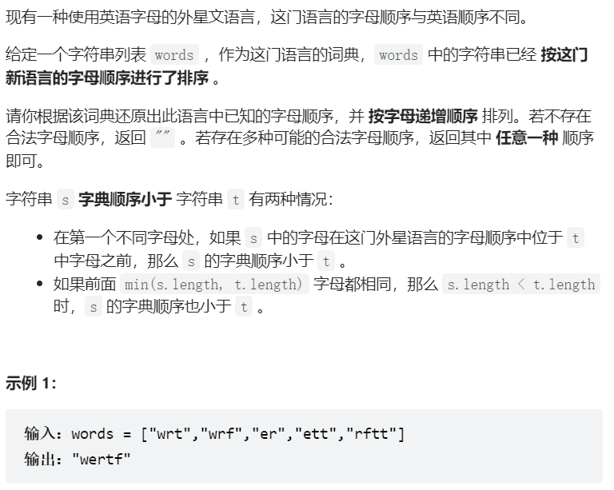
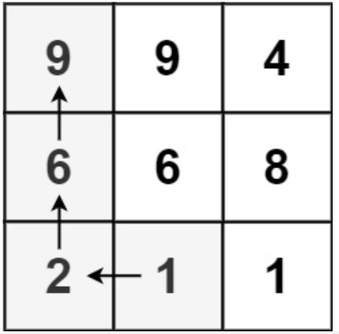
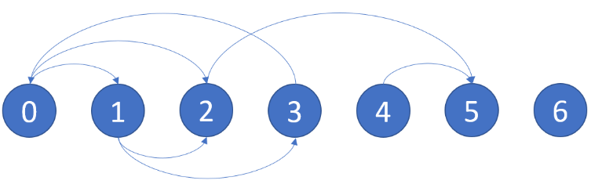

最近在忙各种各样的事情，忙着改代码写论文还有准备找工作，连游戏都没空碰（啊，好想玩侠客风云传……），所以转眼间又大半个月没写博客了。

寻思着总得写点什么，想到我对图论相关的算法一直都不太熟（虽然研一的时候选过图论相关的选修，但是都是纸上谈兵），于是这篇博客的主题是图论中很常用的拓扑排序。内容包括拓扑排序的简要概括，以及一些相关的leetcode困难题的题解。


### 浅尝一下拓扑排序

简单地来说，拓扑排序就是对一个有向无环的图的顶点进行排序，它可以分为三步：1. 找到入度为0的点并输出，2. 删除这些点以及连着它们的边， 3. 重复1和2直到所有的点都被删除。

这可以用深度优先搜索（DFS）或广度优先搜索（BFS）来实现。

这两种方法首先都需要建图，首先获取从每个点出发的edge所指向的点，以及每个点的入度。

如果用DFS，那么用一个栈存储来点的排序。首先访问图中的任意一点，并依次访问它的邻接点，同时记录每个点的访问情况。如果一个点的所有的邻接点都被访问过了，那么该点被标记为已访问，并被压入栈中，这样一来，最后被压进栈里的就是入度为0的点，应该被排在最前面。

如果用BFS，那么首先建立一个队列，并将入度为0的点入队，然后：当队列非空时，将最前面的点出队，并将其邻居点的入度-1，如果邻居中有点的入度变为了0，那么将其入队。这个步骤会被不断地重复，直到队列为空（此时要么所有的点都排序完毕，要么图里有环，无法排序）


### 浅尝一下例题

**例题1：外星文字典**

以下是剑指offer上的一道困难题：外星文字典，因为题目有点长，我直接放上截图：


<div align=center>
    
</div>

简单地来说，就是这门外星语言有一个独特的字典序，给出一些按照外星字典排序的单词，我们需要根据这些单词推测出其中的字母在外星字典里的前后顺序。

在单词中出现的字母可以被视为图中的一个结点，而有明显先后顺序的字母之间存在边，例如，由于"wrt"排在"wrf"之前，说明"t"应该在"f"前，那么图中就存在一条从"t"指向"f"的边。

解这道题的方法是：首先通过比较两两相邻的单词来获得字母之间的相对顺序，构造出一个有向图，然后再进行拓扑排序。

需要注意的是，题目中提到这个外星字母的排序可能会有问题（也就是有向图中存在环），因此我们在拓扑排序的过程中也要注意结果是否合理。

以下是用BFS实现拓扑排序的代码：

```c++
class Solution {
public:
    unordered_map<char, vector<char>> edges; //记录边
    unordered_map<char, int> indegrees; //入度
    bool valid = true;

    //构建图
    void add_edge(string word1,string word2)
    {
        if(!valid)
            return;
        //遍历两个单词，找到第一个不同的字符
        int n = word1.size();
        int m = word2.size();
        int idx = 0;
        while(idx < n && idx < m)
        {
            //说明此时c2排在c1之后
            if(word1[idx] != word2[idx])
            {
                char c1 = word1[idx];
                char c2 = word2[idx];
                edges[c1].push_back(c2);
                indegrees[c2]++;
                break;
            }
            idx++;
        }

        //排序有问题
        if (n > m && idx == m) {
            valid = false;
        }
        return;
    }


    string alienOrder(vector<string>& words) {
        int length = words.size();
        //初始化哈希表
        for (auto word : words) {
            int wordLength = word.size();
            for (int j = 0; j < wordLength; j++) {
                char c = word[j];
                if (!edges.count(c)) {
                    edges[c] = vector<char>();
                }
            }
        }

        //构建图
        for (int i = 1; i < length && valid; i++) {
            add_edge(words[i - 1], words[i]);
        }
        
        if (!valid) {
            return "";
        }

        queue<char> qu;
        for (auto it : edges) {
            //入度为0的字母（排序是靠前的）
            if (!indegrees.count(it.first)) {
                qu.emplace(it.first);
            }
        }
        string order;
        while (!qu.empty()) {
            char u = qu.front();
            qu.pop();
            order.push_back(u);
            //将与u相连的字母放入队列
            for (char v : edges[u]) {
                indegrees[v]--;
                if (indegrees[v] == 0) {
                    qu.emplace(v);
                }
            }
        }
        return order.size() == edges.size() ? order : "";
    }

};

```


**例题2：矩阵中的最长递增路径**

**题目：**

给定一个 m x n 整数矩阵 matrix ，找出其中 最长递增路径 的长度。

对于每个单元格，你可以往上，下，左，右四个方向移动。 你 不能 在 对角线 方向上移动或移动到 边界外（即不允许环绕）。

一个例子：

<div align=center>
    
</div>

**题解：**

我们可以将这个矩阵化为一个有向图，如果矩阵中的一个元素比它的某个邻居要小，那么就构造一条由该点指向邻居的边。对于矩阵中每个元素，我们统计它的出度（即周围有几个点的值比它大）。

对于出度为0的点，它周围没有任何比它大的点，所以该点必定是某条递增路线的终点。我们可以采用BFS来解决这个问题。首先建立一个队列，将出度为0的点存入其中。当队列非空时，循环执行这样的操作：对于当前队列中的每个元素，依次取出队列最前端的点，搜索其四周是否存在值小于该点的邻居，如果存在，就将邻居点对应的出度值减一（周围有一个比它大的点被访问过了），如果邻居点的出度变为了0，就将其放入队列中。

每进行一次循环，代表递增序列的长度增加1，因此最长递增序列的长度等于循环的次数。

以下是用BFS解题的代码：

~~~c++
class Solution {
public:
    int longestIncreasingPath(vector<vector<int>>& matrix) {
    	//dirs代表上下左右，由于连续打2个大括号jekyll会报错，所以略过了定义
	//不知道有什么方法可以解决这个问题
        int dirs[4][2]; 
        
        int m = matrix.size();
        int n = matrix[0].size();
		//建立有向图
        //统计出度，即四周比自身更大的邻居的数量
        vector<vector<int>> outdegree(m,vector<int>(n,0));
        for(int i = 0; i < m; i++)
        {
            for(int j = 0; j < n; j++)
            {
                for (int k = 0; k < 4; ++k) {
                    int newRow = i + dirs[k][0], newColumn = j + dirs[k][1];
                    if (newRow >= 0 && newRow < m && newColumn >= 0 && 
                    newColumn < n && matrix[newRow][newColumn] > matrix[i][j]) 
                    {
                        ++outdegree[i][j];
                    }
                }
            }
        }
        queue<pair<int,int>> q;
        //出度为0的点周围没有比它更大的点，所以其一定是某条路径的终点
        //从出度为0的点开始搜索
        for(int i = 0; i < m; i++)
        {
            for(int j = 0; j < n; j++)
            {
                if(outdegree[i][j]==0)
                    q.push({i,j});
            }
        }
        int rtn = 0;
        while(!q.empty())
        {
            int sz = q.size();
            rtn++;
            for(int i = 0; i < sz;i++)
            {
                auto pt = q.front();
                q.pop();
                for(int j = 0; j <4; j++)
                {
                    int newx = pt.first+dirs[j][0];
                    int newy = pt.second + dirs[j][1];
                    if(newx >= 0 && newy >= 0 && newx < m && newy < n &&
                    matrix[newx][newy] < matrix[pt.first][pt.second])
                    {
                        outdegree[newx][newy]--;
                        if(outdegree[newx][newy] == 0)
                            q.push({newx,newy});
                    }
                }
            }
        }
        return rtn;
    }

};
~~~

### 6.18日新增

在做图论专题的学习计划的时候碰到了一道新的题。

**例题3： 找到最终的安全状态**

有一个有 n 个节点的有向图，节点按 0 到 n - 1 编号。图由一个 索引从 0 开始 的 2D 整数数组 graph表示， graph[i]是与节点 i 相邻的节点的整数数组，这意味着从节点 i 到 graph[i]中的每个节点都有一条边。

如果一个节点没有连出的有向边，则它是 终端节点 。如果没有出边，则节点为终端节点。如果从该节点开始的所有可能路径都通向 终端节点 ，则该节点为 安全节点 。

返回一个由图中所有 安全节点 组成的数组作为答案。答案数组中的元素应当按 升序 排列。

示例：

假设输入的是如下的一个图：

<div align=center>
    
</div>

那么输出节点为[2,4,5,6]。

**题解：**

感觉题目描述挺绕的……其实可以把答案分为两部分：1. 出度为0的节点，2. 只与出度为0的节点相连的节点。将这两部分都求出来，排序后就得到了最终答案。

令初始的图为graph，我们首先把有向图里每条边的方向都翻转，得到新的图inverse_graph。这样的话，在graph中出度为0的点，到inverse_graph里就变成了入度为0的点。我们统计inverse_graph中每个节点的入度，用一个数组count来记录。

然后再采用拓扑排序，首先将inverse_graph中所有入度为0的点存入一个队列中，再在inverse_graph中依次删除这些节点。每删除一个节点，其相连的节点的入度值就要-1，如果由此产生了新的入度为0的点，就将其push到队列中，一直重复直到队列为空。在这个过程中所产生的的所有入度为0的节点就是符合条件的点。

代码如下：

```c++
class Solution {
public:
    vector<int> eventualSafeNodes(vector<vector<int>>& graph) {
        //找到所有入度为0的点（反过来）
        int n = graph.size();
        vector<vector<int>> inverse_graph(n);
        vector<int> count(n,0);
        for(int i = 0; i < graph.size();i++)
        {
            for(int j: graph[i])
            {
                count[i]++; //计算入度
                inverse_graph[j].push_back(i);
            }
        }
        queue<int> q;
        
        //找出入度为0的点
        for(int i = 0;i < n;i++)
        {
            if(count[i] == 0)
            {
                q.push(i);
            }
        }
        vector<int> rtn;
        while(!q.empty())
        {
            int cur = q.front();
            q.pop();
            rtn.push_back(cur);
            //与他相连的点入度-1
            for(int i: inverse_graph[cur])
            {
                count[i]--;
                if(count[i] == 0)
                {
                    q.push(i);
                }
            }
        }
        sort(rtn.begin(),rtn.end());
        return rtn;

    }
};
```

### Reference

- [拓扑排序](https://blog.csdn.net/qq_46258139/article/details/113623693)

- [外星文字典](https://leetcode.cn/problems/Jf1JuT/)

- [矩阵中的最长递增路径](https://leetcode.cn/problems/longest-increasing-path-in-a-matrix/)
