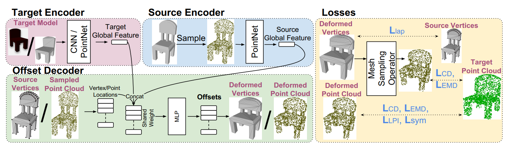
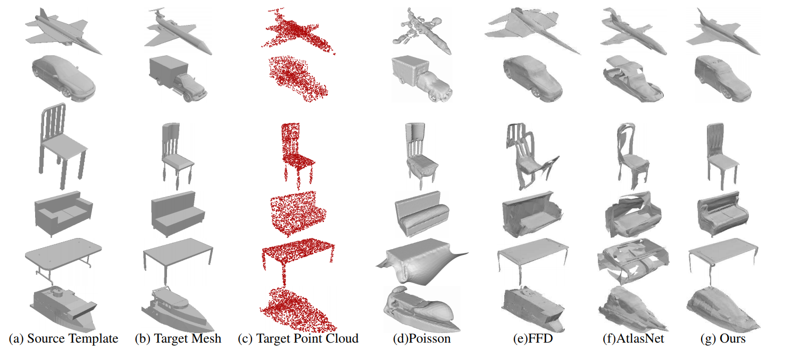

<head>
    
    
</head>

之前一直在捣鼓一些有关点云非刚性配准的问题，现在转换了目标，开始研究网格模型的非刚性配准了。我主要是想要了解如何在保证网格表面平滑以及网格质量（比如说，不能有过于尖细的三角形）的情况下，来对source mesh朝着target mesh的形状进行变形。同时，我也想知道如何定义从source到target的所谓“距离”，也就是损失函数。我找来了一些论文，本篇博客是关于其中一篇发表在CVPR上的论文：*3DN: 3D Deformation Network* 的阅读笔记。

## 1. 方法
这篇文章提出的网络，简称为3DN，只改变顶点坐标，而不改变点之间的拓扑关系。输入有两部分，一个是source mesh，用$S=(V,E)$来表示，其中$V$是顶点集合，$E$是三角形的集合。另一个是source变形的参照对象$T$，即target，是一张二维的图像，或一个三维模型。我只想考虑target是三维模型的情况，此时$T$是一个三维点云，其点的数量为$N_T$。网络的输出是$S$中每个顶点的位移$O$。那么变形后的source mesh为$S=(V',E)$，其中$V' = V+O$。

3DN有一个source编码器和target编码器，用来学习source和target的全局特征，还有一个位移解码器，采用编码器的输出来求解形变。流程图如下：

    

### 编码器

编码器的结构参考了[PointNet](https://openaccess.thecvf.com/content_cvpr_2017/papers/Qi_PointNet_Deep_Learning_CVPR_2017_paper.pdf), 其输入的数据是点云，所以对于source mesh，首先从表面均匀地采样一些点，再将这些点送入编码器中。编码器会输出一个全局特征向量(global feature vector)。source和target的特征向量被拼接在一起之后送入解码器。

### 解码器

解码器通过学习函数$F(\cdot)$来预测每个点的形变。输入一个三维坐标$v$，$F$能够预测出位移$o$，最终我们可以得到变形后的坐标$v' = v+o$。解码器的设计同样参照了PointNet，不过与PointNet不同的是，解码器将顶点坐标与特征向量连接到了一起(PointNet里用的是单个点的特征)。

### 损失函数

我们需要一个损失函数来衡量$S'$和$T$之间的距离（这是我想要了解的重点）。作者提出了一个Differentiable Mesh Sampling Operator（DSMO），用来从网格的表面均匀采样点。

用质心坐标来表示从一个三角面片上采样的点$p = w_1v_1+w_2v_2+w_3v3$，其中$w_1+w_2+w_3 = 1$，那么变形之后该点对应的偏移量也应该按照同样的权重来算，即$o_p = w_1o_{v_1}+ w_2o_{v_2}+ w_3o_{v_3}$。这样在反向传播的时候，顶点的梯度可以用$g_{o_{v_i}} = w_ig_{o_{v_p}}$来简单计算。(其实这里我不太能理解，右边的系数不应该是$\frac{1}{w_i}$么？)

此外，作者采用了chamfer和earth-mover距离来衡量$S'$的采样点云$PC$和$T$的采样点云$PC_T$之间的误差。其中chamfer距离就是$PC$中每个点到$PC_T$的最近距离以及$PC_T$中每个点到$PC$的最近距离的平方之和。而earth-mover距离对我而言是个新的概念，它需要求得一个$PC \rightarrow PC_T$的点到点的映射，使每对点之间的距离之和最小，这个最小的距离即为earth-mover距离。这两种距离对于不同的点密度具有健壮性，分别用$L_{CD}$和$L_{EMD}$来表示。

除了以上这些内容之外，我们还需要一些其他的loss来保证$S'$的质量，因此作者还提出了以下的三个loss：

**对称损失 Symmtry loss：**

很多人造的物体是有对称性的，但是他的mesh拓扑不一定是对称的，所以在从source mesh上采样点云的同时，作者还对$S$的镜像模型进行了采样，获得镜像点云$M(PC)$，并借助它来计算对称损失：

$$
L_{sym}(PC,PC_T) = L_{CD}(M(PC),PC_T)+ L_{EMD}(M(PC),PC_T)
$$

说白了就是对$M(PC)$和$PC_T$计算chamfer距离和earth-mover距离，以此来保证变形后模型的对称性。然而我对这个地方有点疑惑，这个loss似乎只能应用于严格对称的物体，并且对称轴是已知的才可以。此外，就算原模型$S$是对称的，但是$T$不一定对称，万一$T$就是一侧大另一侧小，那这个loss应该会阻止$S$往正确的方向变形吧？总觉得采用这个loss起作用的前提条件有些许苛刻。

**拉普拉斯损失 Mesh Laplacian loss：** 这个没啥好讲的，目的是为了保证$S'$表面平滑，其计算方法如下：

$$
L_{lap} = \sum_{i} \|Lap(S)-Lap(S')\|_2
$$

其中$Lap()$是拉普拉斯算子。

**局部置换不变损失 Local permutation invariant loss：** 这个loss的目的是，让模型在变形过程中不会和自身相交。一些老旧的变形方法，比如自由变形（在[之前的博客](https://jyyyjyyyj.github.io/2021-12-04-FFD/)里探讨过），则无法保证这一特性。为了实现这一特性，对于一个点$p$以及距离它$\delta$的邻居点，需要保证二者的距离不受变形的影响：

$$
L_{LPI} = -\min(F(V+\delta) - F(V),0)
$$

即二者形变程度相同，其中$\delta$是一个很小的三维offset。如果我们将变形前后的模型分成很多很小的部分，可以发现在这些小的局部范围内，点和点之间的相对距离的变动其实很小，因此这个loss也有助于保持表面的平滑性。这个概念在另一篇[论文阅读笔记](https://jyyyjyyyj.github.io/2021-11-23-non-paper/)里也有提到过。

把以上所有的loss都给予一个权重，加起来就获得了最终的损失函数$L$。

## 2. 实验结果

实验的细节就懒得记笔记了。以下是3DN与其他的网络的实验结果对比。其中target mesh是通过对点云进行泊松重建得到的。

    

可以看出3DN的结果更加平滑，对称性更好。

## 3. 我的一些总结

这篇论文在神经网络结构上并没有花费太多笔墨，主要是借鉴了PointNet。作者对于loss的计算描述很详细，而这也是我最想要了解的部分，看完这篇论文收获还是挺多的。

有些其他论文会把三角面片的规则度（mesh regularity，我也不知道怎么表述，暂且就称之为规则度吧）也放入考虑范围内，比如就是让三角面片的三个角的大小差距不要太大，不要出现特别尖细的三角形等等，不过这篇论文似乎没有考虑到这一点。一个简单计算规则度的方法是，对于一个三角形的三条边，计算如下参数：

$$
\gamma = \frac{4\sqrt 3 w}{l^2_1+l^2_2+l^2_3}
$$

其中$w$是三角形的面积。三角形越不规则，$\gamma$越小。当三角形为等边三角形时，$\gamma$达到最大值，为1。

## Reference

- [3DN: 3D Deformation Network](https://openaccess.thecvf.com/content_CVPR_2019/papers/Wang_3DN_3D_Deformation_Network_CVPR_2019_paper.pdf)
