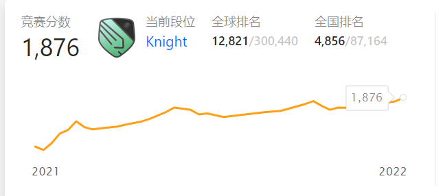

在家上了一年多的网课之后，终于来到日本了！

来之前有很多顾虑，由于之前一年一直在家里没有正常的社交，而且我的日语也不好，我有点担心自己能不能在这里很好地生活下去。而且因为最近身体状况不是很好，我对于健康和新冠的问题也有些顾虑。

今天是我到达东京的第三天，到目前为止一切都很好（在ns上下载游戏终于不需要挂加速器了），开始尝试着恢复正常的生活，和同龄人好好相处吧！

出国前一周我久违地同时参加了力扣的周赛和双周赛，昨天分数更新之后也终于拿到了段位勋章：

    

