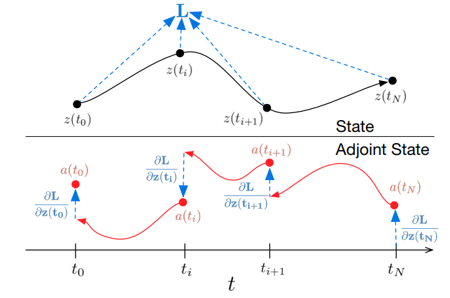

<head>
    
    
</head>

最近在写一篇新的会议论文，似乎我很习惯于进行极限操作，距离ddl只剩下半个月了而我连代码都没改完（笑），文章更是只写了个开头。我最近在做关于非刚性配准的课题，之前一直都用cpp写偏传统的方法，最近换成了深度学习（再次感叹一句，python的语法真的好难适应！）。不过目前的代码结果不算很好，所以我一直在找有没有什么更合适的神经网络模型来替换一下，于是就看到了标题上的这篇论文：*Neural Ordinary Differential Equations*。本篇博客就是关于这篇论文的阅读笔记。

## 1. 问题设定

在某些神经网络中，比如residual networks等，会通过一系列隐藏状态（hidden state）的转换来构建复杂的转换：

$$
{\rm h}_{t+1} = {\rm h}_t + f({\rm h}_t,\theta_t)
$$

其中$t\in{0,...,T},  {\rm h}_t \in R^D$。这一系列的隐藏状态可以看做是一个连续变换的离散化形式。由此，我们可以用一个常微分方程（ODE）来表示这个连续变化的过程：

$$
\frac{d{\rm h}_{t}}{dt} =  f({\rm h}(t),t,\theta)
$$

从输入层${\rm h}(0)$开始，我们可以将输出层${\rm h}(T)$看做是这个ODE初值问题在$T$时刻的解。

## 2. 方法

训练这种连续深度网络的难点在于如何进行反向微分。作者将ODE solver看做是一个黑盒，并用adjoint sensitivity method来计算梯度。这个方法不会占用过多存储空间。

假设损失函数$L()$是这样的：

$$
L({\rm z}(t_1)) = L(z(t_0) + \int_{t_0}^{t_1}f({\rm z(t)},t,\theta)) = L({\rm ODESolve}({\rm z}(t_0),f,t_0,t_1,\theta) )
$$

首先，我们要确定$L()$对${\rm z}(t)$的微分关系，即$\frac{\partial L}{\partial{\rm z}(t)}$。这个参数被称为adjoint，用${\rm a}(t)$表示，它的变化可以通过另一个ODE给出（链式法则）：

$$
\frac{d{\rm a}(t)}{dt} =  -{\rm a}(t)^\intercal \frac{\partial f({\rm z}(t),t,\theta))}{\partial {\rm z}}
$$

因此，要计算$\frac{\partial L}{\partial{\rm z}(t_1)}$，solver必须要不断地回溯，获取每一个时间点的$\frac{\partial L}{\partial{\rm z}(t)}$。微分的计算过程如下图所示：

    

以下是计算loss关于$\theta$的导数的公式：

$$
\frac{dL}{d\theta} =\int_{t_1}^{t_0} a^{\rm \intercal} \frac{\partial f({\rm z}(t),t,\theta)}{\partial \theta} dt
$$

作者将初始状态，adjoint和其他的偏微分放到了一个向量里，通过以下的算法，使用一次ODE solver就可以计算出$z$,$a$和$\frac{\partial L}{\partial \theta}$。

    

其中$a^{\rm \intercal} \frac{\partial f({\rm z}(t),t,\theta)}{\partial z}$是vector-Jacobian乘积。

暂时就先写到这里，剩下的以后再补充。

### 一些题外话

写这篇博客的时候正好就在安倍晋三遇刺那天的下午，晚上回宿舍的时候还看见电车上的日本人正拿着报纸看这个新闻，标题里写着大大的“铳枪”二字。

没想到我刚来日本一个星期就遇到了这种事。这几年的国际形势真是变换莫测，时代的变化会对我们这些芸芸众生产生什么影响，未来又会变成什么样呢。

### Reference

- [Neural Ordinary Differential Equations](https://proceedings.neurips.cc/paper/2018/file/69386f6bb1dfed68692a24c8686939b9-Paper.pdf)
