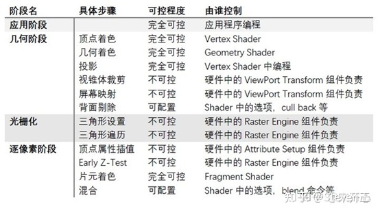

好久都没有写博客了，因为秋招的事情搞得我焦头烂额。最近三天有两场面试五场笔试（啊！毁灭吧！），忙得我是晕头转向。

说到找工作，我一直很向往游戏行业，也给各大游戏公司都投了简历（截至2022.09.03，已经挂掉两个了）。虽然研究生的方向和图形学也有点关联，但是和渲染，物理动画之类的领域并不太沾边，因此我投的大多都是要求相对较低的游戏客户端开发岗。

我想要在面试之前恶补一下图形学知识，然而感觉自己太焦虑了，怎么都学不进去，后来就想到了一个办法……那就是写博客呀！于是本篇博客的内容就是关于图形渲染管线的。

我主要参考了[b站上的视频](https://www.bilibili.com/video/BV1L54y1s7xw?p=2&share_source=copy_web)，虽然只有半小时但是讲得非常详细，此外还有一些技术博客。每个作者讲的内容都有一些细微的差别，不过整体上是一致的。

## 1. 图形渲染管线的基本步骤

渲染管线所做的事情，就是对一系列三维图形进行处理和变换，将其转化为一副二维图像呈现在屏幕上。在渲染管线的每一步中，下一个步骤的输入就是上一个步骤的输出，这也是其被称为“管线”的原因。对于渲染管线每个步骤的区分有很多种不同的方法，以下是其中一种常用的区分：

    

总共有四个步骤：

应用阶段，几何处理阶段，光栅化阶段和像素处理阶段。其中应用阶段是在CPU上进行的，其他的阶段在GPU进行。GPU的并行性比较好，可以用来处理批量的顶点数据。

## 2. 应用阶段

应用阶段是在CPU里实现的，能够由用户完全控制。应用阶段会对输入的图形进行一些预处理，其中的内容有：

**基本场景数据的准备**：包括场景中待渲染的物体，摄像机的数据，光源的数据，以及其他的一些全局性的数据。

更详细地说，基本场景数据包括以下这些内容：

**场景物体数据**：物体变换数据（位置，旋转，缩放等）和物体网格数据（顶点位置，uv贴图等）

**光源信息**：光源类型（方向光，点光，聚光等），位置，方向，角度等。

方向光的信息包括颜色和方向，点光源的信息包括颜色，位置和范围，聚光源包括颜色，位置，方向内外圆锥角等。此外还有关于阴影的设置，比如是否需要设置阴影，该光源可见范围内是否有可投射阴影的物体，以及阴影的参数（阴影强度，级联参数，深度偏移等）。接下来就是逐光源绘制阴影贴图（有很多种算法）。

**摄像机参数**：位置，方向，远近截面，正交/透视，视口长宽比，fov等

**空间加速，粗粒度剔除**：

视锥剔除：删除不在视锥范围内的物体。如果聚光锥和视锥不相交，也可以将其剔除。

层级剔除：以unity为例，可以通过给物体设定不同层级，让摄像机不去渲染某一层。

常用的加速方法包括一些数据结构以及算法。其中有：

层次包围盒（BVH）：用一个体积略大但是形状简单的包围盒来描述复杂的几何体，通过构造层次树状结构，可以使包围盒越来越接近被描述对象。层次包围盒经常被用在视锥体剔除中。

二叉空间分割树（BSP树）：BSP树的每个节点表示一个超平面，将当前空间分为前向和后向两个部分，即左右子节点。有了BSP树，就可以根据观察者的位置，快速地按照从前到后的顺序对场景中的对象进行访问。

还有kd树，八叉树等等树形结构可用来存储几何体。

**设置渲染状态和参数**：其中包括渲染顺序的设置，比如由近到远渲染，或者先渲染不透明的，再渲染半透明的等等，不透明的物体是从前往后排序，这样可以剔除一些被遮挡的物体，而半透明的物体需要从后往前排序。顺序通过**渲染队列**来决定。此外，不同的物体可能需要不同的着色器来渲染，渲染的结果输出也可能不同，渲染模式（比如前向渲染，延迟渲染）也需要进行设置。

**调用DrawCall**：设置完以上部分之后，处理好的场景数据包括：顶点数据（位置，颜色，法线，纹理uv坐标等），MVP变换矩阵，纹理贴图等。我们需要调用DrawCall将带有渲染数据的图元（可以是点，直线，三角形等等）输出给GPU。

## 3. 几何处理阶段

这一步以及后面的步骤就都是在GPU上实现的了。几何处理阶段主要包括：顶点着色，投影，裁剪，屏幕映射。其中顶点着色和投影之间还存在一些可选项。

**顶点着色**: 这一个步骤是可以编程的。每一个顶点都会调用一次顶点着色器，主要有坐标变换和着色（比如计算光照）两个部分。

顶点的坐标在最初始的时候是其相对于物体轴心的坐标，那么坐标变换的第一步就是根据物体相对于世界坐标系的位移/旋转/缩放，来获取顶点在世界坐标系中的位置。第二步是将顶点从世界坐标系变换到观察坐标系。第三步进行投影变换，获取其在裁剪坐标系的位置，裁剪掉一些不在投影范围内的图元。投影分为正交投影和透视投影，其中透视投影遵循近大远小的规则。这三个步骤所用到的矩阵就是MVP（model，view，projection）矩阵。

**曲面细分**：这是一个可选的步骤，就是一个三角网格细分的过程。网格细分有很多算法，这里就不提了。

**几何着色器**：也是一个可选步骤。顶点着色器的输入是顶点，而几何着色器的输入是图元（点，线段，三角形，折线段等），可以通过给定的图元生成新的图元，比如把输入的点或线段扩展成多边形。

**投影**：对于在裁剪空间中的物体，对他进行透视除法（xyz除以w），从投影坐标系转换到标准设备坐标系（NDC）。有正交投影和透视投影两种，正交投影的w为1，而透视投影遵循近大远小规则，w在近处较小，远处较大。

**裁剪**：如果经过透视除法之后的xyz坐标超出了-1~1的范围，就需要被裁减掉。如果一个图元部分处于范围之外，则需要在裁剪之后补全新的顶点。

**屏幕映射**：使用视口变换，把标准坐标系映射到屏幕上（标准坐标系的范围都是-1~1）。对于opengl来说，它的屏幕坐标原点在左下角。

## 4. 光栅化阶段

光栅化阶段是完全不可控的。其主要有两个步骤：三角形设置和三角形遍历。有一些设备会将片元着色和颜色混合也放到光栅化阶段中。

**三角形设置**：计算三角形边界信息。

**三角形遍历**：检查每个像素是否被三角形覆盖。如果被覆盖，那么说明该像素属于三角形。 接下来使用三角形的三个顶点对每个被覆盖的像素进行线性插值（获得重心坐标），然后得到该像素对应的片元的数据。片元并不等同于像素，一个像素可能会对应多个三角形的不同片元，因此在后续处理中，可能会舍弃一部分片元。

**抗锯齿**：抗锯齿是用来对三角形的边缘进行平滑处理，让其看上去不会突兀。抗锯齿的常用方法有：**超采样抗锯齿（SSAA）**，将渲染输出的分辨率放大n倍，然后再进行下采样，消耗的资源比较大；**多重采样抗锯齿（MSAA）**，在一个像素里放置多个采样点，对其进行覆盖测试（是否在三角形内）和遮挡测试（比较深度值），对于每个像素只计算一次着色，后续逐片元操作时再根据三角形对采样点的覆盖率来进行颜色的混合，消耗小于SSAA，但是不太支持延迟渲染；**快速近似抗锯齿（FXAA）**，是在后处理阶段实现的，其首先找出图像中的所有边缘（通过亮度比较，G分量），其次平滑化边缘（沿着某个方向将一定范围的像素取出来加权平均）；**时域抗锯齿（TAA）**，同样也是在后处理阶段，使用同个像素在普通帧上的不同采样点进行加权平均，容易出现鬼影或抖动的问题。

## 5. 像素处理阶段

包括片元着色，测试混合两个步骤，最后输出到目标缓冲区。

**片元着色**：在上一步光栅化中，我们已经获得了每个片元对三角形顶点插值的信息，采用片元数据以及其他信息（比如光照，阴影）进行计算，获取最终的片元颜色。各种复杂的着色模型，光照计算都是在这一步进行的。

**测试**：这一步涉及到了各种测试，只有通过测试的片元才会被留下来。**深度测试**：将片元的深度值和对应的深度缓冲的值作比较，可以远处覆盖近处，也可以近处覆盖远处。**模板测试**：用片段指定的参考值与模板缓冲中的模板值进行比较，如果达到预设的比较结果，模板测试就通过了，然后用这个参考值更新模板缓冲中的模板值，如果没有达到预设的比较结果，就是没有通过测试，就不更新模板缓冲。**裁剪测试**：开设一个裁剪框，只有框内的片元能通过测试。**透明度测试**：根据物体的透明度决定是否渲染（会导致无法使用early-z技术）。

以上几种测试的执行顺序：裁剪->透明度->模板->深度。

**混合**：是可配置的。屏幕中的一个像素，可能对应着多个片元，我们可能要对这多个片元的颜色进行混合来获得最终的像素颜色（比如对透明物体的颜色进行混合）。

---

以上就是图形渲染管线的基本流程了，其中一些步骤是可控的，一些是不可控的，我从网上copy了一张图来进行说明：

    

## Reference

- [实时渲染学习（十）渲染加速算法总结](https://blog.csdn.net/ljytower/article/details/89483055)

- [渲染基础](https://www.cnblogs.com/forever-Ys/p/15520028.html)

- [【技术美术百人计划】图形 1.1 渲染流水线
](https://www.bilibili.com/video/BV1L54y1s7xw?p=2&share_source=copy_web)

- [【游戏开发面经汇总】- 图形学基础篇](https://zhuanlan.zhihu.com/p/430541328)
