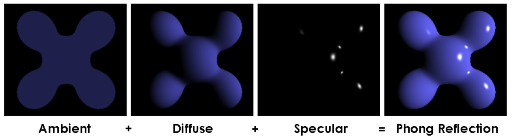
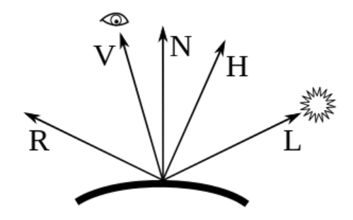
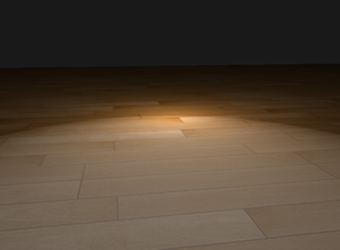
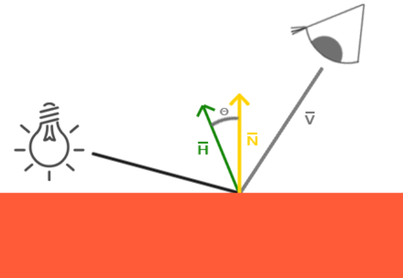
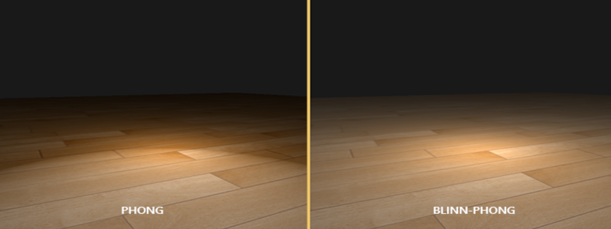

<head>
    
    
</head>

这是秋招抱佛脚系列的第三篇，主要内容涉及到了Phong和Blinn-Phong这两个常用的局部光照模型。

## 1. Phong模型

phong模型是最经典的光照模型。它由三个部分组成：环境光（ambient)，漫反射光（diffuse）和高光反射（Specular，也就是镜面反射）。Phong模型其实是经验模型，参数信息是通过经验得到的。

使用phong模型得到的最终效果就是以下三者的叠加：

    

以下是计算时需要使用的向量：

    

其中 $L$：物体表面指向光源位置的向量，$N$：表面法线，$V$：物体表面到摄像机的向量，$R=2(L\cdot N)N-L$：镜面反射的方向。

Phong模型的完整公式如下：

$$
I_p = I_{pa}k_a+\sum( I_{pd}k_d\cos i + I_{ps}k_s \cos^\alpha \theta)
$$

其中，$k_a$为环境反射系数，$k_{d}$为漫反射系数，$k_s$为镜面反射系数，且$k_d+k_s = 1$，而$I_{pa}$，$I_{pd}$，$I_{ps}$为光照强度（也可以理解为RGB），$i$为入射光反方向与表面法线的夹角，$\cos i = L \cdot N$，$\theta$为视角和反射光方向的夹角，$\cos \theta = R\cdot V$，夹角越小，高光越强，$\alpha$为光泽度，值越大，则亮点越小。可以看出，漫反射不受视角的影响。

对于RGB三个同道，可以有不同的反射系数。

## 2. Blinn-Phong模型

Phong模型的缺点在于，当观察向量和反射向量的夹角超过90度时，$\cos \theta$的值就变成负数了，这个时候镜面光的分量就会变成0，从而造成断层的情况（如下图所示）。

    

当物体的反光度非常小时，及时观察向量和反射向量的夹角大于90度，其产生的镜面高光半径足以让这些相反方向的光线对亮度产生足够大的影响。在这种情况下就无法忽略镜面光分量的贡献了。

Blinn-Pong模型对这个缺陷进行了改进，其不再依赖于反射向量，而是一个半程向量（halfway）$H=\frac{(L+V)}{\|L+V\|}$，当半程向量和法线越接近，镜面光分量就越大。

    

然后，$\cos \theta$的计算就变成了$\cos\theta = N\cdot H$，取非负值。以下是Phong和Blinn-Phong的对比：

    

可以看出Blinn-Phong模型不会出现断层的情况了，此外，由于Blinn-Phong中$\theta$的值通常要小于Phong模型里的，所以如果想要让二者有类似的效果，可以将Blinn-Phong中的反光度$k_s$设置得大一些（通常是Phong模型的2~4倍）。一般情况下，Blinn-Phong的效果更加真实。

## Reference

- [高级光照](https://learnopengl-cn.github.io/05%20Advanced%20Lighting/01%20Advanced%20Lighting/)

- [Phong光照模型](https://wallenwang.com/2017/03/phong-lighting-model/)

- [百度百科-Phong光照模型](https://baike.baidu.com/item/Phong%E5%85%89%E7%85%A7%E6%A8%A1%E5%9E%8B/16858963)
