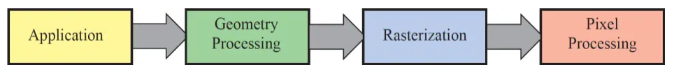

这是秋招抱佛脚系列的第4篇，内容是延迟渲染。本篇博客是关于延迟渲染的一个很简单的概述。

在正向渲染中，我们是一个物体一个物体来渲染的，对于每一个物体，我们需要根据每一个光源来给物体的每一个片段来进行着色。然而有很多片段会被后续的片段所覆盖，实际上并没有着色的必要。

延迟渲染就是用来减少这种无效的计算的，它可以在有大量光源的情况下仍然保持可以接受的帧率。

延迟渲染包含两步，第一步是在几何处理阶段获取对象的各种几何信息，并且存储到G-buffer（geometric buffer）中。第二步是在像素处理阶段中，根据G-buffer中的数据来计算光照。延迟渲染基本思想是，先执行深度测试，再进行着色计算，将本来在物体空间（三维空间）进行光照计算放到了屏幕空间（二维空间）进行处理。

首先回忆一下图形渲染管线，几何处理阶段和像素处理阶段分别在第二步和第四步：

    

## G-buffer里都存了些什么

G-buffer是对所有用来储存光照相关的数据，并在最后的光照处理阶段中使用的所有纹理的总称。我们采用MRT(Multi Render Target)技术来将数据存到G-buffer里，存储的内容包括：**世界坐标，颜色向量，法向量或镜面值**，等等，总之就是计算光照所需要的全部内容。每一类数据都是一个大小和像素处理阶段的2D窗口大小相同的纹理，这样的话，在像素处理阶段就可以进行一对一的映射。

以下是一个G-buffer的例子：

    

## 光照处理

由于G-buffer里存储的纹理和最终显示在屏幕上的像素是一一对应的，我们只需要遍历一遍G-buffer中的纹理来计算光照就可以了，这让渲染变得非常高效。

## 延迟渲染的优缺点

**优点：**

对于延迟渲染而言，每个像素只需要运行一次片段着色器，而对于正向渲染，一个像素往往要运行多次片段着色器。因此，延迟渲染能够很大程度地优化性能，尤其是针对于一些光照复杂的情况。

**缺点：**

当场景比较小，且没有很多的光源的时候，延迟渲染带来的提升并不明显。

延迟渲染不支持混色，因此无法使用MSAA，可以用FXAA和TXAA，同时也无法进行透明物体的渲染，因此在采用延迟渲染的时候，会先渲染非透明物体，再渲染透明物体。

延迟渲染会占用很多内存。

不同的物体只能使用同一套光照算法，因为在进行光照处理的时候，我们已经不知道每个像素所属的是物体是哪个了，所以只能对所有物体都采用同样的光照。

## Reference

- [【游戏开发面经汇总】- 图形学基础篇](https://zhuanlan.zhihu.com/p/430541328)

 - [延迟渲染](https://zhuanlan.zhihu.com/p/102134614)
 
 - [LearnOpenGL - 延迟着色法](https://learnopengl-cn.github.io/05%20Advanced%20Lighting/08%20Deferred%20Shading/)
