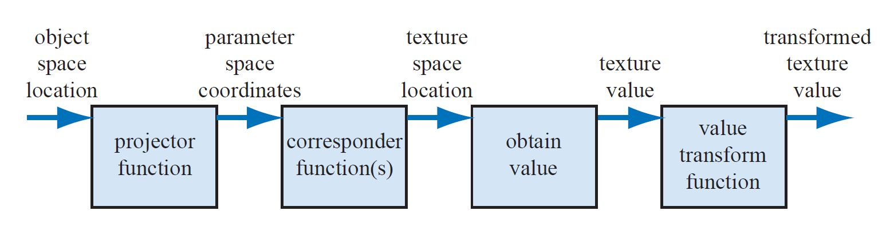
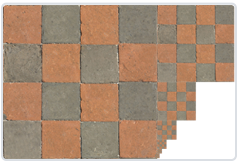

<head>
    
    
</head>

这是秋招抱佛脚学图形学的第五篇，距离我开始投简历已经过去了将近两个月时间了，我依旧颗粒无收。互联网的寒冰真气已经把我冻麻了~~，我又不是岳不群，打不赢啊~~。在投了十几家游戏公司，历经一个多月之后，我终于收到了第一个来自于游戏公司的面试邀请！虽然是个规模不大的小公司，但是就今年这个校招的情况，~~给面试的就是爹~~。

废话不多说，开始今天的抱佛脚吧。

### 什么是纹理

简单地来说，纹理是一个2D的图片（不过也有1D和3D纹理），我们可以通过一系列映射将纹理贴合到物体的表面，通过在纹理中加入细节，使物体表面呈现出各种各样的精细效果。

### 纹理贴图的过程

以下是纹理贴图管线，总共可以分为四个步骤：

    

**投影函数**。投影函数的作用是将三维空间中的任意坐标转换为纹理空间里的二维坐标。比如想要将纹理贴到一个三角形上，那么首先获取三角形三个顶点在纹理中的对应坐标，然后再对三角形内部的其他片段上进行片段插值。纹理空间中的坐标用u和v来表示。

**映射函数**。将参数空间的坐标转化为纹理空间中的位置。由于uv的值都是介于0和1之间的，如果参数坐标的值超过了这个范围，那么就需要通过一些其他的手段来决定其对应的纹理坐标。在OpenGL中，默认的纹理环绕方式（wrapping mode）是对纹理图像进行重复（GL_REPEAT），也有一些其他的处理方法：

GL_MIRRORED_REPEAT：镜像地重复

GL_CLAMP_TO_EDGE： 纹理坐标会被约束在0到1之间，超出的部分会重复纹理坐标的边缘，产生一种边缘被拉伸的效果。

GL_CLAMP_TO_BORDER：超出的坐标为用户指定的边缘颜色。

u轴和v轴可以使用不同的环绕方式。此外，有一种特殊的贴图叫做tile，进行重复拼接之后是上下连续的，经常被用来实现草地，地板等等的贴图。

 接下来的两步就是根据纹理坐标获取纹理值，然后进行变换后输出。
 
### 纹理过滤（Texture Filtering）

当物体很大，但是纹理分辨率很低，或者物体很小，纹理分辨率过高的时候，我们需要采取合适的方法来把纹理坐标映射到物体上。其实一开始我不是很理解“纹理过滤”到底是什么意思，看完了资料之后我觉得所谓纹理过滤指的对纹理坐标进行插值、采样的过程。以下是OpenGL中主要的两种方式：

**邻近过滤 GL_NEAREST：** 是默认的过滤方式，会选择中心点距离纹理坐标最近的那个像素。这种方式返回的结果会比较粗糙，有颗粒感，像素的颜色不是很连续。

**线性过滤 GL_LINEAR：** 基于纹理坐标附近的纹理像素，计算出一个插值（考虑周围的四个像素，进行双线性插值），近似出这些纹理像素之间的颜色。一个纹理像素的中心距离纹理坐标越近，那么这个纹理像素的颜色对最终的样本颜色的贡献越大。线性过滤返回的结果更加平滑，也更加接近于真实情况。

**多级渐远纹理（MipMap）：** 考虑到近大远小的问题，远处物体虽然只在屏幕上占据了几个像素，但是其本身却很大，此时一个屏幕像素点会对应多个纹理像素，此时需要跨越很多纹理片段而只选取一个纹理颜色，如果再用以上方法的话，可能会产生失真。

MiPMap就是用来解决这个问题的。简单地来说，它是一系列纹理图像（如下图所示），后一个是前一个的1/2，我们需要根据到观察者的距离来选取不同的多级纹理。可以采用以上提到的两种过滤方法来对多级纹理的边界进行过渡。

    

那么具体的，该怎么估计屏幕空间中每个像素到观察者的距离呢？一种方法是，选取该像素上方和右方的临近像素（也可以四个方向都选），然后查询这几个像素在纹理空间中到该像素对应点的距离，并取最大值$L$。该像素对应的多级纹理的层级则是$D=\log_2L$。由于此时算出的级别$D$并不是一个整数，我们可以采用四舍五入来确认它的大小，亦或是三线性插值（在$D$层进行一次线性过滤，再在$D+1$层进行依次线性过滤，最后对二者进行插值）。

然而这样还是会有一些问题，上面提到计算$L$的时候，是根据上方和右方的像素在uv坐标系里对应的坐标差值的最大值来计算的，然而当u和v变化率很不一致的时候，这样返回的结果就不太准确了。此时可以采用各向异性过滤（Anisotropic Filtering）来差别性地计算，从而获取更好的结果。

### Reference

- [LearnOpenGL - 纹理](https://learnopengl-cn.github.io/01%20Getting%20started/06%20Textures/#_1)

- [【《Real-Time Rendering 3rd》 提炼总结】(五) 第六章 · 纹理贴图及相关技术](https://zhuanlan.zhihu.com/p/27551369)

- [计算机图形学七：纹理映射(Texture Mapping)及Mipmap技术](https://zhuanlan.zhihu.com/p/144332091)
