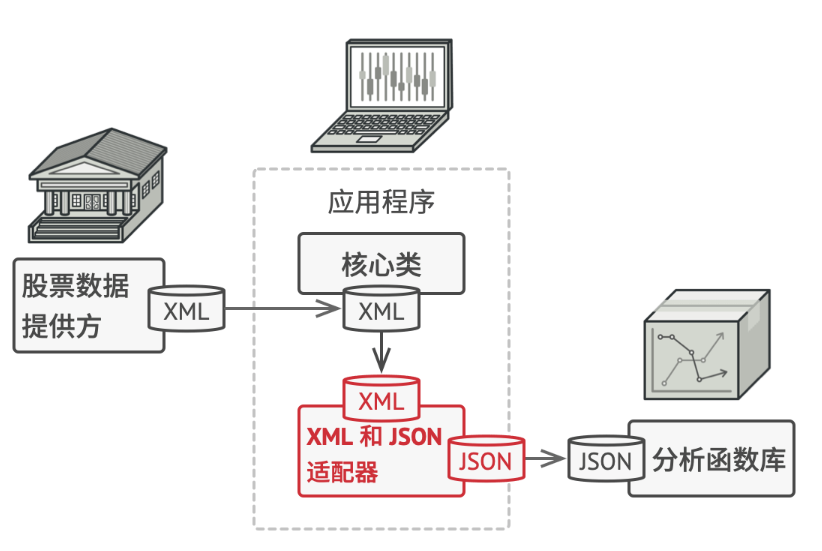
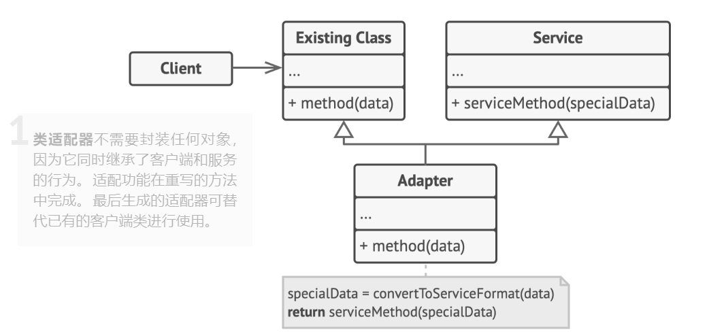
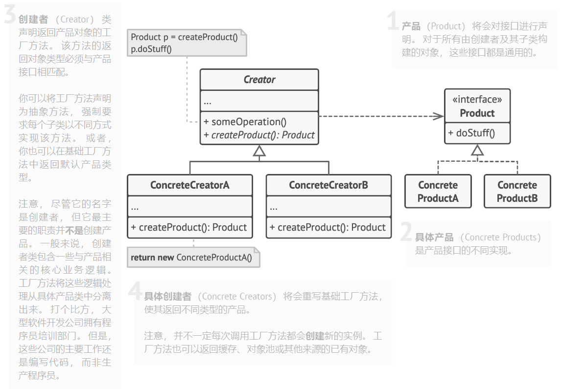
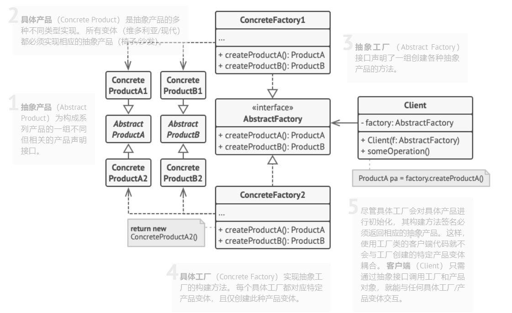

国庆快乐！从2021年9月30日开博客到现在，我写博客已经有整整一年时间了，然而尽管（我自认为）很努力，秋招到现在依旧是颗粒无收，甚至还在今天收到了一封新的感谢信。~~国庆还加班发感谢信，孩子感动哭了~~打算趁着国庆假期多学点东西好应付国庆之后的面试，虽然国庆期间日本并不放假，但是面试官放假就是我放假。

本篇的博客是关于设计模式的，这也是开发类岗位经常被问到的一类知识。

### 1. 设计模式以及六大原则

设计模式，是一套被反复使用、多数人知晓的、经过分类编目的、代码设计经验的总结。设计模式总共有六大原则：

单一职责原则：一个类只有一个职责。（降低代码复杂度）

开放封闭原则：对程序进行改动时，只能在原有的基础上进行扩展，不能修改已有的部分。

里氏代换原则：将基类替换成派生类不影响程序的行为。

接口隔离原则：每个接口中不存在派生类用不到却必须实现的方法，否则要将接口拆分，使用多个隔离的接口。

依赖倒转原则：抽象不依赖于细节，细节依赖于抽象。即要针对接口编程而非实现编程。

迪米特原则：如果两个类不直接通行，那么这两个类不应发生直接的相互作用，如果一个类要调用另一个类，那么需要经过第三个类转发。

设计模式共有23种，可分为三类：

1. 创造型模式：**单例模式**、**工厂模式**、建造者模式、原型模式

2. 结构型模式：**适配器模式**、桥接模式、外观模式、组合模式、装饰模式、享元模式、代理模式

3. 行为型模式：责任链模式、命令模式、解释器模式、迭代器模式、中介者模式、备忘录模式、观察者模式、状态模式、策略模式、模板方法模式、访问者模式

其中加粗的是本篇博客已经涉及到的设计模式。

## 2. 单例模式

单例模式保证类的实例化对象只有一个，并且创建一个访问它的全局节点。由于他同时解决了两个问题，违反了单一职责原则。

既然要保证类的实例化对象只有一个，那么我们需要保证类的对象不会被重复创建，因此很容易可以想到将这个对象设为静态变量（因为一个类的所有对象共享同一个静态变量）。


### 单例模式的应用场合

如果需要更严格地控制全局变量，或程序中某个类对于客户端只有一个实例，可以使用单例模式。例如，操作系统中表示文件系统的类，或是打印机里打印程序的实例等等。


### 实现单例模式

一般单例模式的创建有如下两步：

1.为了防止在类外使用`new`来创建新对象，将类的构造函数设为protected，同时禁用拷贝构造函数和赋值构造函数。

2. 新建一个静态构建方法作为构造函数。 该函数会调用私有构造函数来创建对象， 并将其保存在一个静态成员变量中。 此后所有对于该函数的调用都将返回这一静态对象。

单例模式有两种方法，一种是懒汉模式（第一次使用时构造对象）和饿汉模式（在类定义时就实例化）。

其中懒汉模式是不安全的，因为有可能会有两个线程同时调用静态构造方法，并同时检测到实例对象未创建，那么两个线程会同时实例化对象。该问题的解决方法就是加锁，每次判断实例对象是否为空时都要被锁定。不过对于这种情况，如果是多线程，可能会造成阻塞。

懒汉模式的实现如下：


```c++
class Singleton
{
private:
    static Singleton * pinstance_;  
    static mutex mutex_;  //互斥量

protected:
    Singleton(const string value): value_(value)  
	//构造函数和析构函数设为protected（这样派生类可以访问）
    {
    }
    ~Singleton() {}
    string value_;

public:

    Singleton(Singleton &other) = delete;  //禁用拷贝和赋值

    void operator=(const Singleton &) = delete;

	static Singleton *GetInstance(const string& value);  //返回实例

    void func()  //一些其他功能
    {
        // ...
    }
    
    string value() const{
        return value_;
    } 
};

//静态变量和函数需要在类外定义
Singleton* Singleton::pinstance_{nullptr};
mutex Singleton::mutex_;

Singleton *Singleton::GetInstance(const string& value) 
{
    lock_guard<mutex> lock(mutex_);
    if (pinstance_ == nullptr)
    {
        pinstance_ = new Singleton(value);
    }
    return pinstance_;
}
```


饿汉模式是线程安全的，其实现如下：

```c++
class Singleton{
private:
    static Singleton* instence;

protected:
	 Singleton(){} 
public:
	Singleton(const Singleton& other) = delete;
	Singleton& operator=(const Singleton& other) = delete;
    static Singleton* getInstence(){ 
        return instence;    
    }
};
Singleton* Singleton::instence = new Singleton(); //直接实例化
```

### 优缺点

**缺点**：违反了单一职责原则，单例模式实现了两个功能（保证类只有一个实例，提供全局访问点）。

测试代码的编写比较困难。

多线程环境下需要考虑线程安全性。

可能会掩盖一些不良设计。


## 3. 适配器模式

适配器模式是一种结构型设计模式，能够转换对象的接口，从而让有不同接口的对象进行交互。


一个简单的例子如下图。应用程序输出的是XML格式，而分析函数库却需要JSON格式的输入。此时我们可以编写一个适配器来将数据从XML转到JSON，从而保证二者的正常交互。

<div align=center>
    
</div>

适配器模式有两种实现方式，一种是对象适配器：适配器实现了其中一个对象的接口，并对另一个对象进行封装；另一种是类适配器：适配器同时继承两个对象的接口（只可以在支持多重继承的语言里实现）。

以下是类适配器的UML图：

<div align=center>
    
</div>

### 适配器模式的使用场合

某个类的接口和其他代码不兼容时。

### 实现适配器模式

适配器模式的实现方式如下：

1. 首先确保代码里有两个接口不同的类：一个服务类，一个客户端类。

2. 声明服务端接口，描述服务端如何如客户端交互。

3. 创建遵循客户端接口的适配器类。

4. 在适配器类中添加一个成员变量用于保存对于服务对象的引用。 通常情况下会通过构造函数对该成员变量进行初始化， 但有时在调用其方法时将该变量传递给适配器会更方便。

5. 依次实现**适配器类客户端接口的所有方法**。 适配器会将实际工作委派给服务对象， 自身**只负责接口或数据格式的转换**。

6. 客户端必须通过客户端接口使用适配器。 


适配器模式的代码如下：

```c++

//客户端用的接口
class Target {
public:
	virtual ~Target();
	virtual void Request() const
	{
		//....
	}
};

//adaptee的接口和客户端的不兼容，适配器的目标就是让二者可以正常交互。
class Adaptee {
public:
	void SpecificRequest() const
	{
		//...
	}
};


//适配器类，需要继承target和adaptee
class Adapter: public Target, public Adaptee {
public:
	Adapter(){}

	//重写target中的request，让adaptee能看懂target的输出
	void Request() const override{
		//...
	}
	
};

//由于Adapter是Target的派生类，所以函数的输入可以为Adapter。
void ClientCode(const Target *target)
{
	//...
}
```


### 优缺点

**优点**：遵循单一职责原则，把转换接口的功能与程序主要业务隔离。

遵循开放封闭原则，可以一直添加新的适配器。

**缺点**：代码复杂度可能会增加，有时候不如直接改服务类来得快。

## 4. 工厂模式

工厂模式是创建型模式，其包含简单工厂模式，工厂方法模式和抽象工厂模式。

简单工厂模式用一个工厂来根据输入产生不同的类。然而工厂类违反了开放封闭原则，每当新增一个产品，就要改写工厂类，可能会让程序逻辑变得复杂。

工厂方法模式解决了以上的问题，其在父类中提供一个创建对象的方法， 允许子类决定实例化对象的类型。也就是说，通过编写不同的子类，可以创建不同的产品，不需要在同一个类里不断地增添了。

在工厂方法中，每个具体工厂对应一种具体产品，如果我们希望一个工厂能够生产多种产品（比如一个电器工厂可以同时生产电视，冰箱，空调等等），就需要采用抽象工厂方法。抽象工厂方法提供一个创建一系列相关或相互依赖对象的接口，而无须指定它们具体的类。

在此只记录工厂方法模式和抽象工厂模式

### 4.1  工厂方法模式

以下是工厂方法模式的UML图：

主要包括创建者（返回具体工厂方法），具体工厂方法（返回具体产品），产品以及具体产品。


<div align=center>
    
</div>

### 实现工厂方法模式

1. 让所有产品都遵循同一接口。 该接口必须声明对所有产品都有意义的方法。

2. 在创建类中添加一个空的工厂方法。 该方法的返回类型必须遵循通用的产品接口。

3. 在创建者代码中找到对于产品构造函数的所有引用。 将它们依次替换为对于工厂方法的调用， 同时将创建产品的代码移入工厂方法。

4. 在工厂方法中添加临时参数来控制返回的产品类型（比如switch之类的）。

5. 为工厂方法中的每种产品编写一个创建者子类， 然后在子类中重写工厂方法， 并将基本方法中的相关创建代码移动到工厂方法中。

6. 如果应用中的产品类型太多， 那么为每个产品创建子类并无太大必要， 此时也可以在子类中复用基类中的控制参数。

工厂方法模式的代码：

```c++
//产品
class Product {
 public:
  virtual ~Product() {}
  virtual string Operation() const = 0;
};

//具体产品1
class ConcreteProduct1 : public Product {
 public:
  string Operation() const override {
    return "{Result of the ConcreteProduct1}";
  }
};

//具体产品2
class ConcreteProduct2 : public Product {
 public:
  string Operation() const override {
    return "{Result of the ConcreteProduct2}";
  }
};

//创建者
class Creator {

 public:
  virtual ~Creator(){};
  virtual Product* FactoryMethod() const = 0;

  //实现一些操作
  string SomeOperation() const {
    // Call the factory method to create a Product object.
    Product* product = this->FactoryMethod();
    // Now, use the product.
    string result = "Creator: The same creator's code has just worked with " + product->Operation();
    delete product;
    return result;
  }
};

//具体工厂1，生产产品1
class ConcreteCreator1 : public Creator {

 public:
  Product* FactoryMethod() const override {
    return new ConcreteProduct1();
  }
};


//具体工厂1，生产产品2
class ConcreteCreator2 : public Creator {
 public:
  Product* FactoryMethod() const override {
    return new ConcreteProduct2();
  }
};


void ClientCode(const Creator& creator) {
  // ...
  cout<<creator.SomeOperation()<<endl;
  // ...
}

int main() {
  cout << "App: Launched with the ConcreteCreator1.\n";
  Creator* creator = new ConcreteCreator1();
  ClientCode(*creator);
  cout << endl;
  cout << "App: Launched with the ConcreteCreator2.\n";
  Creator* creator2 = new ConcreteCreator2();
  ClientCode(*creator2);

  delete creator;
  delete creator2;
  return 0;
}
```

### 工厂方法模式的优缺点


**优点**：客户端不需要知道具体产品类的名字，只需要知道生产产品的具体工厂类名字。

符合单一职责原则，代码好维护。

符合开放封闭原则，无需更改客户端代码即可引入新的产品。

**缺点**：应用工厂方法模式需要引入许多新的子类， 代码可能会因此变得更复杂。


### 4.2 抽象工厂模式

工厂方法模式中，一个具体工厂类只能生产一类产品（比如iPhone的工厂只能生产iPhone）。如果此时我们不仅想让工厂生产iPhone，还想生产Mac，那就可以考虑使用抽象工厂模式。抽象工厂模式在抽象工厂中增加创建产品的接口，并在具体子工厂中实现新加产品的创建。同时，客户端在调用具体工厂生产产品时，无需知道工厂的具体信息。以下是抽象工厂模式的UML图：

<div align=center>
    
</div>

其实和工厂方法模式有些类似，不过不同之处在于，在抽象工厂模式中，一个具体工厂可以对应多种不同的产品。

### 实现抽象工厂模式

1. 首先把不同类型的产品和具体的产品变型列成一个矩阵。

2. 为所有产品声明抽象接口，并让所有具体产品类实现该接口。

3. 声明抽象工厂接口，并在抽象工厂中提供创建抽象产品的方法。

4. 为每种产品变体实现一个具体产品类。

5. 对特定具体工厂类进行初始化。 然后将该工厂对象传递给所有需要创建产品的类。

6. 找出代码中所有对产品构造函数的直接调用， 将其替换为对工厂对象中相应构建方法的调用。

```c++
//每种抽象产品都有一个接口
class AbstractProductA {
 public:
  virtual ~AbstractProductA(){};
  virtual string UsefulFunctionA() const = 0; //纯虚函数，在子类中实现
};

//根据抽象产品，构建具体产品类
class ConcreteProductA1 : public AbstractProductA {
 public:
  string UsefulFunctionA() const override {
    return "The result of the product A1.";
  }
};

class ConcreteProductA2 : public AbstractProductA {
  string UsefulFunctionA() const override {
    return "The result of the product A2.";
  }
};

class AbstractProductB {

 public:
  virtual ~AbstractProductB(){};
  virtual string UsefulFunctionB() const = 0;
  //产品之间可以交互
  virtual string AnotherUsefulFunctionB(const AbstractProductA &collaborator) const = 0;
};

class ConcreteProductB1 : public AbstractProductB {
 public:
  string UsefulFunctionB() const override {
    return "The result of the product B1.";
  }

  string AnotherUsefulFunctionB(const AbstractProductA &collaborator) const override {
    const string result = collaborator.UsefulFunctionA();
    return "The result of the B1 collaborating with ( " + result + " )";
  }
};

class ConcreteProductB2 : public AbstractProductB {
 public:
  string UsefulFunctionB() const override {
    return "The result of the product B2.";
  }

  string AnotherUsefulFunctionB(const AbstractProductA &collaborator) const override {
    const string result = collaborator.UsefulFunctionA();
    return "The result of the B2 collaborating with ( " + result + " )";
  }
};

//抽象工厂类声明一系列抽象产品
class AbstractFactory {
 public:
  virtual AbstractProductA *CreateProductA() const = 0;
  virtual AbstractProductB *CreateProductB() const = 0;
};

//具体工厂类生产具体的产品
class ConcreteFactory1 : public AbstractFactory {
 public:
  AbstractProductA *CreateProductA() const override {
    return new ConcreteProductA1();
  }
  AbstractProductB *CreateProductB() const override {
    return new ConcreteProductB1();
  }
};

class ConcreteFactory2 : public AbstractFactory {
 public:
  AbstractProductA *CreateProductA() const override {
    return new ConcreteProductA2();
  }
  AbstractProductB *CreateProductB() const override {
    return new ConcreteProductB2();
  }
};

//客户端调用
void ClientCode(const AbstractFactory &factory) {
  const AbstractProductA *product_a = factory.CreateProductA();
  const AbstractProductB *product_b = factory.CreateProductB();
  cout << product_b->UsefulFunctionB() << "\n";
  cout << product_b->AnotherUsefulFunctionB(*product_a) << "\n";
  delete product_a;
  delete product_b;
}
```


### 抽象工厂模式的优缺点

**优点**：同一具体工厂生产的产品可以相互匹配（可以为他们编写一些交互的函数），可以避免客户端代码和具体产品的耦合，符合单一职责原则和开放封闭原则。

**缺点**：需要引入很多接口和类，代码比较复杂。


## 5. 观察者模式

待续


## Reference

- [设计模式目录：22种设计模式](https://refactoringguru.cn/design-patterns/catalog)

- [23种设计模式总结](https://blog.csdn.net/lgxzzz/article/details/124970034)

- [C++面试突破](https://leetcode.cn/leetbook/read/cmian-shi-tu-po/v0xdyi/)
