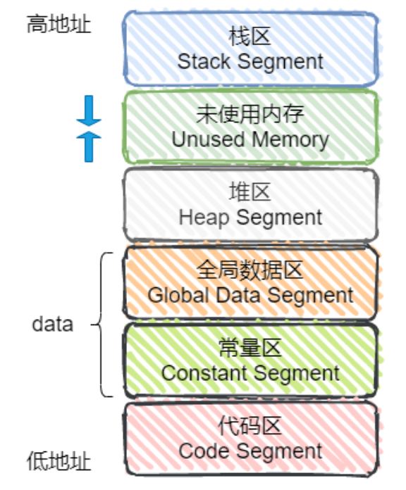

又是一篇关于面经的博客。距离写上篇博客已经过去了快一周了，很可惜的是那家独立游戏工作室虽然看上去对我非常满意，但一提到二面/offer的事情对方就开始踌躇了，甚至还提出让我毕业后去他们公司看看再决定是否要加入（就离谱，你见过哪个应届生毕业之后还没定下工作的？），只能说HR的心思实在是不可捉摸，我把她的话读了一遍又一遍，还是看不透她到底想表达什么。。。。

两个多月秋招的屡战屡败已经彻底磨灭了我的信心和尊严，看见周围的同学纷纷拿到offer上岸而我一个offer都没有的时候我忍不住开始怀疑人生，明明大家条件都差不多，我也付出了不少努力，怎么我就没有人要呢（望天）。

今天下午参加了米x游的一面（他们公司不让在网上发面经，虽然我觉得没有人会看我的博客，不过保险起见我还是给名字来个~~无效~~打码吧），我在8月底投的简历，9月上旬做的笔试，然后10月下旬才进入面试流程。其实都到了这个时间点，大家都心知肚明公司已经没hc了，我是抱着见见世面以及刷经验的态度参加了一面。虽然面试比我想象中的要简单，但是整体上还是很硬核的，没有自我介绍，一上来就开始问问题，总共你问我答了40分钟，大概问了十几二十来个问题，内容涵盖C++，计网，操作系统还有设计模式，以及三道常规的口述算法题，图形学倒是没问。这涵盖面，不愧是游戏行业的top级难度啊。

我总结了一些面试里我答得有点烂的问题，我觉得都挺有价值：

**1. 重载和重写的区别？如果两个同名函数的形参分别是`int i`和 `const int i`，这样子可以重载吗？如果是`int& i`和`const int& i`呢？**

第一个问题比较容易回答，重载是编译时多态，而重写是运行时多态，和虚函数和类的继承有关。第二、三个问题让我愣了一下，由于我之前写代码的时候遇到过类似的问题，所以我觉得这二者应该都是不可以重载的，但是具体为啥我也没说出个所以然来。。。

在查阅了一番资料以及自己写代码试了试之后，发现`int i`和`const int i`是不可以重载的，会显示重定义，因为函数调用的时候，存在形实结合的过程，而这二者都不会改变实参的值。

对于后一种情况，`int& i`和`const int& i`，是可以重载的（答错了，555），因为前者引用的是变量，而后者引用的是常量，有点类似于变量指针和常量指针。所以类似的，`int *`和`const int *`也是可以重载的。

**2. STL里的迭代器是用来做什么的？如果给迭代器加个const会变成什么样，`const_iterator`呢？**

对于第一个问题，迭代器就是在不暴露容器内部的情况下，为我们提供一个访问容器元素的途径，同时还可以通过迭代器修改内部的值（由此面试官引出了第二个问题）。至于第二个问题……我没这么写过代码啊！所以我当时猜测前者应该会变得和常量指针一样，迭代器的指向可以改，但是迭代器指向的内容不可以改，至于`const_iterator`，愚笨如我没用过这玩意……我猜这二者的关系应该类似于常量指针和指针常量。

后来去网上查了资料得到了更加详细的解释，很不幸的是，我猜错了，这二者的作用我说反了。。`const iterator`必须要被初始化，它的指向不可以改变，只能改变指向的值；而`const iterator`，它的指向可变，但是不能改变容器内部的元素值，只能读不能写。当时太紧张了，现在静下心来回想了一下，`const iterator`前面都有`const`了，那可不就不能改变它的指向了吗。

**3. TCP和UDP的区别是？现在HTTP 3已经可以不用TCP了，如果我们想让UDP实现可靠传输，可以做些什么？**

对于第一个问题，TCP是面向连接，而UDP是面向无连接，TCP可靠，UDP不可靠，TCP慢UDP快，简单地概括就是这样。至于后者，我之前背八股文的时候瞄过一眼，但是面试的时候一紧张就全忘了，悔しい！脑子里只记得可以通过在应用层模仿TCP的一些特性来实现UDP可靠传输了，太紧张了也没说出个所以然来。

返回去看了下资料，大概是这样的（其实很简单）：

1. 添加seq/ack机制，确保数据发送到对端。

2. 添加发送和接收缓冲区，可以实现超时重传。

同时也有一些开源的实现UDP可靠传输的程序，比如RUDP，RTP，UDT。

**4. 内存分配问题，你知道栈啊堆啊这些东西在内存里的位置顺序吗？**

忘记答得啥了，反正乱答了一通肯定是错的，以下是我找来的一张内存的分布图：

    

**5. 进程和线程的区别？线程共享进程的那些资源呢？**

其实应该是很常规的问题，但是由于我操作系统实在是看得不多，所以第二个问题没答上来……我找到了这样一篇文章，觉得讲得很合理：[线程间到底共享了哪些进程资源？](https://cloud.tencent.com/developer/article/1768025)。

面试官问的远远不止以上这么多，不过可能是因为其他问题我答出来了所以没什么印象了，就不写了。

**总结：**

大概摸清了米x游面试官的套路，先问你一个常规问题涨涨自信，然后再在这个基础上深入问一个问题，我觉得这种面试套路可以很好地考验应聘者的水平，只是苦了身为应聘者的我。。。。面试结束之后我问面试官何时可以收到反馈，他表示不知道，我真的不知道，我问他对我有什么评价，他说我感觉你还行，我真的觉得你还行……

得，八成是凉了。
