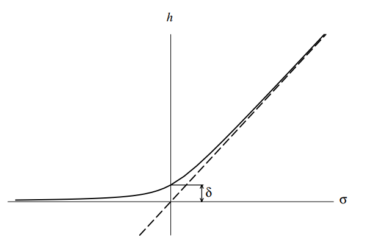

<head>
    
    
</head>

最近看了一些关于**四面体网格（tetrahedral mesh）** 的质量评定的论文，在这里记录一个很基础也很常用的方法。（说句题外话，tetrahedron这个单词真的好难念，每次念的时候感觉舌头都要打结了……）

对于一个四面体而言，其形状越接近于正四面体，质量就越高，那么一种很简单的想法就是通过测量该四面体形状与正四面体的差距来表示它的质量。

我们用$T = {\rm x}_k, k = 0,1,2,3$来表示需要测量的四面体，用$T_I$来表示正四面体，那么它的四个顶点的坐标为：${\rm v}_0=(0,0,0)^T, {\rm v}_1 = (1,0,0)^T, {\rm v}_2 = (1/2, \sqrt{3}/2, 0)^T, {\rm v}_3 = (1/2, \sqrt 3/6, \sqrt2/\sqrt3)^T$，用$T_R$来表示参考四面体，它的四个顶点坐标为：${\rm u}_0=(0,0,0)^T, {\rm u}_1 = (1,0,0)^T, {\rm u}_2 = (0,1,0)^T, {\rm u}_3 = (0,0,1)$。要衡量$T$到$T_I$的差距，我们通过可以求得$T_I$到$T$的仿射变换来得到。而这个放射变换又可以分为两步：首先求得$T$到$T_R$的变换，再求$T_R$到$T_I$的。

对于前者，假设以${\rm x_0}$为参考点，那么$T_R$到$T$的映射可以表示为${\rm x} = A{\rm u}+{\rm x_0}$，其中$A={(\rm x_1 - x_0, x_2 - x_0, x_3 - x_0})$。对于后者，假设${\rm v} = W {\rm u}$，那么$W = (\rm{v}_1, \rm{v}_2, \rm{v}_3)$。这样一来，$T_I \rightarrow T$的变换可以写为：${\rm x} = S{\rm v}+ {\rm x_0}$，其中$S = AW^{-1}$。

我们可以用如下公式来描述四面体的质量：

$$
q = \frac{3\sigma^{2/3}}{\vert S\vert ^2}
$$

其中$\vert S \vert$是frobenius范数，即$\vert S \vert =\sqrt{tr(S^TS)}$，而$\sigma = \det(S)$。$q$的值越大，则质量越高，正四面体的$q$值为1。

因此，如果我们想要最大化整个四面体网格模型的质量，那么最小化$\sum_i \frac{1}{q_i }$就可以了，不过这样会有一个问题那么就是$\sigma$的值有时候会为0，此时$\frac{1}{q}$的值就算不出来了。为了解决这个问题，我们可以对$\sigma$做出一些改动：

$$
h(\sigma) = \frac{1}{2}(\sigma + \sqrt{\sigma^2 + 4\delta^2})
$$

其中$\delta = h(0)$，$h(\sigma)$的走向如下图：

    

可以看出，当$\sigma \geq 0$的时候，$h(\sigma)$和$\sigma$是非常近似的，并且$h(\sigma)$不会穿过x轴，因此可以解决除零的问题。

### Reference

- [Smoothing and local refinement techniques for improving tetrahedral mesh quality](https://www.sciencedirect.com/science/article/abs/pii/S0045794905002385)
