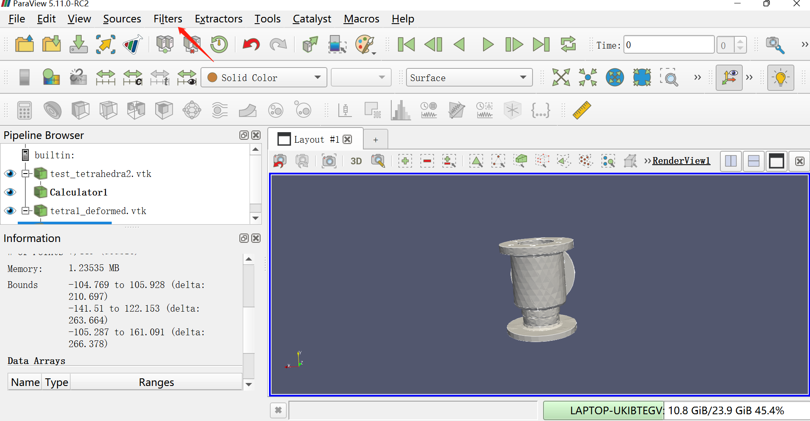
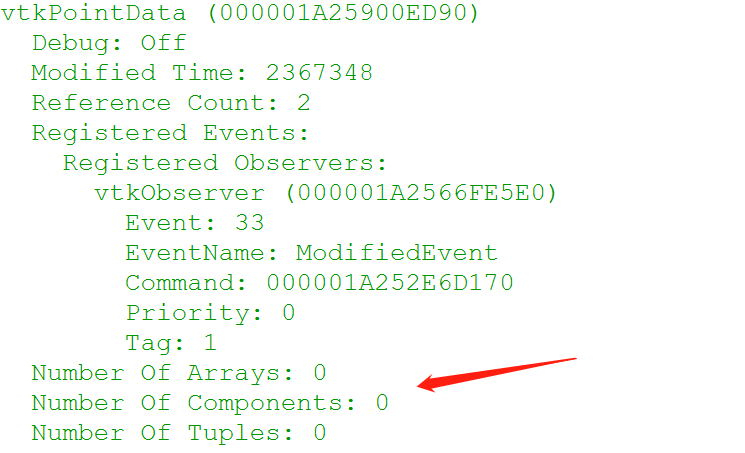
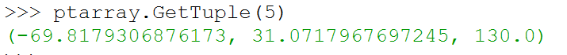
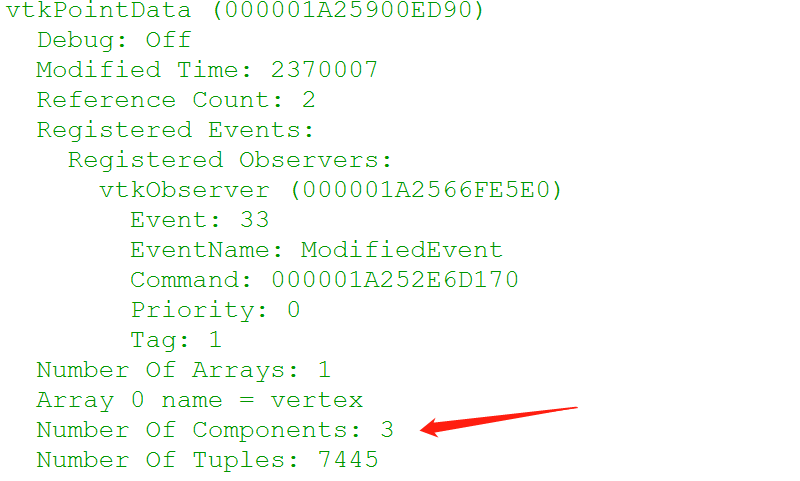

ParaView是一款开源的三维模型可视化软件，我之前处理的大多都是点云（可以用CloudCompare来可视化）和三角网格数据（我一般用MeshLab和GOMInspect），最近开始做四面体数据处理了。常用的三个软件都应付不来，于是转向了ParaView。

感觉这软件是真复杂啊……我想实现两个四面体网格对比的功能，但翻了翻各个菜单发现ParaView没这个功能，但是ParaView里可以运行Python代码，于是打算试着用python写一个出来。

ParaView可视化的过程可以分为三个部分：读取数据，滤波（filter）和渲染。在添加Python代码之前，首先需要了解一下filter这个概念。在ParaView中，filter是一个管线模块(pipeline module，我也不知道用中文怎么说合适)，所谓管线模块就是，上一步的输出是这一步的输入，而这一步的输出又是下一步的输入，整个数据处理的过程可以被看做是一条线性的管道。一个filter可以有多个输入和输出。

我们可以通过添加filter的方式来实现Python脚本的运行。以下是ParaView的界面，在右侧的pipeline browser里面选中一个对象并apply，然后去上方菜单的Filters->Alphabetical里找到Python Calculator并添加。

<div align=center>
    
</div>


我的vtk文件是unstructured grid格式的（除此之外还有structured grid，structured points等等，不过unstructured是最常见的格式）。

导入vtk文件之后，数据（比如points，cells）会呈现在data array里，不过很奇怪的是无论我怎么倒腾data array都是空的，然而point和cell确实是被读取进来了……没有data array的话就不太好用calculator了（因为输入的参数都是data array里的），我查了很多资料之后（在这里吐槽一下，好像官网的指南对应的不是最新的版本），决定用Python shell来处理数据。

点击菜单栏View->Python Shell即可调出一个Python的编辑框。我通过执行Python指令来读取数据：

```Python
from paraview.simple import * 
import paraview.vtk as vtk #必须要有这个才可以读取vtk格式

#创建一个reader，读取的数据就存在这个里面
reader = OpenDataFile("path")
#更新管线
UpdateDataPipeline() 
#获取四面体数据
data = servermanager.Fetch(reader)
#可以单独获取顶点数据
pt = data.GetPointData()
```

然后执行以下`print(pt)`，看看里面都存了些啥：

<div align=center>
    
</div>

以上是Point Data的一部分，可以看到array, component之类的数量都是0，我猜测这就是data array为空的原因（可能是因为我的vtk文件里的内容不够全……？反正挺奇怪的）。

既然没有data array，那就自己造一个出来吧：

```python
numpt = data.GetNumberOfPoints() #获取顶点数量
ptarray = vtk.vtkDoubleArray() #创建一个矩阵
ptarray.SetName("vertex")
ptarray.SetNumberOfTuples(numpt)  #设置矩阵中数据的数量
ptarray.SetNumberOfComponents(3) #每条数据的长度

#把点坐标填进去
for i in xrange(numpt):
	p = data.GetPoint(i)
	ptarray.InsertNextTuple3(p[0],p[1],p[2])
```

最后试着获取一下`ptarray`里的数据：


<div align=center>
    
</div>

然后把`ptarray`塞回到`pt`里：`pt.AddArray(ptarray)`，然后print一下看看：

<div align=center>
    
</div>

现在array的数量不是0了！成功！

想要实现两个四面体对比的话，那么就对source->target进行knn搜索，寻找到source中每一点到target中最近的一点的距离，用pvpython自带的一些库应该不难实现。

就写到这儿，该睡觉去了。
