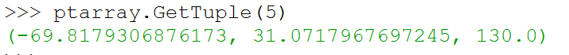

ParaView是一款开源的三维模型可视化软件，我之前处理的大多都是点云（可以用CloudCompare来可视化）和三角网格数据（我一般用MeshLab和GOMInspect），最近开始做四面体数据处理了。常用的三个软件都应付不来，于是转向了ParaView。

感觉这软件是真复杂啊……我想实现两个四面体网格对比的功能，但翻了翻各个菜单发现ParaView没这个功能，但是ParaView里可以运行Python代码，于是打算试着用Python写一个出来。

ParaView可视化的过程可以分为三个部分：读取数据，滤波（filter）和渲染。在添加Python代码之前，首先需要了解一下filter这个概念。在ParaView中，filter是一个管线模块(pipeline module，我也不知道用中文怎么说合适)，所谓管线模块就是，上一步的输出是这一步的输入，而这一步的输出又是下一步的输入，整个数据处理的过程可以被看做是一条线性的管道。一个filter可以有多个输入和输出。

我们可以通过添加filter的方式来实现Python脚本的运行。以下是ParaView的界面，在右侧的pipeline browser里面选中一个对象并apply，然后去上方菜单的Filters->Alphabetical里找合适的filter。其中Python Calculator可以调用numpy里的函数，不过只能写一行，而Programmable Filter可以写很多行（类似于写一个内置函数了），所以用programmable filter更合适一些。

<div align=center>
    
</div>


### 输入数据准备

我的vtk文件是unstructured grid格式的（除此之外还有structured grid，structured points等等，不过unstructured是最常见的格式）。

导入vtk文件之后，数据（比如points，cells）会呈现在data array里，不过很奇怪的是无论我怎么倒腾data array都是空的，然而point和cell确实是被读取进来了……没有data array的话就不太好用filter了（因为输入的参数都是data array里的），我查了很多资料之后（在这里吐槽一下，好像官网的指南对应的不是最新的版本），决定用Python shell来处理数据。

点击菜单栏View->Python Shell即可调出一个Python的编辑框。我通过执行Python指令来读取数据：

```python
from paraview.simple import * 
import paraview.vtk as vtk #必须要有这个才可以读取vtk格式

#创建一个reader，读取的数据就存在这个里面
reader = OpenDataFile("path")
#更新管线
UpdateDataPipeline() 
#获取四面体数据
data = servermanager.Fetch(reader)
#可以单独获取顶点数据
pt = data.GetPointData()
```

然后执行以下`print(pt)`，看看里面都存了些啥：

<div align=center>
    
</div>

以上是Point Data的一部分，可以看到array, component之类的数量都是0，我猜测这就是data array为空的原因（可能是因为我的vtk文件里的内容不够全……？反正挺奇怪的）。

既然没有data array，那就自己造一个出来吧：

```python
numpt = data.GetNumberOfPoints() #获取顶点数量
ptarray = vtk.vtkDoubleArray() #创建一个矩阵
ptarray.SetName("vertex")
ptarray.SetNumberOfTuples(numpt)  #设置矩阵中数据的数量
ptarray.SetNumberOfComponents(3) #每条数据的长度

#把点坐标填进去
for i in xrange(numpt):
	p = data.GetPoint(i)
	ptarray.InsertTuple3(i,p[0],p[1],p[2])
```

最后试着获取一下`ptarray`里的数据：


<div align=center>
    
</div>

然后把`ptarray`塞回到`pt`里：`pt.AddArray(ptarray)`，然后print一下看看：

<div align=center>
    
</div>

现在array的数量不是0了！成功！

最后调用一下`writer`，把加入了array的数据写到一个新的vtu文件（就是unstructured的vtk），然后再读进来，发现data array里面有值了：

<div align=center>
    
</div>

### 用Programmable Filter实现功能

我想要用Programmable Filter来实现两个网格之间顶点的比较。首先写一个很简单的脚本来实现两个相同拓扑的四面体网格的顶点对比（它们的顶点数量相同），同时选中Pipeline Browser里的两个网格对象，然后添加Programmable Filter，打开View->Properties就可以写脚本了：

```python
#输入的对象是存在inputs里的，我们通过data array的名称来获取对应的数据
dataArray = inputs[0].PointData["vertex"] - inputs[1].PointData["vertex1"]
#把两个网格的顶点相减，然后把结果存到output里面
output.PointData.append(dataArray,"comp")
```

点击apply，就可以看到生成了一个新的data array：

<div align=center>
    
</div>

如果想要计算source网格到target网格的距离，只是顶点相减肯定是不够的，我打算建立一个kd树来存放target的点，然后通过kd树来搜索source中每一个顶点到target中最近邻点的距离。由于pvpython中是包含了scipy的，而scipy有现成的kdtree类，所以我的想法实现起来很容易：

```python
from scipy.spatial import KDTree
#get source and target
target = inputs[0].PointData["vertex1"]
source = inputs[1].PointData["vertex"]
numpt = source.shape[0]
#build a kdtree
tree = KDTree(target)
#search in kdtree
distance, _ = tree.query(source,k=1)
#output the distances from each point in source to
#its closest neighborhood in target
output.PointData.append(distance,"dist")
```

运行一下，新增了一个data array：


<div align=center>
    
</div>

dist的长度和点的数量相同。

最后，把Properties->Colorling里的选项切换为dist，就得出最终结果了：


<div align=center>
    
</div>

感觉不太自然……后续我再找找其他办法来让色彩过渡更加平滑一些。


### 总结

感觉ParaView真的挺有意思的！还能顺便锻炼一波Python编程水平（我真的不太会写Python，一直都是需要边查搜索引擎边写的。。。）

可惜的就是网上相关的讨论不是很多，而且绝大部分都是英文的，相对中文论坛读起来还是会耗费多一些时间。

### Reference

- [ParaView Tutorials (Python & Batch)](https://docs.paraview.org/en/latest/Tutorials/ClassroomTutorials/PythonAndBatchPythonCalculatorProgrammableSourceAndFilter.html)

- [ParaView 技术论坛](https://discourse.paraview.org/t/cant-view-the-new-data-array-in-paraview/1231)

- [ParaView Tutorials (Using NumPy for processing data)](https://docs.paraview.org/en/latest/ReferenceManual/vtkNumPyIntegration.html)

- [Python Calculator and Programmable Filter](https://www.paraview.org/Wiki/Python_calculator_and_programmable_filter)

- [Color Maps](https://docs.paraview.org/en/latest/ReferenceManual/colorMapping.html)
