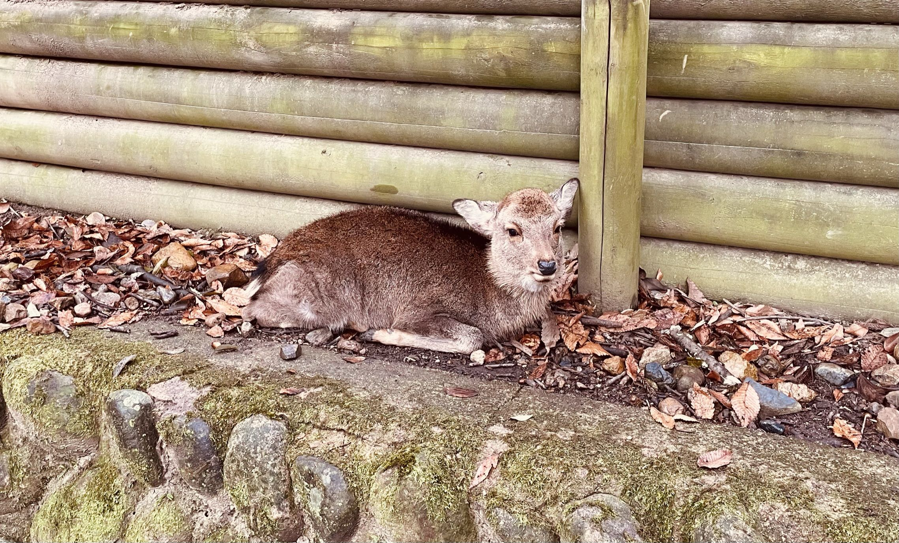

今天是我的24岁生日！

这周一到周五我都在出差。周一下午我开完一个线上会议之后立马从东京出发，夜里到了奈良；周二没有什么特殊行程，我在奈良闲逛了一下午；周三上午我发表了自己的研究（有一个很认真的日本小哥记了笔记还向我提问，我很高兴！），晚上参加了晚宴，同桌有来自大阪大学和东京都立大学的老师和同学，可惜的是我因为日语不好没有聊太多；周四我去了京都；今天上午跟着会议主办方参观了DMG Mori的工厂（并再次遇到了周三的小哥），然后下午返回了东京。~~所以其实只有周三上午在干正事，其他时间都在玩儿~~。

这是周二闲逛的时候拍的奈良公园的小鹿↓

晚上到达东京之后挤着满员电车回到了宿舍，还拖着行李箱爬了几百米的坡，这应该是我过得最累的一个生日了……回了宿舍之后打开电脑在steam上收了来自朋友的生日礼物，是我在心愿单里放了好久的p5r！！

第一次在异国他乡过生日，祝自己生日快乐，希望未来的一年身体健康，风调雨顺。
